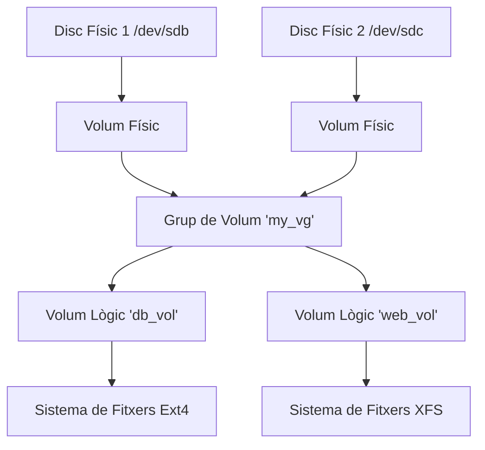

LVM et permet abstreure l'emmagatzematge físic. Pots combinar múltiples discos en un grup i redimensionar volums sobre la marxa.

## Conceptes



## Passos d'Implementació

### 1. Volums Físics (PV)
Marca els discos en brut per a l'ús de LVM.
```bash
sudo pvcreate /dev/sdb /dev/sdc
```

### 2. Grup de Volum (VG)
Crea un grup anomenat `data_vg`.
```bash
sudo vgcreate data_vg /dev/sdb /dev/sdc
```

### 3. Volum Lògic (LV)
Retalla un tros.
```bash
# Crear un volum de 10GB anomenat 'backups'
sudo lvcreate -n backups -L 10G data_vg
```
S'accedeix a `/dev/data_vg/backups`.

### 4. Formatar i Muntar
Tracta'l com una partició normal.
```bash
sudo mkfs.ext4 /dev/data_vg/backups
sudo mount /dev/data_vg/backups /mnt/backups
```

## Redimensionament (La màgia de LVM)
Si et quedes sense espai a `backups`, i `data_vg` té espai lliure:

```bash
# Estendre el LV i el Sistema de Fitxers d'una vegada (-r)
sudo lvextend -L +5G -r /dev/data_vg/backups
```
