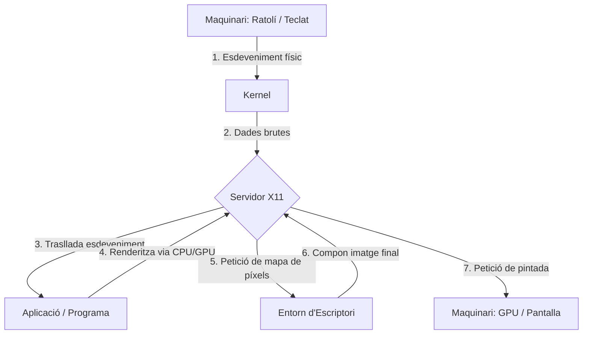
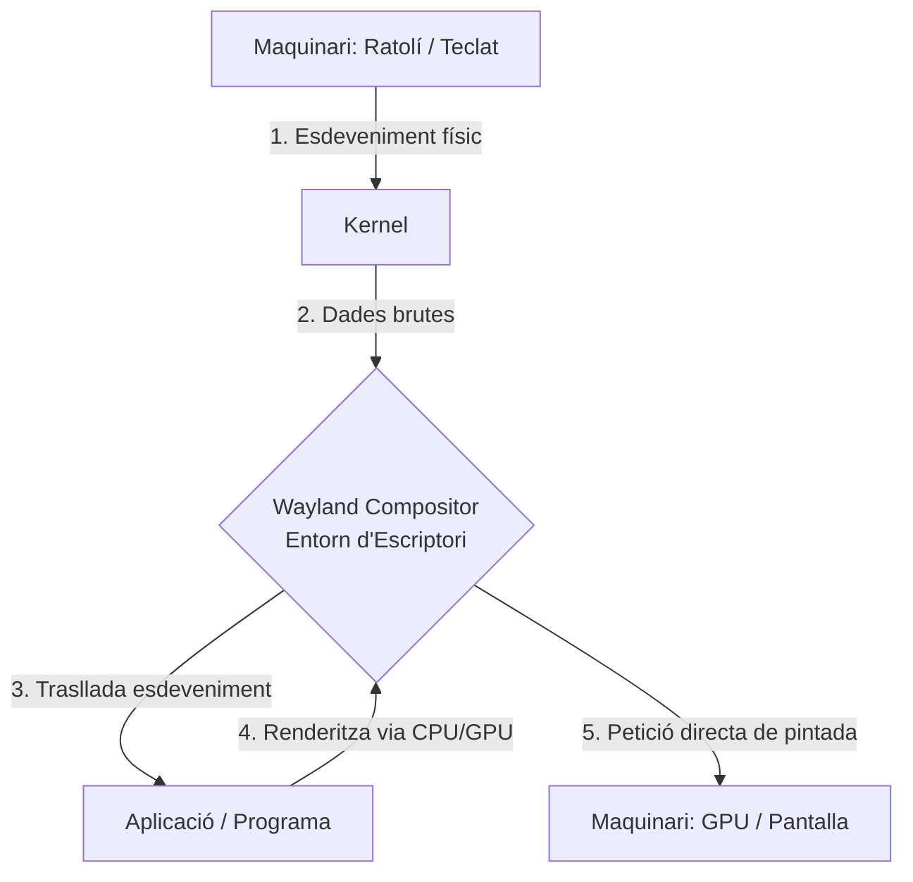

import { Aside, Tabs, TabItem, Card, CardGrid, Code } from "@astrojs/starlight/components";
import MultipleChoice from "@/components/tutorial/MultipleChoice.astro";
import Option from "@/components/tutorial/Option.astro";
import { Icon } from 'astro-icon/components';

## 1. Breu Història i Filosofia

Per entendre com funciona Linux, especialment com a Administrador de Sistemes en l'entorn modern de servidors, ajuda entendre d'on ve.

### De Unix a Linux

1. **Unix (Anys 70)**: Desenvolupat originalment per investigadors als Laboratoris Bell d'AT&T (incloent Ken Thompson i Dennis Ritchie). El seu disseny apostà per crear sistemes operatius jeràrquics de fitxers i utilitats petites que feien una sola cosa, però la feien bé (la "Filosofia Unix"). Unix, però, es va convertir en programari propietari molt costós.
2. **El Projecte GNU (1983)**: Richard Stallman va llançar el Projecte GNU (_GNU's Not Unix_) amb l'objectiu de crear un sistema operatiu complet, lliure i de codi obert que es comportés com Unix. Van dedicar anys a reconstruir versions lliures de totes les utilitats essencials d'Unix (com `ls`, `grep`, el compilador GCC, etc.). Però a principis dels 90, el seu nucli (o _kernel_), anomenat GNU Hurd, encara no estava llest.
3. **El Nucli de Linux (1991)**: Linus Torvalds, un estudiant a Finlàndia, va escriure el seu propi nucli aficionat i el va combinar amb les utilitats de GNU. Aquest matrimoni d'eines (GNU) + nucli (Linux) és el que tècnicament forma el sistema operatiu complet que avui comunament anomenem, de manera abreujada, "Linux".

### Sistemes Operatius

<Tabs>
  <TabItem label="Unix original">
    
    > Dennis Ritchie
    
    **Ken Thompson & Dennis Ritchie — Bell Labs, AT&T (anys 70)**

    Van desenvolupar Unix i el llenguatge C als Laboratoris Bell d'AT&T. El seu disseny apostà per crear sistemes jeràrquics de fitxers i utilitats petites que feien una sola cosa —però la feien bé— (la «Filosofia Unix»). Unix, però, es va convertir en programari propietari d'alt cost i ús restringit.

    **Llegat:** tota la família de sistemes operatius moderns —Linux, macOS, BSD— descendeix filosòficament o directament del seu treball.
  </TabItem>

  <TabItem label="GNU/Linux">
    
    > Linus Torvalds

    [Github de Linus Torvalds](https://github.com/torvalds)
    
    **Richard Stallman (GNU, 1983) + Linus Torvalds (nucli, 1991)**

    Richard Stallman va llançar el Projecte GNU per reconstruir un Unix completament lliure. Va crear eines essencials (GCC, Bash, `ls`, `grep`…) però li mancava el nucli. El 1991 Linus Torvalds, amb 21 anys, va escriure el nucli Linux i el va unir amb les eines GNU. Amb 21 anys va anunciar en una llista de correu: *«Estic fent un sistema operatiu lliure, només un hobby, no serà gran ni professional com GNU»*. Aquest hobby avui sustenta:

    - El **96%** dels servidors web del món (Apache, Nginx…)
    - La infraestructura d'AWS, Google Cloud i Azure
    - Android (3.000 milions de dispositius)
    - El **100%** dels supercomputadors del Top500 mundial

    **Distros destacades:** Debian, Ubuntu, Fedora, Arch Linux, RHEL

    **Nucli:** Linux · **Llicència:** GPLv2 · **Shell per defecte:** Bash / Zsh
  </TabItem>

  <TabItem label="macOS">
  <CardGrid>
  <Card title="Steve Jobs">
    
  </Card>
  <Card title="Steve Wozniak">
    
  </Card>
  </CardGrid>
    **Steve Jobs & Steve Wozniak — Apple (2001)**

    Apple va construir macOS sobre un nucli BSD Unix en una cadena directa: Unix AT&T → BSD (UC Berkeley) → NeXTSTEP (Jobs en sortir d'Apple) → Darwin/XNU (de tornada a Apple). macOS és avui un sistema Unix **certificat per The Open Group**, la qual cosa significa que el seu terminal és plenament compatible amb comandes POSIX estàndard.

    - **XNU**: nucli híbrid d'Apple (Mach microkernel + components BSD)
    - Compatible POSIX: els scripts Bash/Zsh funcionen igual que a Linux
    - Homebrew: el gestor de paquets no oficial més popular per a macOS
    - iOS, iPadOS i tvOS comparteixen el mateix nucli Darwin/XNU

    **Nucli:** XNU (Darwin) · **Llicència:** APSL (parcialment codi obert) · **Shell per defecte:** Zsh
  </TabItem>

  <TabItem label="BSD">
  <Icon name="bsd" style="width: 4em; height: 4em;"/>
    **Origen:** Unix d'AT&T → UC Berkeley → BSD lliure (1993)

    La família BSD (Berkeley Software Distribution) és Unix pur, reimplementat amb llicència lliure per la Universitat de Califòrnia a Berkeley. El seu codi és tan madur que Apple l'utilitzà com a base per a macOS. Avui existeixen tres branques actives:

    - **FreeBSD**: alt rendiment i emmagatzematge (usat per Netflix, PlayStation 4/5)
    - **OpenBSD**: el sistema més auditat del món, base de molts tallafocs i encaminadors
    - **NetBSD**: màxima portabilitat; funciona en quasi qualsevol arquitectura de maquinari

    **Nucli:** BSD · **Llicència:** BSD License (molt permissiva) · **Shell per defecte:** csh / sh
  </TabItem>

  <TabItem label="Windows (NT)">
  <Icon name="wind" style="width: 4em; height: 4em;"/>
    **Origen:** Windows NT — Dave Cutler, Microsoft (1993) — no descendeix d'Unix

    Windows NT va ser dissenyat des de zero amb idees de VMS (Digital Equipment Corporation), **no** d'Unix. Tot i això, al llarg dels anys Microsoft va afegir compatibilitat Unix:

    - **WSL2**: executa un nucli Linux real dins Windows 10/11
    - PowerShell: adopta canonades inspirades en Unix
    - Els servidors Windows (IIS, Active Directory) conviuen habitualment amb Linux en infraestructures híbrides

    Un sysadmin modern sol gestionar ambdós entorns de manera simultània.

    **Nucli:** Windows NT · **Llicència:** Propietària · **Shell per defecte:** PowerShell / CMD
  </TabItem>
</Tabs>

---

### La Filosofia «Tot és un Fitxer»

Un dels principis més definitoris que Linux hereta d'Unix és que **«Tot és un Fitxer»**. Això no és una metàfora. A Linux:

- Un document de text és un fitxer.
- Els directoris (carpetes) són fitxers (que contenen llistes d'altres fitxers).
- Els teus discos durs i unitats USB estan representats com a fitxers al directori `/dev` (ex. `/dev/sda`).
- Els processos en execució de la memòria RAM tenen el seu propi «fitxer» virtual al sistema de fitxers `/proc`.

Si domines les eines per manipular fitxers de text, podràs manipular la major part de la configuració del sistema operatiu.

---

## 2. L'Ecosistema Linux i el nostre objectiu: Debian

Avui en dia, el terme «Linux» es refereix al nucli (kernel). Per tenir un sistema usable, diverses organitzacions i comunitats empaqueten el nucli juntament amb centenars d'altres eines i programes de GNU, un sistema d'inicialització, i més. Aquests paquets s'anomenen **Distribucions** o **«Distros»**.

Per a un administrador de sistemes, hi ha dues famílies corporatives/comunitàries gegants que dominen els servidors:

1.  **Família Red Hat (RHEL)**: Utilitza gestors de paquets com `dnf` i `/rpm`. És l'estàndard de moltes corporacions. Exemples: Red Hat Enterprise Linux, Fedora, Rocky Linux, AlmaLinux.
2.  **Família Debian**: Utilitza gestors de paquets com `apt` o `apt-get` i el sistema de paquets `.deb`.

<Aside type="note" title="El Focus d'aquest Curs: Debian">
  Al llarg de les nostres 32 hores de formació per a la certificació LFCS,
  **utilitzarem la distribució Debian (i els seus derivats directes com Ubuntu
  Server) com a la nostra plataforma principal de referència**.
   
  [Visitar Debian](https://www.debian.org/)
   
  Debian és conegut per la seva extrema estabilitat (la seva branca «Stable» només rep
  actualitzacions quan han estat exhaustivament provades), la seva rigorosa
  adhesió als principis del Codi Obert i el seu enorme repositori de paquets.
  Aprendre Debian avui significa tenir una base sòlida per administrar la
  immensa majoria dels contenidors Docker moderns i servidors al núvol.
</Aside>

---

## 2.1 Distribucions Linux

Una distribució (o «distro») pren el nucli de Linux i li afegeix programari addicional, com un gestor de paquets, utilitats de GNU, i típicament un entorn d'escriptori, per crear un sistema operatiu complet que l'usuari final o administrador pugui usar.

Les distros es divideixen comunament en «famílies» segons el seu origen i el seu sistema de gestió de paquets:

- **Família Debian** (Debian, Ubuntu, Linux Mint): Usen `apt` i paquets `.deb`. Famoses per la seva gran comunitat i increïble estabilitat. Són l'estàndard de facto en contenidors i servidors al núvol.
- **Família Red Hat** (RHEL, Fedora, CentOS, Rocky Linux): Usen `dnf`/`yum` i paquets `.rpm`. Molt comunes en entorns empresarials i corporatius tradicionals.
- **Família Arch** (Arch Linux, Manjaro): Usen `pacman` i un model *rolling release* (actualitzacions contínues). Populars entre entusiastes que desitgen tenir instal·lat el programari més recent en un sistema minimalista.

<Tabs>
  <TabItem label="Arch Linux">
    <Icon name="arch" style="width: 3rem; height: 3rem;" />

    Arch Linux és la distro més minimalista i la que més control té l'usuari. No té un entorn gràfic per defecte, sinó que s'instal·la amb el mínim de paquets i es pot configurar des de zero. És la distro que més s'assembla a un sistema operatiu tradicional, però amb l'avantatge que pots instal·lar el que necessitis.

    **Família:** Rolling release · **Paquets:** `pacman` · [Visitar Arch Linux](https://archlinux.org/)
  </TabItem>

  <TabItem label="Debian">
    <Icon name="debian" style="width: 3rem; height: 3rem;" />

    Debian és un dels sistemes operatius lliures més antics i estables. Conegut pel seu rigorós sistema de proves i el seu immens repositori de programari, serveix com a base fonamental per a incomptables distribucions modernes (incloent Ubuntu). És l'estàndard de facto per a servidors a causa de la seva confiabilitat extrema.

    **Família:** Debian · **Paquets:** `apt` / `.deb` · [Visitar Debian](https://www.debian.org/)
  </TabItem>

  <TabItem label="Fedora">
    <Icon name="fedora" style="width: 3rem; height: 3rem; color: #007acc;" />

    Fedora és una distribució independent finançada per Red Hat que es caracteritza per estar sempre a l'avantguarda tecnològica (*bleeding edge*). Incorpora les versions més recents de programari lliure i innovacions que, després de ser provades i madurar a Fedora, eventualment formaran part de les futures versions estables de RHEL.

    **Família:** Red Hat · **Paquets:** `dnf` / `.rpm` · [Visitar Fedora](https://fedoraproject.org/)
  </TabItem>

  <TabItem label="RHEL">
    <Icon name="redhat" style="width: 3rem; height: 3rem;" />

    Red Hat Enterprise Linux és la principal distribució de Linux de codi obert però d'ús comercial dissenyada per al sector empresarial. Destaca per oferir un suport tècnic robust, seguretat certificada i cicles de vida increïblement llargs per al programari, sent la peça central d'infraestructures crítiques corporatives.

    **Família:** Red Hat · **Paquets:** `dnf` / `.rpm` · [Visitar Red Hat](https://www.redhat.com/)
  </TabItem>

  <TabItem label="Ubuntu">
    <Icon name="ubuntu" style="width: 3rem; height: 3rem; color: #ff8000;" />

    Ubuntu és una distribució popular i estable desenvolupada per l'empresa Canonical (i basada estretament en Debian). Inicialment enfocada en la facilitat d'ús per a l'usuari d'escriptori, s'ha convertit també en una elecció prioritària per a servidors i desplegament de programari al núvol gràcies a les seves versions LTS (Long Term Support).

    **Família:** Debian · **Paquets:** `apt` / `.deb` · [Visitar Ubuntu](https://ubuntu.com/)
  </TabItem>
</Tabs>

<Aside type="tip" title="Distribucions Linux">
Pots explorar l'immens arbre genealògic complet de distribucions de Linux en aquest extens article de [Wikipedia](https://en.wikipedia.org/wiki/List_of_Linux_distributions).
</Aside>

---

### 2.2 Entorns d'Escriptori (X11 vs Wayland)

<Aside type="caution" title="Servidors sense interfície">
  Tingues en compte que **com a administradors de sistemes normalment gestionarem servidors en mode *headless* (sense pantalla o interfície visual)**, operant quasi exclusivament a través de la interfície de línia de comandes (CLI) de forma remota via SSH.
</Aside>

En sistemes operatius com Windows o macOS, la interfície gràfica d'usuari (GUI) està intrínsecament unida al nucli del sistema. A Linux, la interfície gràfica és simplement un conjunt de programes d'espai d'usuari que s'executen sobre el sistema base, oferint una alta modularitat.

Per a que existeixi una interfície gràfica s'utilitza un **Servidor Gràfic** (o Display Server), existint dues opcions principals:

- **X11 (X.Org)**: L'estàndard tradicional que porta dècades en ús. És extremadament compatible amb la majoria de programari, però la seva base de codi i disseny antics no ofereixen el nivell d'aïllament i seguretat que requereixen els sistemes actuals.
- **Wayland**: El protocol modern dissenyat com a remplàçament lògic a X11. És fonamentalment més segur davant la captura de tecles i del sistema (*keyloggers*), i gestiona amb molta més suavitat i independència les distintes taxes de refresc i l'escalat en monitors d'alta resolució. La majoria de distros d'escriptori modernes l'adopten per defecte.

A continuació, un esquema simplificat per comparar com d'ineficient i llarg és el camí gràfic a X11 davant l'arquitectura directa de Wayland (i per què aquest darrer consumeix menys recursos de CPU/GPU):

#### Arquitectura X11 (La Via Llarga)

#### Arquitectura Wayland (La Via Directa)

Sobre aquest servidor s'apoia l'**Entorn d'Escriptori** (Desktop Environment), responsable del *look & feel* i disseny d'interacció del sistema (gestió de finestres, menús, explorador de fitxers, configuració). Alternatives molt populars inclouen:

- **GNOME**: Disseny enfocat al modernisme, al minimalisme, i en fluxos de dreceres de teclat i gestos (entorn base a Ubuntu i Fedora).
- **KDE Plasma**: Altament personalitzable i ple d'utilitats; resulta més familiar als usuaris recents que migren de Windows.
- **XFCE**: Eficient, simple i summament lleuger, creat amb el propòsit d'optimitzar els recursos computacionals i allargar la vida útil del maquinari antic.

<Aside type="caution" title="Distribucions Linux vs Entorns d'Escriptori">
És essencial **no confondre una distribució amb un entorn d'escriptori**. Ubuntu, per exemple, és una distribució que per defecte porta l'escriptori GNOME integrat, però pots perfectament modificar el sistema per instal·lar i iniciar un entorn diferent com KDE Plasma o XFCE.
</Aside>
---

<CardGrid>
  <Card title="Hyprland (Wayland)">
    
  </Card>
  <Card title="KDE Plasma (X11)">
    
  </Card>
</CardGrid>

## 3. Què és un Sysadmin Modern?

Un Administrador de Sistemes de Linux és el lampista, arquitecte i guardaespatlles de la infraestructura digital.

### Les teves Tasques Principals

1. **Posada en Marxa i Configuració**: Instal·lar el SO sense interfície gràfica (headless), configurar comptes i assegurar que els serveis de xarxa responguin.
2. **Manteniment i Rendiment**: Monitoritzar la saturació del disc i els colls d'ampolla de la RAM a través d'eines especialitzades sense entorn de finestres (X11 o Wayland).
3. **Seguretat**: Auditar i reduir permisos (`chmod`, `chown`, ACLs), revisar registres i configurar tallafocs (`ufw` o `iptables`).
4. **Automatització**: En lloc de fer i escriure la mateixa comanda manualment en 10 servidors, escriure un script (en `bash`) que ho faci per tu.

<Code lang="bash" title="manteniment.sh" code={`#!/bin/bash
# manteniment.sh — Manteniment rutinari en servidors Ubuntu
# Ús: sudo bash manteniment.sh

set -euo pipefail

LOG="/var/log/manteniment.log"
DATA=$(date '+%Y-%m-%d %H:%M:%S')

echo "[\$DATA] Iniciant manteniment" | tee -a "\$LOG"

# 1. Actualitzar paquets
echo "[INFO] Actualitzant paquets..." | tee -a "\$LOG"
apt-get update -qq && apt-get upgrade -y >> "\$LOG" 2>&1

# 2. Eliminar paquets orfes
echo "[INFO] Netejant paquets no necessaris..." | tee -a "\$LOG"
apt-get autoremove -y >> "\$LOG" 2>&1
apt-get autoclean -y  >> "\$LOG" 2>&1

# 3. Comprovar espai en disc (avisa si supera el 80%)
US=$(df / | awk 'NR==2 {print \$5}' | tr -d '%')
if [ "\$US" -gt 80 ]; then
  echo "[AVÍS] Disc al \${US}% — revisar /var/log o /tmp" | tee -a "\$LOG"
fi

# 4. Reiniciar serveis caiguts gestionats per systemd
for SERVEI in nginx postgresql ssh; do
  if ! systemctl is-active --quiet "\$SERVEI"; then
    echo "[WARN] \$SERVEI caigut — reiniciant..." | tee -a "\$LOG"
    systemctl restart "\$SERVEI"
  fi
done

echo "[\$DATA] Manteniment completat" | tee -a "\$LOG"
`} />

---

## 4. Les Certificacions de la Indústria

Entendre com funciona aquest ecosistema i poder moure's sense un ratolí és fonamental, i validar-ho mitjançant certificacions impulsarà la teva carrera.

### Linux Foundation Certified Sysadmin (LFCS)

El nostre objectiu per a les pròximes lliçons és preparar-te per al **LFCS**.

- **Enfocament**: Habilitat ràpida i pràctica per instal·lar, configurar i solucionar problemes des del CLI en ambients Enterprise.
- **Proveïdor**: The Linux Foundation, el gremi neutral que dóna suport al desenvolupament del Kernel.
- **Format de l'Examen**: **100% Basat en Rendiment** (Escenari Pràctic en Terminal en viu). Tens 2 hores per connectar-te a una consola remota i resoldre tiquets mitjançant el terminal en el moment.
- **Distribucions**: En el moment de la inscripció s'ha d'escollir entre Ubuntu 20.04 (família Debian) o CentOS Stream (família Red Hat). Ens enfocarem en preparar per a Ubuntu/Debian.

<Aside type="tip">
  **La Memòria Muscular és la Clau** Atès que l'examen requereix que executis
  comandes reals per arreglar sistemes reals de forma remota, la teoria (llegir
  aquest manual) no serà útil sense la pràctica contínua de picar el teclat fins
  que les comandes flueixin de manera natural sense haver-les de consultar
  (memorització tàctil).
</Aside>

---

## Comprova els teus coneixements

Per assentar el que has après en aquesta lliçó, respon a aquestes preguntes integradores:

1. Històricament, per què va ser vital la creació del Projecte GNU abans del Nucli de Linux?

   <MultipleChoice>
     <Option>
       Perquè Linus Torvalds necessitava una interfície gràfica per poder compilar
       C.
     </Option>
     <Option isCorrect>
       Perquè Unix era propietari/tancat, i GNU va aportar les eines
       utilitàries lliures essencials (ls, grep, compiladors) a les quals es va
       acoblar posteriorment el Nucli.
     </Option>
     <Option>
       Perquè GNU va ser en realitat el primer nucli desenvolupat als anys 70.
     </Option>
   </MultipleChoice>

2. Quina de les següents afirmacions descriu millor el principi «Tot és un Fitxer» a Linux?

   <MultipleChoice>
     <Option>
       Tots els fitxers de text han d'acabar amb l'extensió `.txt` perquè
       el Nucli els llegeixi.
     </Option>
     <Option>
       Linux desa una còpia física de la memòria RAM al disc dur cada vegada
       que arrenquem.
     </Option>
     <Option isCorrect>
       Els components de maquinari (com `/dev/sda`) i els processos en RAM
       (`/proc`) es representen i interactuen en el sistema de manera idèntica a
       els fitxers de text estàndard.
     </Option>
   </MultipleChoice>

3. Respecte a l'examen de certificació LFCS, quin és el seu format principal?
   <MultipleChoice>
     <Option>
       Elecció múltiple i veritable/fals sobre l'arquitectura del Nucli.
     </Option>
     <Option isCorrect>
       100% Basat en Rendiment, resolent problemes usant comandes reals
       en un terminal en viu.
     </Option>
     <Option>
       Un projecte de desenvolupament escrit en Bash que s'entrega després d'una
       setmana.
     </Option>
   </MultipleChoice>
