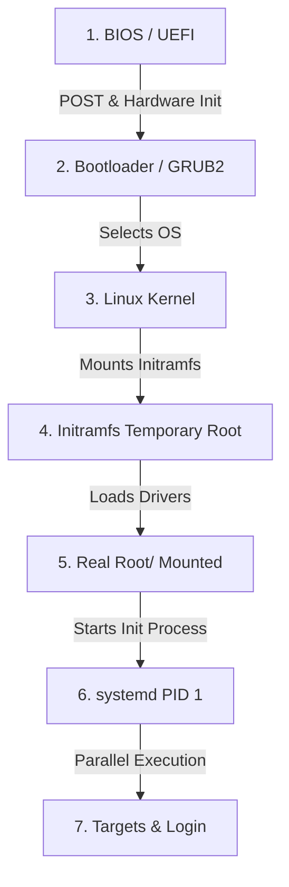

import { Aside, Tabs, TabItem, FileTree, LinkCard } from "@astrojs/starlight/components";
import PreCheck from "@/components/tutorial/PreCheck.astro";
import MultipleChoice from "@/components/tutorial/MultipleChoice.astro";
import Option from "@/components/tutorial/Option.astro";

<PreCheck>
  - Aprendràs la nomenclatura que usa Linux per interactuar amb discs (ex.
  `/dev/sda`, `/dev/nvme0n1`). - Entendràs les limitacions de l'antic MBR
 front al modern GPT. - Memoritzaràs l'etapa crítica d'arrencada des de la
  BIOS fins que `systemd` pren el control amb PID 1.
</PreCheck>

Per a un administrador de sistemes operant servidors, una fallada al disc dur o un sistema que es queda "congelat" durant l'arrencada (kernel panic) són el pa de cada dia. Entendre amb exactitud com detecta Linux els discs i quins fitxers intervenen per arribar a la pantalla d'inici de sessió és vital.

---

## 1. Tractament de Discos en Linux

En Linux, els discs durs i altres mitjans d'emmagatzematge de blocs es representen com a fitxers al directori `/dev`.

La nomenclatura depèn del tipus de connexió física o bus:

- **Discos SATA/SAS (Tradicionals i SSDs):** `/dev/sda` (primer disc), `/dev/sdb` (segon disc), etc.
- **Discos NVMe (Alt rendiment PCIe):** `/dev/nvme0n1` (primer disc), `/dev/nvme1n1` (segon disc).
- **Lectors SD /eMMC:** `/dev/mmcblk0`.

Quan particionem un disc, a cada partició se li assigna un número:

- Les particions de `/dev/sda` es diuen `/dev/sda1`, `/dev/sda2`, etc.
- Les particions de `/dev/nvme0n1` es diuen `/dev/nvme0n1p1`, `/dev/nvme0n1p2`, etc.

### MBR vs GPT

- **MBR (Master Boot Record):** És l'estàndard antic. Limitat a un màxim de 4 particions primàries i no suporta discs majors de 2 Terabytes. S'emmagatzema al primer sector absolut del disc.
- **GPT (GUID Partition Table):** És l'estàndard modern lligat a plaques base UEFI. Permet fins a 128 particions per defecte en Linux i suporta discs de mides massives de Zettabytes. Conté còpies de seguretat de si mateixa al final del disc per evitar corrupció.

---

## 2. Sistemes de Fitxers (Filesystems)

Pintar les "ratlles de la pista" en un disc perquè Linux sàpiga organitzar carpetes requereix formatejar-les amb un _sistema de fitxers_.

- **ext4 (Fourth Extended Filesystem):** És l'estàndard tradicional de facto en la família Debian i la majoria de Linux. És ràpid, té excel·lent compatibilitat i és _journaling_ (manté un registre (journal) del que escriurà abans de fer-ho, per evitar corrupcions si hi ha un apagada).
- **xfs:** L'estàndard per defecte en la família RHEL. Està ultra-optimitzat per manejar fitxers paral·lelament i de mides gegantesques.
- **btrfs i ZFS:** Sistemes de pròxima generació (Copy-on-Write) que gestionen el particionament i els fitxers simultàniament, permetent"snapshots" (fotografies del sistema en el temps) natius sense eines extra.

---

## 3. Esquemes de Particionament Habituals

<LinkCard
  title="Arbre de directoris FHS"
 description="Repasa com s'organitza el sistema de fitxers de Linux abans de decidir com particionar."
  href="/es/modules/module-1/2-installation/#2-el-árbol-de-directorios-fhs"
/>

El instalador de distribucions com Ubuntu o Debian sol preguntar-te si vols **todo junto** o separar `/home`. Aquí estan los tres escenaris més comuns:

<Tabs>
  <TabItem label="🖥️ Mínim (tot junt)">
    La opció més senzilla: tot en una sola partició arrel. Válida per VMs, entorns de prova o equips amb poc espai.

    | Partición | Punto de montaje | Sistema de archivos | Tamaño orientativo |
    |-----------|-----------------|---------------------|--------------------|
    | `/dev/sda1` | `/boot/efi` | FAT32 | 512 MB |
    | `/dev/sda2` | `[SWAP]` | swap | RAM × 1-2 |
    | `/dev/sda3` | `/` | ext4 | Todo el resto |

    <FileTree>
    - / *Todo el sistema en una sola partición*
      - boot/
        - efi/ `sda1` — FAT32, 512 MB
      - home/ `sda3` — mismo disco que el sistema
        - usuario/
      - var/
        - log/
      - etc/
      - tmp/
    </FileTree>

    <Aside type="caution">
      Si un usuari omple `/home` amb fitxers grans, el sistema operatiu també es queda sense espai i pot deixar de funcionar.
    </Aside>
  </TabItem>

  <TabItem label="🏠 Desktop (/home separat)">
    La opció que típicament t'ofereix l'instal·lador gràfic d'Ubuntu. Separar `/home` permet reinstal·lar el sistema sense perdre les dades de l'usuari.

    | Partición | Punto de montaje | Sistema de archivos | Tamaño orientativo |
    |-----------|-----------------|---------------------|--------------------|
    | `/dev/sda1` | `/boot/efi` | FAT32 | 512 MB |
    | `/dev/sda2` | `[SWAP]` | swap | RAM × 1-2 |
    | `/dev/sda3` | `/` | ext4 | 30–50 GB |
    | `/dev/sda4` | `/home` | ext4 | Todo el resto |

    <FileTree>
    - / `sda3` — ext4, 30-50 GB
      - boot/
        - efi/ `sda1` — FAT32, 512 MB
      - etc/
      - var/
        - log/
      - tmp/
    - home/ `sda4` — ext4, partición independiente
      - usuario/
        - documentos/
        - proyectos/
    </FileTree>

    <Aside type="tip">
      Amb `/home` en la seva pròpia partició pots formatejar `/` i reinstal·lar el sistema operatiu mantenint intactes tots els teus documents, configuracions d'usuari i projectes.
    </Aside>
  </TabItem>

  <TabItem label="🖧 Servidor (producció)">
    En entorns de servidor s'aïllen `/var` i opcionalment `/tmp` per evitar que logs o bases de dades descontrolats col·lapsin el sistema. És l'esquema recomanat per al LFCS.

    | Partición | Punto de montaje | Sistema de archivos | Tamaño orientativo |
    |-----------|-----------------|---------------------|--------------------|
    | `/dev/sda1` | `/boot/efi` | FAT32 | 512 MB |
    | `/dev/sda2` | `[SWAP]` | swap | RAM × 1 |
    | `/dev/sda3` | `/` | ext4 / xfs | 20–30 GB |
    | `/dev/sda4` | `/var` | ext4 / xfs | 20–100 GB |
    | `/dev/sda5` | `/home` | ext4 | Lo que quede |

    <FileTree>
    - / `sda3` — ext4/xfs, 20-30 GB
      - boot/
        - efi/ `sda1` — FAT32, 512 MB
      - etc/
      - tmp/
    - var/ `sda4` — ext4/xfs, 20-100 GB
      - log/ *Logs del sistema — pueden crecer sin límite*
      - lib/
        - postgresql/
        - mysql/
      - www/
        - html/
    - home/ `sda5` — ext4, espacio restante
      - deploy/
      - admin/
    </FileTree>

    <Aside type="note">
      `/var` conté `/var/log` (logs del sistema), `/var/lib` (bases de dades com PostgreSQL o MySQL) i `/var/www` (webs con Apache/Nginx). Aïllar-lo impedeix que un log desbocat ompli el disc arrel i tumbei el servidor.
    </Aside>
  </TabItem>
</Tabs>

---

## 4. El Procés d'Arrencada (Des de Botó d'Encès a Servidor Actiu)

¿Què passa des del segon que encens la màquina de metall fins que pots escriure comandaments?

1. **Firmware (BIOS/UEFI):**Inicialitza el hardware rudimentari (CPU, memòria, teclat). Comprova que res està en curtcircuit (POST) i busca la partició `/boot/efi` per trobar el gestor d'arrencada.
2. **Bootloader (GRUB2):** Llegeix la seva configuració (`/boot/grub/grub.cfg`) que diu on es troba físicament el Kernel. Carrega el Kernel i un fitxer anomenat `initramfs` a la memòria RAM, i li cedeix el control.
3. **El Kernel (`vmlinuz`):** Autodetecta el hardware a baix nivell. Comença a gestionar la memòria. És el cervell absolut.
4. **Initramfs (Initial RAM Filesystem):** El Kernel inicialment no sap com llegir el disc dur real (`ext4`, volums LVM, o si està xifrat amb contrasenya). El `initramfs` és un "mini-Linux" que es carrega a la RAM que conté només els _drivers_ (mòduls) necessaris per saber llegir el disc dur central de veritat.
5. **Muntatge de Arrel:** Un cop superat el `initramfs`, el sistema munta el disc de veritat a l'arrel (`/`).
6. **Init (`systemd`):** El Kernel executa el primer programa real: `/sbin/init` (que en sistemes moderns és sempre `systemd`). Se li assigna l'ID de Procés 1 (`PID 1`).
7. **Systemd Targets:** `systemd` llegeix la seva configuració i inicia serveis en paral·lel per arribar a un "Target" objectiu. Per exemple, el `multi-user.target` per servidors. Inicialitza la xarxa, SSH, munta bases de dades, i finalment, mostra el **Prompt de Login**.

<Aside type="caution" title="¿Què és una pantalla de Kernel Panic?">
 Si el Kernel no pot trobar o muntar la partició arrel (Pas 5) degut a
  que `/etc/fstab` està mal configurat, el procés s'atura amb un fatal
  *Kernel Panic*. No pot continuar perquè no troba fitxers del disc dur
  que executar. ¡Aprendrem a diagnosticar això en mòduls futurs!
</Aside>

---

## Comprova els teus coneixements

1. Estàs instal·lant Linux en un servidor amb un disc NVMe ultra-ràpid. ¿Sota quina ruta i nom de fitxer el buscaries típicament en la terminal per particionar-lo?

   <MultipleChoice>
     <Option>`/mnt/nvme-drive1`</Option>
     <Option>`/dev/sda`</Option>
     <Option isCorrect>`/dev/nvme0n1`</Option>
   </MultipleChoice>

2. ¿Quina de les següents és una limitació històrica crítica de l'esquema de particions MBR (Master Boot Record) que va ser superada per GPT?

   <MultipleChoice>
     <Option>
       MBR limitava la velocitat màxima de transferència a 300 MB/s.
     </Option>
     <Option isCorrect>
       MBR només suportava un màxim de 4 particions primàries i no reconeixia
       discs majors de ~2 Terabytes.
     </Option>
     <Option>
       MBR només funcionava amb distribucions derivades de Red Hat.
     </Option>
   </MultipleChoice>

3. Durant el procés d'arrencada de Linux, ¿quina peça de software s'encarrega de carregar a la RAM un "mini-Linux" temporal amb els controladors justos per poder muntar el disc dur real?
   <MultipleChoice>
     <Option>El Firmware UEFI</Option>
     <Option>Systemd (PID 1)</Option>
     <Option isCorrect>
       El Bootloader (GRUB2) carregant el Kernel i el `initramfs`
     </Option>
   </MultipleChoice>
