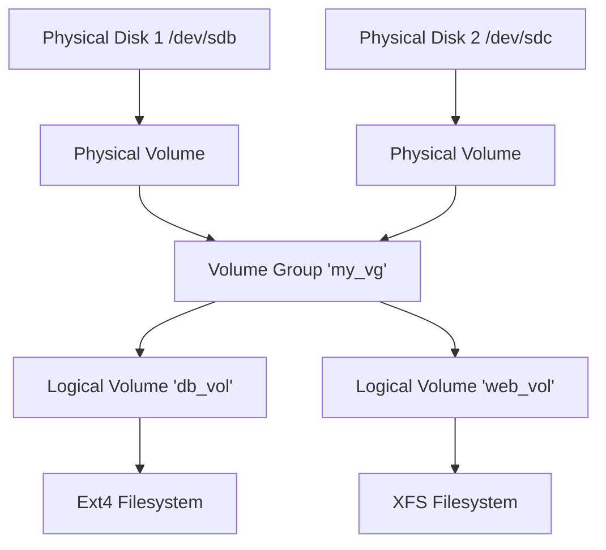

LVM allows you to abstract physical storage. You can combine multiple disks into one pool and resize volumes on the fly.

## Concepts



## Implementation Steps

### 1. Physical Volumes (PV)
Mark the raw disks for LVM use.
```bash
sudo pvcreate /dev/sdb /dev/sdc
```

### 2. Volume Group (VG)
Create a pool called `data_vg`.
```bash
sudo vgcreate data_vg /dev/sdb /dev/sdc
```

### 3. Logical Volume (LV)
Carve out a chunk.
```bash
# Create a 10GB volume named 'backups'
sudo lvcreate -n backups -L 10G data_vg
```
It is accessed at `/dev/data_vg/backups`.

### 4. Format and Mount
Treat it like a normal partition.
```bash
sudo mkfs.ext4 /dev/data_vg/backups
sudo mount /dev/data_vg/backups /mnt/backups
```

## Resizing (The magic of LVM)
If you run out of space in `backups`, and `data_vg` has free space:

```bash
# Extend the LV and the Filesystem in one go (-r)
sudo lvextend -L +5G -r /dev/data_vg/backups
```
