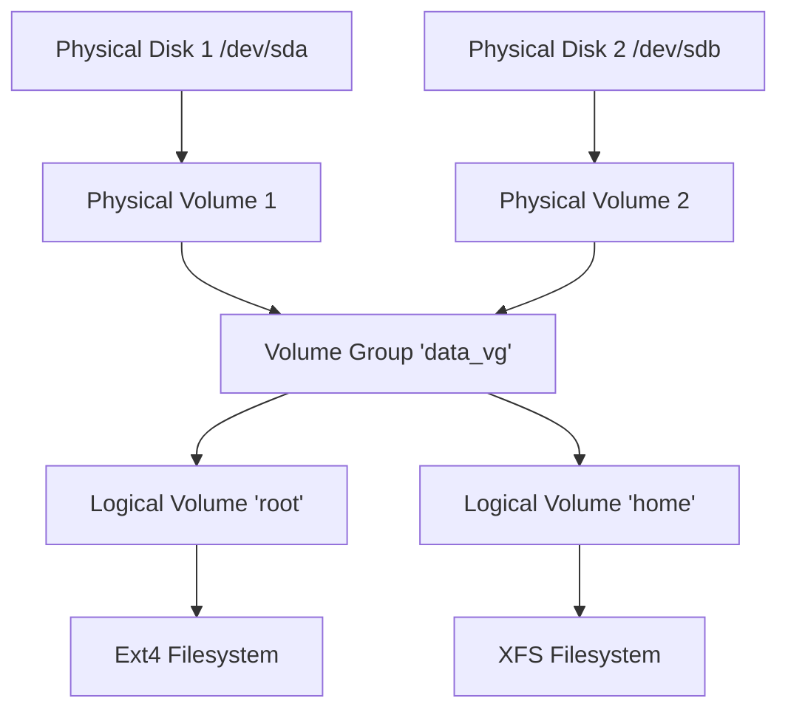

**Duration**: 4 hours

This module covers how Linux interacts with storage devices, from physical disks to mounted file systems.

## Topics Covered

### 1. Block Devices and Partitions
- Identifying devices (`/dev/sda`, `/dev/nvme0n1`).
- Partitioning tools: `fdisk` (MBR) and `gdisk` (GPT).

### 2. File Systems
- Creating file systems (formatting): `mkfs.ext4`, `mkfs.xfs`.
- Mounting file systems manually: `mount`.

### 3. Logical Volume Management (LVM)
Flexible storage management.
- Physical Volumes (PV) -> Volume Groups (VG) -> Logical Volumes (LV).

### 4. Persistent Mounts and Network Storage
- Configuring `/etc/fstab` for automatic mounting on boot.
- Accessing network storage via NFS.
