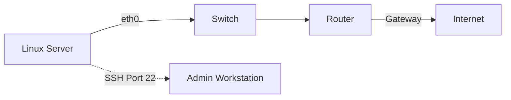

**Duration**: 6 hours

This module ensures you can connect your Linux server to the world securely.

## Topics Covered

### 1. Static IP Configuration
- Understanding IP addressing, subnets, and gateways.
- Tools: `ip addr`, `ip route`, `ping`, `ss` (socket statistics).
- Configuration via Netplan (Ubuntu) or NetworkManager (RHEL/Rocky).

### 2. Firewalls
Protecting the server from unwanted traffic.
- **UFW** (Uncomplicated Firewall) for Ubuntu.
- **firewalld** for RHEL/Rocky.
- Allowing/Denying specific ports and services.

### 3. Secure SSH Configuration
Hardening remote access.
- Generating key pairs (`ssh-keygen`).
- Disabling password authentication in `/etc/ssh/sshd_config`.
- Managing `.ssh/authorized_keys`.

### 4. Introduction to Security
- Basic concepts of **SELinux** and **AppArmor** (Mandatory Access Control).
- Why they are important and how to check their status.
