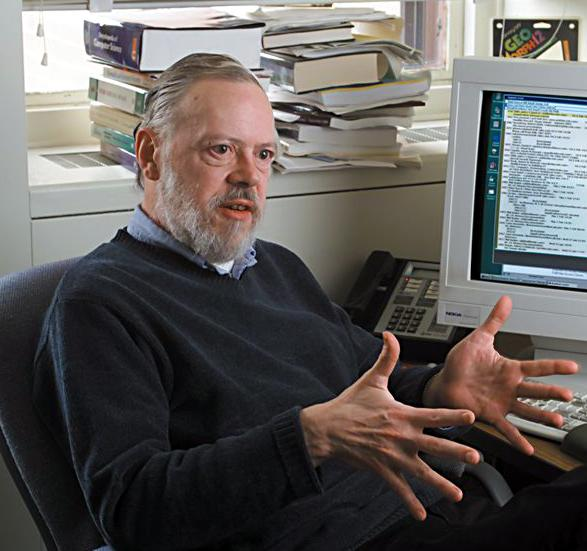
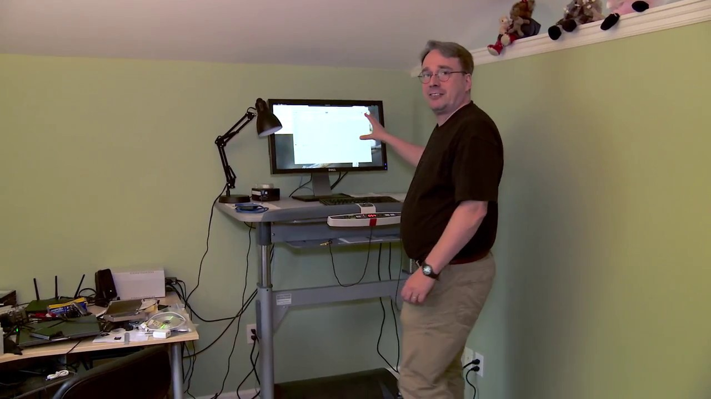
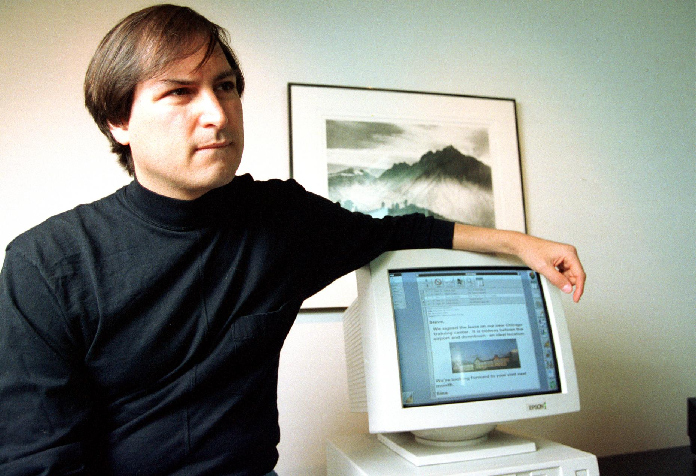
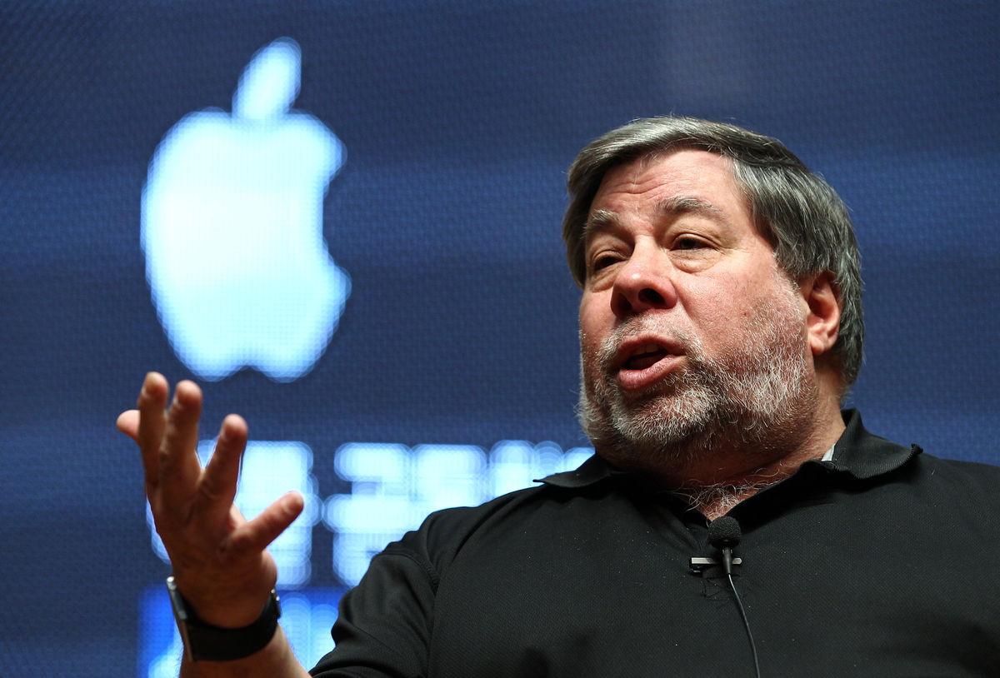
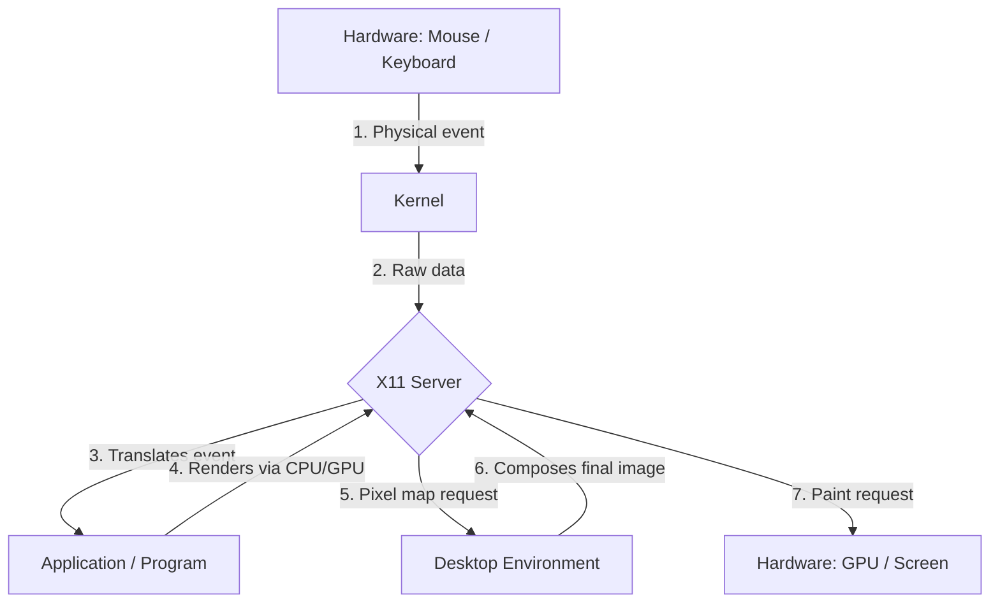
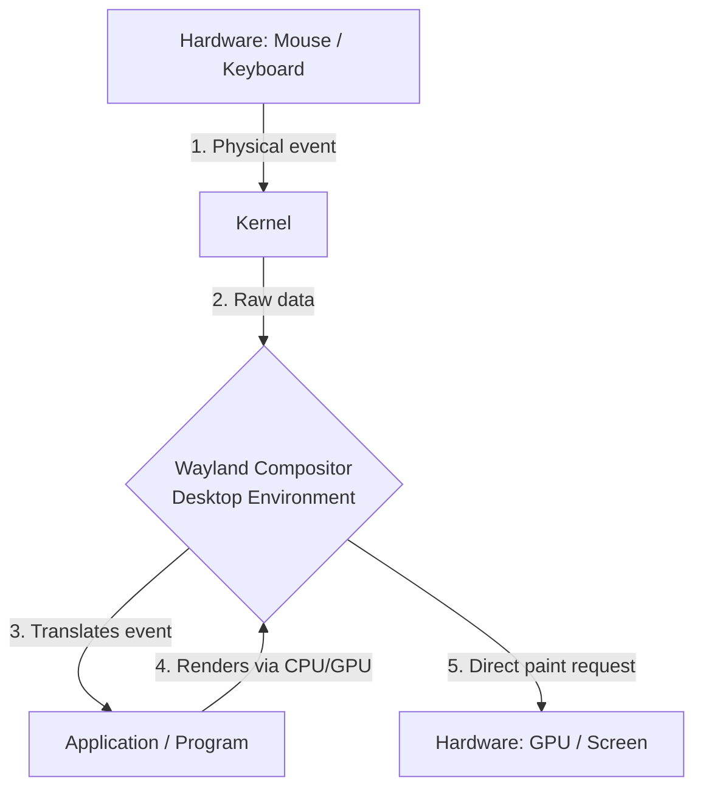
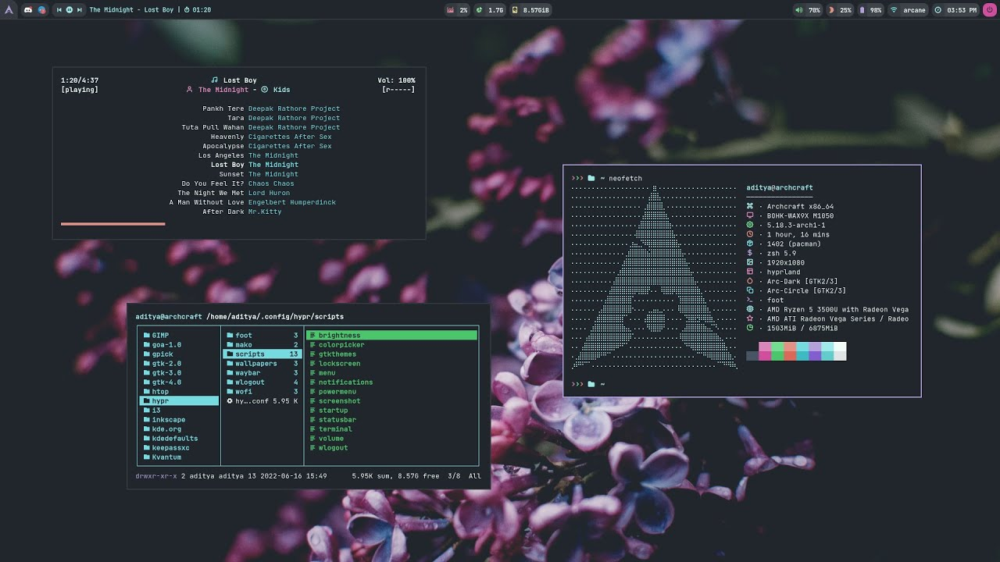
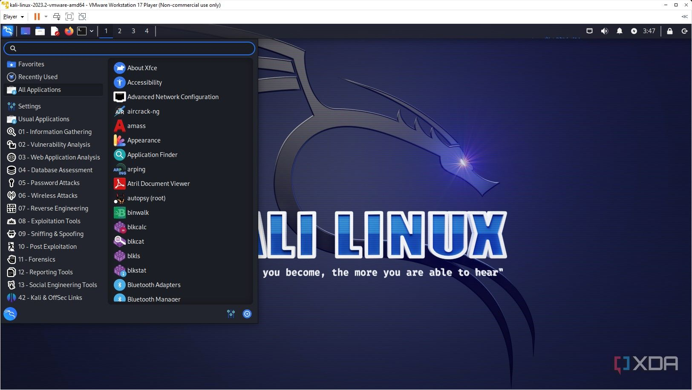

import { Aside, Tabs, TabItem, Card, CardGrid, Code } from "@astrojs/starlight/components";
import MultipleChoice from "@/components/tutorial/MultipleChoice.astro";
import Option from "@/components/tutorial/Option.astro";
import { Icon } from 'astro-icon/components';

## 1. Brief History and Philosophy

To understand how Linux works, especially as a System Administrator in the modern server environment, it helps to understand where it comes from.

### From Unix to Linux

1. **Unix (1970s)**: Originally developed by researchers at AT&T Bell Laboratories (including Ken Thompson and Dennis Ritchie). Its design aimed to create hierarchical file operating systems and small utilities that did one thing, but did it well (the "Unix Philosophy"). Unix, however, became highly costly proprietary software.
2. **The GNU Project (1983)**: Richard Stallman launched the GNU Project (_GNU's Not Unix_) with the goal of creating a complete, free, and open-source operating system that behaved like Unix. They spent years rebuilding free versions of all the essential Unix utilities (like `ls`, `grep`, the GCC compiler, etc.). But by the early 90s, their kernel, called GNU Hurd, was still not ready.
3. **The Linux Kernel (1991)**: Linus Torvalds, a student in Finland, wrote his own hobby kernel and combined it with the GNU utilities. This marriage of tools (GNU) + kernel (Linux) is what technically forms the complete operating system we commonly call, in abbreviated form, "Linux".

### Operating Systems

<Tabs>
  <TabItem label="Original Unix">
    
    > Dennis Ritchie
    
    **Ken Thompson & Dennis Ritchie — Bell Labs, AT&T (1970s)**

    They developed Unix and the C language at AT&T Bell Laboratories. Their design aimed to create hierarchical file systems and small utilities that did one thing —but did it well— (the "Unix Philosophy"). Unix, however, became high-cost proprietary software with restricted use.

    **Legacy:** the entire family of modern operating systems —Linux, macOS, BSD— descends philosophically or directly from their work.
  </TabItem>

  <TabItem label="GNU/Linux">
    
    > Linus Torvalds

    [Linus Torvalds on Github](https://github.com/torvalds)
    
    **Richard Stallman (GNU, 1983) + Linus Torvalds (kernel, 1991)**

    Richard Stallman launched the GNU Project to rebuild a completely free Unix. He created essential tools (GCC, Bash, `ls`, `grep`…) but lacked the kernel. In 1991, Linus Torvalds, at age 21, wrote the Linux kernel and joined it with the GNU tools. At 21 he announced on a mailing list: *"I'm doing a free operating system, just a hobby, won't be big and professional like GNU."* That hobby today powers:

    - **96%** of the world's web servers (Apache, Nginx…)
    - The infrastructure of AWS, Google Cloud and Azure
    - Android (3 billion devices)
    - **100%** of the Top500 supercomputers worldwide

    **Notable Distros:** Debian, Ubuntu, Fedora, Arch Linux, RHEL

    **Kernel:** Linux · **License:** GPLv2 · **Default Shell:** Bash / Zsh
  </TabItem>

  <TabItem label="macOS">
  <CardGrid>
  <Card title="Steve Jobs">
    
  </Card>
  <Card title="Steve Wozniak">
    
  </Card>
  </CardGrid>
    **Steve Jobs & Steve Wozniak — Apple (2001)**

    Apple built macOS on a BSD Unix kernel in a direct chain: AT&T Unix → BSD (UC Berkeley) → NeXTSTEP (Jobs after leaving Apple) → Darwin/XNU (back at Apple). macOS is today a Unix system **certified by The Open Group**, meaning its terminal is fully compatible with standard POSIX commands.

    - **XNU**: Apple's hybrid kernel (Mach microkernel + BSD components)
    - POSIX-compliant: Bash/Zsh scripts work the same as on Linux
    - Homebrew: the most popular unofficial package manager for macOS
    - iOS, iPadOS and tvOS share the same Darwin/XNU kernel

    **Kernel:** XNU (Darwin) · **License:** APSL (partially open source) · **Default Shell:** Zsh
  </TabItem>

  <TabItem label="BSD">
  <Icon name="bsd" style="width: 4em; height: 4em;"/>
    **Origin:** AT&T Unix → UC Berkeley → free BSD (1993)

    The BSD family (Berkeley Software Distribution) is pure Unix, reimplemented under a free license by the University of California at Berkeley. Its code is so mature that Apple used it as the foundation for macOS. Today there are three active branches:

    - **FreeBSD**: high performance and storage (used by Netflix, PlayStation 4/5)
    - **OpenBSD**: the most audited system in the world, base for many firewalls and routers
    - **NetBSD**: maximum portability; runs on almost any hardware architecture

    **Kernel:** BSD · **License:** BSD License (very permissive) · **Default Shell:** csh / sh
  </TabItem>

  <TabItem label="Windows (NT)">
  <Icon name="wind" style="width: 4em; height: 4em;"/>
    **Origin:** Windows NT — Dave Cutler, Microsoft (1993) — does not descend from Unix

    Windows NT was designed from scratch with ideas from VMS (Digital Equipment Corporation), **not** from Unix. However, over the years Microsoft added Unix compatibility:

    - **WSL2**: runs a real Linux kernel inside Windows 10/11
    - PowerShell: adopts Unix-inspired pipes
    - Windows servers (IIS, Active Directory) commonly coexist with Linux in hybrid infrastructures

    A modern sysadmin usually manages both environments simultaneously.

    **Kernel:** Windows NT · **License:** Proprietary · **Default Shell:** PowerShell / CMD
  </TabItem>
</Tabs>

---

### The "Everything is a File" Philosophy

One of the most defining principles Linux inherits from Unix is that **"Everything is a File"**. This is not a metaphor. In Linux:

- A text document is a file.
- Directories (folders) are files (that contain lists of other files).
- Your hard drives and USB drives are represented as files in the `/dev` directory (e.g. `/dev/sda`).
- Running processes in RAM have their own virtual "file" in the `/proc` filesystem.

If you master the tools to manipulate text files, you'll be able to manipulate most of the operating system configuration.

---

## 2. The Linux Ecosystem and Our Goal: Debian

Today, the term "Linux" refers to the kernel. To have a usable system, various organizations and communities package the kernel together with hundreds of other GNU tools and programs, an init system, and more. These packages are called **Distributions** or **"Distros"**.

For a system administrator, there are two giant corporate/community families that dominate servers:

1.  **Red Hat Family (RHEL)**: Uses package managers like `dnf` and `/rpm`. It is the standard for many corporations. Examples: Red Hat Enterprise Linux, Fedora, Rocky Linux, AlmaLinux.
2.  **Debian Family**: Uses package managers like `apt` or `apt-get` and the `.deb` package system.

<Aside type="note" title="This Course Focus: Debian">
  Throughout our 32 hours of training for the LFCS certification,
  **we will use the Debian distribution (and its direct derivatives like Ubuntu
  Server) as our main reference platform**.
   
  [Visit Debian](https://www.debian.org/)
   
  Debian is known for its extreme stability (its "Stable" branch only receives
  updates after they have been exhaustively tested), its rigorous adherence to
  Open Source principles, and its enormous package repository.
  Learning Debian today means having a solid foundation for administering the
  overwhelming majority of modern Docker containers and cloud servers.
</Aside>

---

## 2.1 Linux Distributions

A distribution (or "distro") takes the Linux kernel and adds additional software, such as a package manager, GNU utilities, and typically a desktop environment, to create a complete operating system that the end user or administrator can use.

Distros are commonly divided into "families" based on their origin and package management system:

- **Debian Family** (Debian, Ubuntu, Linux Mint): Use `apt` and `.deb` packages. Famous for their large community and incredible stability. They are the de facto standard in containers and cloud servers.
- **Red Hat Family** (RHEL, Fedora, CentOS, Rocky Linux): Use `dnf`/`yum` and `.rpm` packages. Very common in traditional enterprise and corporate environments.
- **Arch Family** (Arch Linux, Manjaro): Use `pacman` and a *rolling release* model (continuous updates). Popular among enthusiasts who want the latest software on a minimalist system.

<Tabs>
  <TabItem label="Arch Linux">
    <Icon name="arch" style="width: 3rem; height: 3rem;" />

    Arch Linux is the most minimalist distro and the one that gives the user the most control. It has no default graphical environment; instead it installs with a minimum of packages and can be configured from scratch. It is the distro that most resembles a traditional operating system, but with the advantage that you can install whatever you need.

    **Family:** Rolling release · **Packages:** `pacman` · [Visit Arch Linux](https://archlinux.org/)
  </TabItem>

  <TabItem label="Debian">
    <Icon name="debian" style="width: 3rem; height: 3rem;" />

    Debian is one of the oldest and most stable free operating systems. Known for its rigorous testing system and its immense software repository, it serves as the fundamental foundation for countless modern distributions (including Ubuntu). It is the de facto standard for servers due to its extreme reliability.

    **Family:** Debian · **Packages:** `apt` / `.deb` · [Visit Debian](https://www.debian.org/)
  </TabItem>

  <TabItem label="Fedora">
    <Icon name="fedora" style="width: 3rem; height: 3rem; color: #007acc;" />

    Fedora is an independent distribution funded by Red Hat that is always at the technological cutting edge (*bleeding edge*). It incorporates the latest versions of free software and innovations that, after being tested and maturing in Fedora, will eventually become part of future stable versions of RHEL.

    **Family:** Red Hat · **Packages:** `dnf` / `.rpm` · [Visit Fedora](https://fedoraproject.org/)
  </TabItem>

  <TabItem label="RHEL">
    <Icon name="redhat" style="width: 3rem; height: 3rem;" />

    Red Hat Enterprise Linux is the leading open-source but commercially used Linux distribution designed for the enterprise sector. It stands out for offering robust technical support, certified security, and incredibly long software lifecycles, being the centerpiece of critical corporate infrastructures.

    **Family:** Red Hat · **Packages:** `dnf` / `.rpm` · [Visit Red Hat](https://www.redhat.com/)
  </TabItem>

  <TabItem label="Ubuntu">
    <Icon name="ubuntu" style="width: 3rem; height: 3rem; color: #ff8000;" />

    Ubuntu is a popular and stable distribution developed by Canonical (and closely based on Debian). Initially focused on ease of use for desktop users, it has also become a top choice for servers and cloud software deployment thanks to its LTS (Long Term Support) versions.

    **Family:** Debian · **Packages:** `apt` / `.deb` · [Visit Ubuntu](https://ubuntu.com/)
  </TabItem>
</Tabs>

<Aside type="tip" title="Linux Distributions">
You can explore the full extensive Linux distribution family tree in this extensive [Wikipedia](https://en.wikipedia.org/wiki/List_of_Linux_distributions) article.
</Aside>

---

### 2.2 Desktop Environments (X11 vs Wayland)

<Aside type="caution" title="Servers without interface">
  Keep in mind that **as system administrators we will normally manage servers in *headless* mode (without a screen or visual interface)**, operating almost exclusively through the command-line interface (CLI) remotely via SSH.
</Aside>

In operating systems like Windows or macOS, the graphical user interface (GUI) is intrinsically tied to the system kernel. In Linux, the graphical interface is simply a set of user-space programs running on top of the base system, offering high modularity.

For a graphical interface to exist, a **Graphics Server** (or Display Server) is used, with two main options:

- **X11 (X.Org)**: The traditional standard that has been in use for decades. It is extremely compatible with most software, but its old code base and design do not offer the level of isolation and security required by modern systems.
- **Wayland**: The modern protocol designed as a logical replacement for X11. It is fundamentally more secure against keystroke and system capture (*keyloggers*), and handles different refresh rates and scaling on high-resolution monitors much more smoothly and independently. Most modern desktop distros adopt it by default.

Below is a simplified diagram comparing how inefficient and long the graphics path in X11 is compared to the direct architecture of Wayland (and why the latter consumes fewer CPU/GPU resources):

#### X11 Architecture (The Long Way)

#### Wayland Architecture (The Direct Way)

On top of this server, the **Desktop Environment** is built, responsible for the *look & feel* and interaction design of the system (window management, menus, file explorer, settings). Very popular alternatives include:

- **GNOME**: Design focused on modernism, minimalism, and keyboard shortcut and gesture workflows (default environment in Ubuntu and Fedora).
- **KDE Plasma**: Highly customizable and full of utilities; more familiar to recent users migrating from Windows.
- **XFCE**: Efficient, simple, and extremely lightweight, created with the purpose of optimizing computational resources and extending the useful life of older hardware.

<Aside type="caution" title="Linux Distributions vs Desktop Environments">
It is essential **not to confuse a distribution with a desktop environment**. Ubuntu, for example, is a distribution that by default comes with GNOME desktop integrated, but you can perfectly modify the system to install and launch a different environment like KDE Plasma or XFCE.
</Aside>
---

<CardGrid>
  <Card title="Hyprland (Wayland)">
    
  </Card>
  <Card title="KDE Plasma (X11)">
    
  </Card>
</CardGrid>

## 3. What is a Modern Sysadmin?

A Linux System Administrator is the plumber, architect, and bodyguard of the digital infrastructure.

### Your Main Tasks

1. **Setup and Configuration**: Install the OS without a graphical interface (headless), configure accounts, and ensure network services respond.
2. **Maintenance and Performance**: Monitor disk saturation and RAM bottlenecks through specialized tools without a windowing environment (X11 or Wayland).
3. **Security**: Audit and reduce permissions (`chmod`, `chown`, ACLs), review logs, and configure firewalls (`ufw` or `iptables`).
4. **Automation**: Instead of manually typing the same command on 10 servers, write a script (in `bash`) that does it for you.

<Code lang="bash" title="maintenance.sh" code={`#!/bin/bash
# maintenance.sh — Routine maintenance on Ubuntu servers
# Usage: sudo bash maintenance.sh

set -euo pipefail

LOG="/var/log/maintenance.log"
DATE=$(date '+%Y-%m-%d %H:%M:%S')

echo "[\$DATE] Starting maintenance" | tee -a "\$LOG"

# 1. Update packages
echo "[INFO] Updating packages..." | tee -a "\$LOG"
apt-get update -qq && apt-get upgrade -y >> "\$LOG" 2>&1

# 2. Remove orphaned packages
echo "[INFO] Cleaning up unnecessary packages..." | tee -a "\$LOG"
apt-get autoremove -y >> "\$LOG" 2>&1
apt-get autoclean -y  >> "\$LOG" 2>&1

# 3. Check disk space (warns if over 80%)
USAGE=$(df / | awk 'NR==2 {print \$5}' | tr -d '%')
if [ "\$USAGE" -gt 80 ]; then
  echo "[WARN] Disk at \${USAGE}% — review /var/log or /tmp" | tee -a "\$LOG"
fi

# 4. Restart stopped services managed by systemd
for SERVICE in nginx postgresql ssh; do
  if ! systemctl is-active --quiet "\$SERVICE"; then
    echo "[WARN] \$SERVICE is down — restarting..." | tee -a "\$LOG"
    systemctl restart "\$SERVICE"
  fi
done

echo "[\$DATE] Maintenance completed" | tee -a "\$LOG"
`} />

---

## 4. Industry Certifications

Understanding how this ecosystem works and being able to navigate without a mouse is fundamental, and validating it through certifications will boost your career.

### Linux Foundation Certified Sysadmin (LFCS)

Our goal for the upcoming lessons is to prepare you for the **LFCS**.

- **Focus**: Quick and practical ability to install, configure, and troubleshoot from the CLI in Enterprise environments.
- **Provider**: The Linux Foundation, the neutral guild that supports Kernel development.
- **Exam Format**: **100% Performance-Based** (Live Terminal Practical Scenario). You have 2 hours to connect to a remote console and resolve tickets via the terminal on the spot.
- **Distributions**: At the time of enrollment, you must choose between Ubuntu 20.04 (Debian family) or CentOS Stream (Red Hat family). We will focus on preparing for Ubuntu/Debian.

<Aside type="tip">
  **Muscle Memory is the Key** Since the exam requires you to run real commands
  to fix real systems remotely, theory (reading this manual) will not be useful
  without the continuous practice of hitting the keyboard until commands flow
  naturally without having to look them up (tactile memorization).
</Aside>

---

## Check Your Knowledge

To consolidate what you've learned in this lesson, answer these integrative questions:

1. Historically, why was the creation of the GNU Project vital before the Linux Kernel?

   <MultipleChoice>
     <Option>
       Because Linus Torvalds needed a graphical interface to compile C.
     </Option>
     <Option isCorrect>
       Because Unix was proprietary/closed, and GNU provided the essential free
       utility tools (ls, grep, compilers) to which the Kernel was later coupled.
     </Option>
     <Option>
       Because GNU was actually the first kernel developed in the 1970s.
     </Option>
   </MultipleChoice>

2. Which of the following statements best describes the "Everything is a File" principle in Linux?

   <MultipleChoice>
     <Option>
       All text files must end with the `.txt` extension for the Kernel to read them.
     </Option>
     <Option>
       Linux saves a physical copy of RAM to the hard drive every time we boot.
     </Option>
     <Option isCorrect>
       Hardware components (like `/dev/sda`) and RAM processes (`/proc`) are
       represented and interacted with in the system in an identical way to
       standard text files.
     </Option>
   </MultipleChoice>

3. Regarding the LFCS certification exam, what is its main format?
   <MultipleChoice>
     <Option>
       Multiple choice and true/false questions about Kernel architecture.
     </Option>
     <Option isCorrect>
       100% Performance-Based, solving problems using real commands in a live
       terminal.
     </Option>
     <Option>
       A Bash development project submitted after one week.
     </Option>
   </MultipleChoice>
