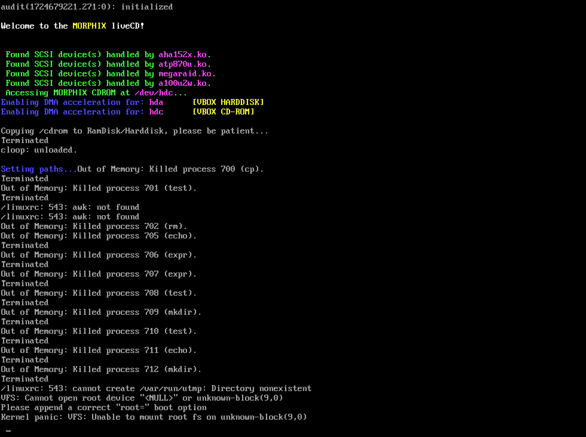
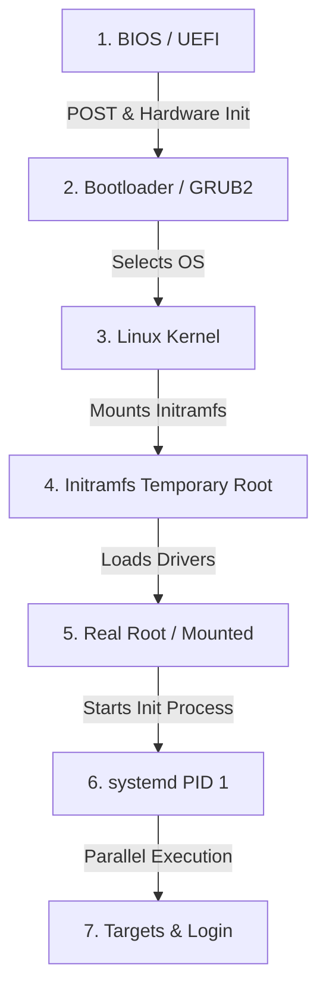

import { Aside, Tabs, TabItem, FileTree, LinkCard } from "@astrojs/starlight/components";
import PreCheck from "@/components/tutorial/PreCheck.astro";
import MultipleChoice from "@/components/tutorial/MultipleChoice.astro";
import Option from "@/components/tutorial/Option.astro";

<PreCheck>
  - You will learn the nomenclature Linux uses to interact with disks (e.g.
  `/dev/sda`, `/dev/nvme0n1`). - You will understand the limitations of the old MBR
  compared to modern GPT. - You will memorize the critical boot stages from
  BIOS until `systemd` takes control with PID 1.
</PreCheck>

For a system administrator operating servers, a hard disk failure or a system that gets "frozen" during boot (kernel panic) are everyday occurrences. Understanding exactly how Linux detects disks and which files are involved in reaching the login screen is vital.

---

## 1. Disk Handling in Linux

In Linux, hard drives and other block storage media are represented as files in the `/dev` directory.

The naming depends on the type of physical connection or bus:

- **SATA/SAS Disks (Traditional and SSDs):** `/dev/sda` (first disk), `/dev/sdb` (second disk), etc.
- **NVMe Disks (High-performance PCIe):** `/dev/nvme0n1` (first disk), `/dev/nvme1n1` (second disk).
- **SD / eMMC Readers:** `/dev/mmcblk0`.

When we partition a disk, each partition is assigned a number:

- Partitions of `/dev/sda` are called `/dev/sda1`, `/dev/sda2`, etc.
- Partitions of `/dev/nvme0n1` are called `/dev/nvme0n1p1`, `/dev/nvme0n1p2`, etc.

### MBR vs GPT

- **MBR (Master Boot Record):** The old standard. Limited to a maximum of 4 primary partitions and does not support disks larger than 2 Terabytes. Stored in the first absolute sector of the disk.
- **GPT (GUID Partition Table):** The modern standard tied to UEFI motherboards. Allows up to 128 partitions by default on Linux and supports disks of massive Zettabyte sizes. Contains backup copies of itself at the end of the disk to prevent corruption.

---

## 2. Filesystems

Painting the "lane markings" on a disk so Linux knows how to organize folders requires formatting them with a _filesystem_.

- **ext4 (Fourth Extended Filesystem):** The traditional de facto standard in the Debian family and most of Linux. It is fast, has excellent compatibility, and is _journaling_ (maintains a journal of what it is about to write before doing it, to avoid corruption if there is a power outage).
- **xfs:** The default standard in the RHEL family. Ultra-optimized for handling files in parallel and of gigantic sizes.
- **btrfs and ZFS:** Next-generation (Copy-on-Write) systems that manage partitioning and files simultaneously, allowing native "snapshots" (system photographs in time) without extra tools.

---

## 3. Common Partitioning Schemes

<LinkCard
  title="FHS directory tree"
  description="Review how the Linux filesystem is organized before deciding how to partition."
  href="/en/modules/module-1/2-installation/#2-the-directory-tree-fhs"
/>

The installer for distributions like Ubuntu or Debian usually asks you whether you want **everything together** or to separate `/home`. Here are the three most common scenarios:

<Tabs>
  <TabItem label="🖥️ Minimum (all together)">
    The simplest option: everything in a single root partition. Valid for VMs, test environments, or machines with limited space.

    | Partition | Mount point | Filesystem | Suggested size |
    |-----------|-------------|------------|----------------|
    | `/dev/sda1` | `/boot/efi` | FAT32 | 512 MB |
    | `/dev/sda2` | `[SWAP]` | swap | RAM × 1-2 |
    | `/dev/sda3` | `/` | ext4 | All the rest |

    <FileTree>
    - / *Entire system in a single partition*
      - boot/
        - efi/ `sda1` — FAT32, 512 MB
      - home/ `sda3` — same disk as the system
        - user/
      - var/
        - log/
      - etc/
      - tmp/
    </FileTree>

    <Aside type="caution">
      If a user fills `/home` with large files, the operating system also runs out of space and may stop working.
    </Aside>
  </TabItem>

  <TabItem label="🏠 Desktop (/home separate)">
    The option typically offered by Ubuntu's graphical installer. Separating `/home` allows reinstalling the system without losing user data.

    | Partition | Mount point | Filesystem | Suggested size |
    |-----------|-------------|------------|----------------|
    | `/dev/sda1` | `/boot/efi` | FAT32 | 512 MB |
    | `/dev/sda2` | `[SWAP]` | swap | RAM × 1-2 |
    | `/dev/sda3` | `/` | ext4 | 30–50 GB |
    | `/dev/sda4` | `/home` | ext4 | All the rest |

    <FileTree>
    - / `sda3` — ext4, 30-50 GB
      - boot/
        - efi/ `sda1` — FAT32, 512 MB
      - etc/
      - var/
        - log/
      - tmp/
    - home/ `sda4` — ext4, independent partition
      - user/
        - documents/
        - projects/
    </FileTree>

    <Aside type="tip">
      With `/home` on its own partition you can format `/` and reinstall the operating system while keeping all your documents, user configurations, and projects intact.
    </Aside>
  </TabItem>

  <TabItem label="🖧 Server (production)">
    In server environments, `/var` and optionally `/tmp` are isolated to prevent uncontrolled logs or databases from collapsing the system. This is the recommended scheme for the LFCS.

    | Partition | Mount point | Filesystem | Suggested size |
    |-----------|-------------|------------|----------------|
    | `/dev/sda1` | `/boot/efi` | FAT32 | 512 MB |
    | `/dev/sda2` | `[SWAP]` | swap | RAM × 1 |
    | `/dev/sda3` | `/` | ext4 / xfs | 20–30 GB |
    | `/dev/sda4` | `/var` | ext4 / xfs | 20–100 GB |
    | `/dev/sda5` | `/home` | ext4 | Remaining space |

    <FileTree>
    - / `sda3` — ext4/xfs, 20-30 GB
      - boot/
        - efi/ `sda1` — FAT32, 512 MB
      - etc/
      - tmp/
    - var/ `sda4` — ext4/xfs, 20-100 GB
      - log/ *System logs — can grow without limit*
      - lib/
        - postgresql/
        - mysql/
      - www/
        - html/
    - home/ `sda5` — ext4, remaining space
      - deploy/
      - admin/
    </FileTree>

    <Aside type="note">
      `/var` contains `/var/log` (system logs), `/var/lib` (databases like PostgreSQL or MySQL), and `/var/www` (web files with Apache/Nginx). Isolating it prevents an uncontrolled log from filling the root disk and taking down the server.
    </Aside>
  </TabItem>
</Tabs>

---

## 4. The Boot Process (From Power Button to Active Server)

What happens from the moment you turn on the metal machine until you can type commands?

1. **Firmware (BIOS/UEFI):** Initializes rudimentary hardware (CPU, memory, keyboard). Checks nothing is short-circuited (POST) and looks for the `/boot/efi` partition to find the boot manager.
2. **Bootloader (GRUB2):** Reads its configuration (`/boot/grub/grub.cfg`) which says where the Kernel is physically located. Loads the Kernel and a file called `initramfs` into RAM, and hands over control.
3. **The Kernel (`vmlinuz`):** Auto-detects hardware at low level. Begins managing memory. It is the absolute brain.
4. **Initramfs (Initial RAM Filesystem):** The Kernel initially does not know how to read the real hard disk (`ext4`, LVM volumes, or if it is encrypted with a password). The `initramfs` is a "mini-Linux" loaded into RAM that contains only the _drivers_ (modules) needed to know how to read the actual central hard disk.
5. **Root Mounting:** Once past the `initramfs`, the system mounts the real disk at the root (`/`).
6. **Init (`systemd`):** The Kernel runs the first real program: `/sbin/init` (which on modern systems is always `systemd`). It is assigned Process ID 1 (`PID 1`).
7. **Systemd Targets:** `systemd` reads its configuration and starts services in parallel to reach a target "Target". For example, `multi-user.target` for servers. It initializes the network, SSH, mounts databases, and finally displays the **Login Prompt**.

<Aside type="caution" title="What is a Kernel Panic screen?">
  If the Kernel cannot find or mount the root partition (Step 5) because
  `/etc/fstab` is misconfigured, the process stops with a fatal
  *Kernel Panic*. It cannot continue because it cannot find disk files
  to execute. We will learn to diagnose this in future modules!
</Aside>

---

## Check Your Knowledge

1. You are installing Linux on a server with an ultra-fast NVMe disk. Under what path and filename would you typically look for it in the terminal to partition it?

   <MultipleChoice>
     <Option>`/mnt/nvme-drive1`</Option>
     <Option>`/dev/sda`</Option>
     <Option isCorrect>`/dev/nvme0n1`</Option>
   </MultipleChoice>

2. Which of the following is a critical historical limitation of the MBR (Master Boot Record) partition scheme that was overcome by GPT?

   <MultipleChoice>
     <Option>
       MBR limited the maximum transfer speed to 300 MB/s.
     </Option>
     <Option isCorrect>
       MBR only supported a maximum of 4 primary partitions and did not recognize
       disks larger than ~2 Terabytes.
     </Option>
     <Option>
       MBR only worked with Red Hat-derived distributions.
     </Option>
   </MultipleChoice>

3. During the Linux boot process, what piece of software is responsible for loading a temporary "mini-Linux" into RAM with just the drivers needed to mount the real hard disk?
   <MultipleChoice>
     <Option>The UEFI Firmware</Option>
     <Option>Systemd (PID 1)</Option>
     <Option isCorrect>
       The Bootloader (GRUB2) loading the Kernel and `initramfs`
     </Option>
   </MultipleChoice>
