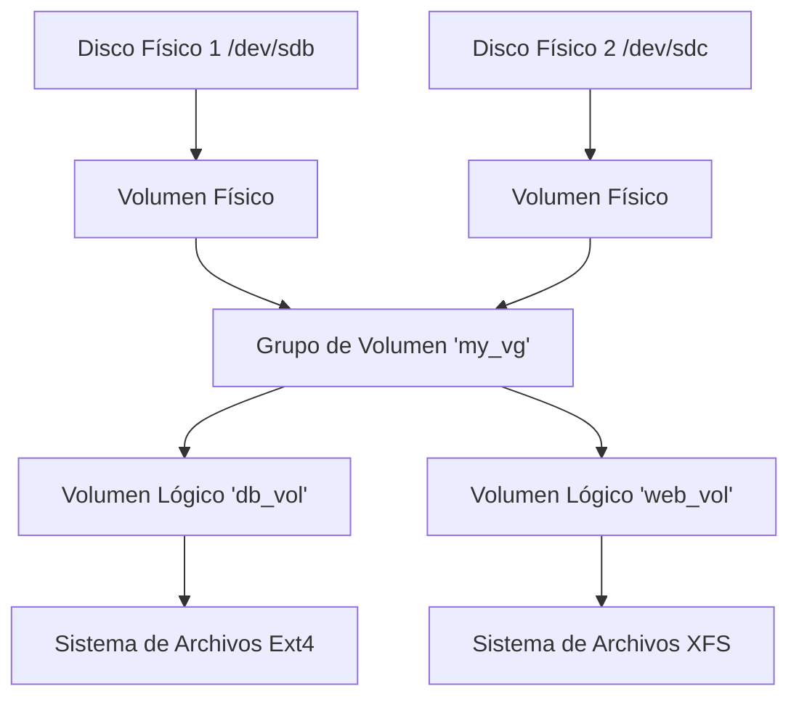

LVM te permite abstraer el almacenamiento físico. Puedes combinar múltiples discos en un grupo y redimensionar volúmenes sobre la marcha.

## Conceptos



## Pasos de Implementación

### 1. Volúmenes Físicos (PV)
Marca los discos en bruto para el uso de LVM.
```bash
sudo pvcreate /dev/sdb /dev/sdc
```

### 2. Grupo de Volumen (VG)
Crea un grupo llamado `data_vg`.
```bash
sudo vgcreate data_vg /dev/sdb /dev/sdc
```

### 3. Volumen Lógico (LV)
Recorta un trozo.
```bash
# Crear un volumen de 10GB llamado 'backups'
sudo lvcreate -n backups -L 10G data_vg
```
Se accede en `/dev/data_vg/backups`.

### 4. Formatear y Montar
Trátalo como una partición normal.
```bash
sudo mkfs.ext4 /dev/data_vg/backups
sudo mount /dev/data_vg/backups /mnt/backups
```

## Redimensionamiento (La magia de LVM)
Si te quedas sin espacio en `backups`, y `data_vg` tiene espacio libre:

```bash
# Extender el LV y el Sistema de Archivos de una vez (-r)
sudo lvextend -L +5G -r /dev/data_vg/backups
```
