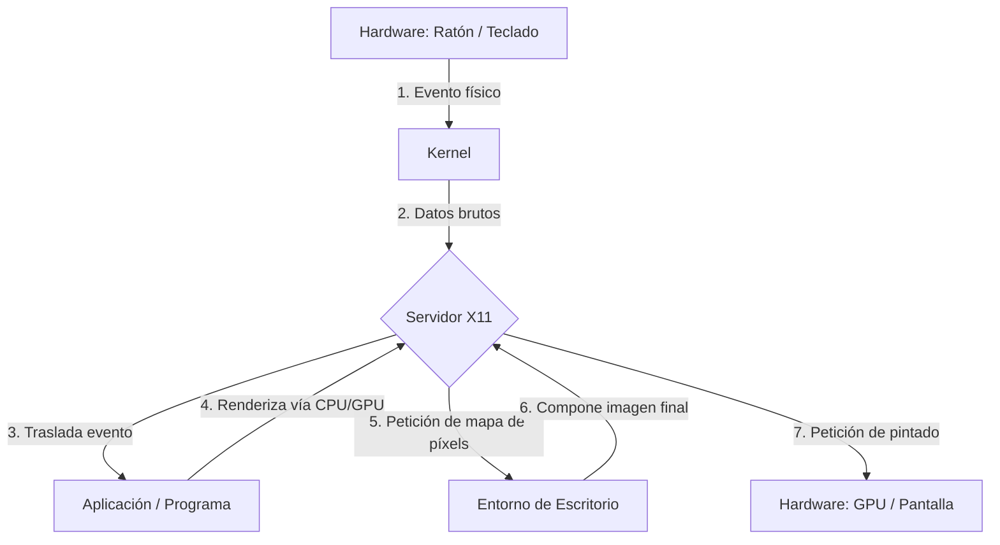
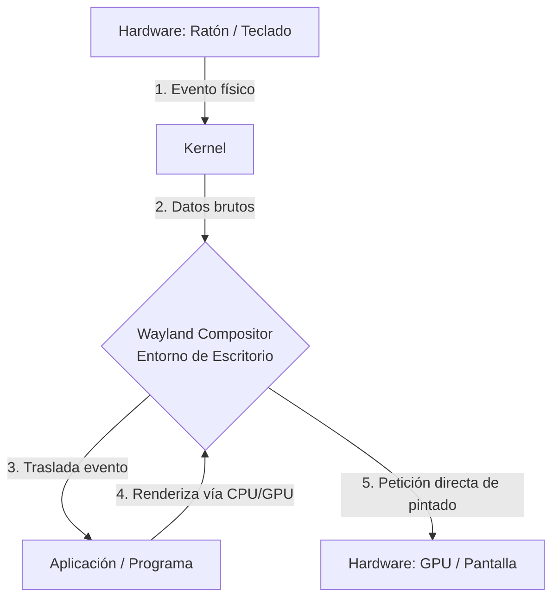

import { Aside, Tabs, TabItem, Card, CardGrid, Code } from "@astrojs/starlight/components";
import MultipleChoice from "@/components/tutorial/MultipleChoice.astro";
import Option from "@/components/tutorial/Option.astro";
import { Icon } from 'astro-icon/components';

## 1. Breve Historia y Filosofía

Para entender cómo funciona Linux, especialmente como Administrador de Sistemas en el entorno moderno de servidores, ayuda entender de dónde viene.

### De Unix a Linux

1. **Unix (Años 70)**: Desarrollado originalmente por investigadores en los Laboratorios Bell de AT&T (incluyendo a Ken Thompson y Dennis Ritchie). Su diseño apostó por crear sistemas operativos jerárquicos de archivos y utilidades pequeñas que hacían una sola cosa, pero la hacían bien (la "Filosofía Unix"). Unix, sin embargo, se volvió software propietario altamente costoso.
2. **El Proyecto GNU (1983)**: Richard Stallman lanzó el Proyecto GNU (_GNU's Not Unix_) con el objetivo de crear un sistema operativo completo, libre y de código abierto que se comportara como Unix. Dedicaron años a reconstruir versiones libres de todas las utilidades esenciales de Unix (como `ls`, `grep`, el compilador GCC, etc.). Pero a principios de los 90, su núcleo (o _kernel_), llamado GNU Hurd, aún no estaba listo.
3. **El Kernel de Linux (1991)**: Linus Torvalds, un estudiante en Finlandia, escribió su propio núcleo aficionado y lo combinó con las utilidades de GNU. Este matrimonio de herramientas (GNU) + núcleo (Linux) es lo que técnicamente forma el sistema operativo completo que hoy comúnmente llamamos, de manera abreviada, "Linux".

### Sistemas Operativos

<Tabs>
  <TabItem label="Unix original">
    
    > Dennis Ritchie
    
    **Ken Thompson & Dennis Ritchie — Bell Labs, AT&T (años 70)**

    Desarrollaron Unix y el lenguaje C en los Laboratorios Bell de AT&T. Su diseño apostó por crear sistemas jerárquicos de archivos y utilidades pequeñas que hacían una sola cosa —pero la hacían bien— (la «Filosofía Unix»). Unix, sin embargo, se convirtió en software propietario de alto coste y uso restringido.

    **Legado:** toda la familia de sistemas operativos modernos —Linux, macOS, BSD— desciende filosófica o directamente de su trabajo.
  </TabItem>

  <TabItem label="GNU/Linux">
    
    > Linus Torvalds

    [Github de Linus Torvalds](https://github.com/torvalds)
    
    **Richard Stallman (GNU, 1983) + Linus Torvalds (kernel, 1991)**

    Richard Stallman lanzó el Proyecto GNU para reconstruir un Unix completamente libre. Creó herramientas esenciales (GCC, Bash, `ls`, `grep`…) pero le faltaba el núcleo. En 1991 Linus Torvalds, con 21 años, escribió el kernel Linux y lo unió a las herramientas GNU. Con 21 años anunció en una lista de correo: *«Estoy haciendo un sistema operativo libre, solo un hobby, no será grande ni profesional como GNU»*. Ese hobby hoy sustenta:

    - El **96 %** de los servidores web del mundo (Apache, Nginx…)
    - La infraestructura de AWS, Google Cloud y Azure
    - Android (3.000 millones de dispositivos)
    - El **100 %** de los supercomputadores del Top500 mundial

    **Distros destacadas:** Debian, Ubuntu, Fedora, Arch Linux, RHEL

    **Kernel:** Linux · **Licencia:** GPLv2 · **Shell por defecto:** Bash / Zsh
  </TabItem>

  <TabItem label="macOS">
  <CardGrid>
  <Card title="Steve Jobs">
    
  </Card>
  <Card title="Steve Wozniak">
    
  </Card>
  </CardGrid>
    **Steve Jobs & Steve Wozniak — Apple (2001)**

    Apple construyó macOS sobre un núcleo BSD Unix en una cadena directa: Unix AT&T → BSD (UC Berkeley) → NeXTSTEP (Jobs tras salir de Apple) → Darwin/XNU (de vuelta en Apple). macOS es hoy un sistema Unix **certificado por The Open Group**, lo que significa que su terminal es plenamente compatible con comandos POSIX estándar.

    - **XNU**: kernel híbrido de Apple (Mach microkernel + componentes BSD)
    - POSIX-compliant: los scripts Bash/Zsh funcionan igual que en Linux
    - Homebrew: el gestor de paquetes no oficial más popular para macOS
    - iOS, iPadOS y tvOS comparten el mismo núcleo Darwin/XNU

    **Kernel:** XNU (Darwin) · **Licencia:** APSL (parcialmente open source) · **Shell por defecto:** Zsh
  </TabItem>

  <TabItem label="BSD">
  <Icon name="bsd" style="width: 4em; height: 4em;"/>
    **Origen:** Unix de AT&T → UC Berkeley → BSD libre (1993)

    La familia BSD (Berkeley Software Distribution) es Unix puro, reimplementado con licencia libre por la Universidad de California en Berkeley. Su código es tan maduro que Apple lo usó como base de macOS. Hoy existen tres ramas activas:

    - **FreeBSD**: alto rendimiento y almacenamiento (usado por Netflix, PlayStation 4/5)
    - **OpenBSD**: el sistema más auditado del mundo, base de muchos firewalls y routers
    - **NetBSD**: máxima portabilidad; corre en casi cualquier arquitectura de hardware

    **Kernel:** BSD · **Licencia:** BSD License (muy permisiva) · **Shell por defecto:** csh / sh
  </TabItem>

  <TabItem label="Windows (NT)">
  <Icon name="wind" style="width: 4em; height: 4em;"/>
    **Origen:** Windows NT — Dave Cutler, Microsoft (1993) — no desciende de Unix

    Windows NT fue diseñado desde cero con ideas de VMS (Digital Equipment Corporation), **no** de Unix. Sin embargo, a lo largo de los años Microsoft añadió compatibilidad Unix:

    - **WSL2**: ejecuta un kernel Linux real dentro de Windows 10/11
    - PowerShell: adopta pipes inspirados en Unix
    - Los servidores Windows (IIS, Active Directory) conviven habitualmente con Linux en infraestructuras híbridas

    Un sysadmin moderno suele gestionar ambos entornos de forma simultánea.

    **Kernel:** Windows NT · **Licencia:** Propietaria · **Shell por defecto:** PowerShell / CMD
  </TabItem>
</Tabs>

---

### La Filosofía "Todo es un archivo"

Uno de los principios más definitorios que hereda Linux de Unix es que **"Todo es un archivo"**. Esta no es una metáfora. En Linux:

- Un documento de texto es un archivo.
- Los directorios (carpetas) son archivos (que contienen listas de otros archivos).
- Tus discos duros y unidades USB están representados como archivos en el directorio `/dev` (ej. `/dev/sda`).
- Los procesos en ejecución de la memoria RAM tienen su propio "archivo" virtual en el sistema de archivos `/proc`.

Si dominas las herramientas para manipular archivos de texto, podrás manipular la mayor parte de la configuración del sistema operativo.

---

## 2. El Ecosistema Linux y nuestra meta: Debian

Hoy en día, el término "Linux" se refiere al núcleo (kernel). Para tener un sistema usable, varias organizaciones y comunidades empaquetan el kernel junto con cientos de otras herramientas y programas de GNU, un sistema de inicialización, y más. A estos empaquetados se les llama **Distribuciones** o **"Distros"**.

Para un administrador de sistemas, hay dos familias corporativas/comunitarias gigantes que dominan los servidores:

1.  **Familia Red Hat (RHEL)**: Utiliza gestores de paquetes como `dnf` y `/rpm`. Es el estándar de muchas corporaciones. Ejemplos: Red Hat Enterprise Linux, Fedora, Rocky Linux, AlmaLinux.
2.  **Familia Debian**: Utiliza gestores de paquetes como `apt` o `apt-get` y el sistema de paquetes `.deb`.

<Aside type="note" title="El Foco de este Curso: Debian">
  A lo largo de nuestras 32 horas de formación para la certificación LFCS,
  **utilizaremos la distribución Debian (y sus derivadas directas como Ubuntu
  Server) como nuestra plataforma principal de referencia**.
   
  [Visitar Debian](https://www.debian.org/)
   
  Debian es conocido por su extrema estabilidad (su rama "Stable" solo recibe
  actualizaciones cuando han sido exhaustivamente probadas), su rigurosa
  adhesión a los principios del Open Source y su enorme repositorio de paquetes.
  Aprender Debian hoy significa tener una base sólida para administrar la
  abrumadora mayoría de los contenedores Docker modernos y servidores en la
  nube.
</Aside>

---

## 2.1 Distribuciones Linux

Una distribución (o "distro") toma el kernel de Linux y le añade software adicional, como un gestor de paquetes, utilidades de GNU, y típicamente un entorno de escritorio, para crear un sistema operativo completo que el usuario final o administrador pueda usar.

Las distros se dividen comúnmente en "familias" según su origen y su sistema de gestión de paquetes:

- **Familia Debian** (Debian, Ubuntu, Linux Mint): Usan `apt` y paquetes `.deb`. Famosas por su gran comunidad e increíble estabilidad. Son el estándar de facto en contenedores y servidores en la nube.
- **Familia Red Hat** (RHEL, Fedora, CentOS, Rocky Linux): Usan `dnf`/`yum` y paquetes `.rpm`. Muy comunes en entornos empresariales y corporativos tradicionales.
- **Familia Arch** (Arch Linux, Manjaro): Usan `pacman` y un modelo *rolling release* (actualizaciones continuas). Populares entre entusiastas que desean tener instalado el software más reciente bajo un sistema minimalista.

<Tabs>
  <TabItem label="Arch Linux">
    <Icon name="arch" style="width: 3rem; height: 3rem;" />

    Arch Linux es la distro más minimalista y la que más control tiene el usuario. No tiene un entorno gráfico por defecto, sino que se instala con el mínimo de paquetes y se puede configurar desde cero. Es la distro que más se asemeja a un sistema operativo tradicional, pero con la ventaja de que puedes instalar lo que necesites.

    **Familia:** Rolling release · **Paquetes:** `pacman` · [Visitar Arch Linux](https://archlinux.org/)
  </TabItem>

  <TabItem label="Debian">
    <Icon name="debian" style="width: 3rem; height: 3rem;" />

    Debian es uno de los sistemas operativos libres más antiguos y estables. Conocido por su riguroso sistema de pruebas y su inmenso repositorio de software, sirve como base fundamental para incontables distribuciones modernas (incluyendo Ubuntu). Es el estándar de facto para servidores debido a su confiabilidad extrema.

    **Familia:** Debian · **Paquetes:** `apt` / `.deb` · [Visitar Debian](https://www.debian.org/)
  </TabItem>

  <TabItem label="Fedora">
    <Icon name="fedora" style="width: 3rem; height: 3rem; color: #007acc;" />

    Fedora es una distribución independiente financiada por Red Hat que se caracteriza por estar siempre a la vanguardia tecnológica (*bleeding edge*). Incorpora las versiones más recientes de software libre e innovaciones que, tras ser probadas y madurar en Fedora, eventualmente formarán parte de las futuras versiones estables de RHEL.

    **Familia:** Red Hat · **Paquetes:** `dnf` / `.rpm` · [Visitar Fedora](https://fedoraproject.org/)
  </TabItem>

  <TabItem label="RHEL">
    <Icon name="redhat" style="width: 3rem; height: 3rem;" />

    Red Hat Enterprise Linux es la principal distribución de Linux de código abierto pero de uso comercial diseñada para el sector empresarial. Destaca por ofrecer un soporte técnico robusto, seguridad certificada y ciclos de vida increíblemente largos para el software, siendo la pieza central de infraestructuras críticas corporativas.

    **Familia:** Red Hat · **Paquetes:** `dnf` / `.rpm` · [Visitar Red Hat](https://www.redhat.com/)
  </TabItem>

  <TabItem label="Ubuntu">
    <Icon name="ubuntu" style="width: 3rem; height: 3rem; color: #ff8000;" />

    Ubuntu es una distribución popular y estable desarrollada por la empresa Canonical (y basada estrechamente en Debian). Inicialmente enfocada en la facilidad de uso para el usuario de escritorio, se ha convertido también en una elección prioritaria para servidores y despliegue de software en la nube gracias a sus versiones LTS (Long Term Support).

    **Familia:** Debian · **Paquetes:** `apt` / `.deb` · [Visitar Ubuntu](https://ubuntu.com/)
  </TabItem>
</Tabs>

<Aside type="tip" title="Distribuciones Linux">
Puedes explorar el inmenso árbol genealógico completo de distribuciones de Linux en este extenso artículo de [Wikipedia](https://en.wikipedia.org/wiki/List_of_Linux_distributions).
</Aside>

---

### 2.2 Entornos de Escritorio (X11 vs Wayland)

<Aside type="caution" title="Servidores sin interfaz">
  Ten en cuenta que **como administradores de sistemas normalmente gestionaremos servidores en modo *headless* (sin pantalla o interfaz visual)**, operando casi exclusivamente a través de la interfaz de línea de comandos (CLI) de forma remota vía SSH.
</Aside>

En sistemas operativos como Windows o macOS, la interfaz gráfica de usuario (GUI) está intrínsecamente unida al núcleo del sistema. En Linux, la interfaz gráfica es simplemente un conjunto de programas de espacio de usuario que se ejecutan sobre el sistema base, ofreciendo una alta modularidad.

Para que exista una interfaz gráfica se utiliza un **Servidor Gráfico** (o Display Server), existiendo dos opciones principales:

- **X11 (X.Org)**: El estándar tradicional que lleva décadas en uso. Es extremadamente compatible con la mayoría de software, pero su código base y diseño antiguo no ofrecen el nivel de aislamiento y seguridad que requieren los sistemas actuales.
- **Wayland**: El protocolo moderno diseñado como reemplazo lógico a X11. Es fundamentalmente más seguro frente a captura de teclas y del sistema (*keyloggers*), y maneja con mucha mayor suavidad e independencia las distintas tasas de refresco y el escalado en monitores de alta resolución. La mayoría de distros de escritorio modernas lo adoptan por defecto.

A continuación, un esquema simplificado para comparar cómo de ineficiente y largo es el camino gráfico en X11 frente a la arquitectura directa de Wayland (y por qué este último consume menos recursos de CPU/GPU):

#### Arquitectura X11 (La Vía Larga)

#### Arquitectura Wayland (La Vía Directa)

Sobre este servidor se apoya el **Entorno de Escritorio** (Desktop Environment), responsable del *look & feel* y diseño de interacción del sistema (gestión de ventanas, menús, explorador de archivos, configuración). Alternativas muy populares incluyen:

- **GNOME**: Diseño enfocado al modernismo, al minimalismo, y en flujos de atajos de teclado y gestos (entorno base en Ubuntu y Fedora).
- **KDE Plasma**: Altamente personalizable y lleno de utilidades; resulta más familiar a los usuarios recientes que migran de Windows.
- **XFCE**: Eficiente, simple y sumamente ligero, creado con el propósito de optimizar los recursos computacionales y alargar la vida útil de hardware antiguo.

<Aside type="caution" title="Distribuciones Linux vs Entornos de Escritorio">
Es esencial **no confundir una distribución con un entorno de escritorio**. Ubuntu, por ejemplo, es una distribución que por defecto trae el escritorio GNOME integrado, pero puedes perfectamente modificar el sistema para instalar e iniciar un entorno diferente como KDE Plasma o XFCE.
</Aside>
---

<CardGrid>
  <Card title="Hyprland (Wayland)">
    
  </Card>
  <Card title="KDE Plasma (X11)">
    
  </Card>
</CardGrid>

## 3. ¿Qué es un Sysadmin Moderno?

Un Administrador de Sistemas de Linux es el fontanero, arquitecto y guardaespaldas de la infraestructura digital.

### Tus Tareas Principales

1. **Puesta en Mancha y Configuración**: Instalar el SO sin inferfaz gráfica (headless), configurar cuentas y asegurar que los servicios de red respondan.
2. **Mantenimiento y Rendimiento**: Monitorizar la saturación del disco y los cuellos de botella de la RAM a través de herramientas especializadas sin entorno de ventanas (X11 o Wayland).
3. **Seguridad**: Auditar y reducir permisos (`chmod`, `chown`, ACLs), revisar logs y configurar cortafuegos (`ufw` o `iptables`).
4. **Automatización**: En lugar de hacer y escribir el mismo comando manualmente en 10 servidores, escribir un script (en `bash`) que lo haga por ti.

<Code lang="bash" title="mantenimiento.sh" code={`#!/bin/bash
# mantenimiento.sh — Mantenimiento rutinario en servidores Ubuntu
# Uso: sudo bash mantenimiento.sh

set -euo pipefail

LOG="/var/log/mantenimiento.log"
FECHA=$(date '+%Y-%m-%d %H:%M:%S')

echo "[\$FECHA] Iniciando mantenimiento" | tee -a "\$LOG"

# 1. Actualizar paquetes
echo "[INFO] Actualizando paquetes..." | tee -a "\$LOG"
apt-get update -qq && apt-get upgrade -y >> "\$LOG" 2>&1

# 2. Eliminar paquetes huérfanos
echo "[INFO] Limpiando paquetes no necesarios..." | tee -a "\$LOG"
apt-get autoremove -y >> "\$LOG" 2>&1
apt-get autoclean -y  >> "\$LOG" 2>&1

# 3. Comprobar espacio en disco (avisa si supera el 80 %)
USO=$(df / | awk 'NR==2 {print \$5}' | tr -d '%')
if [ "\$USO" -gt 80 ]; then
  echo "[AVISO] Disco al \${USO}% — revisar /var/log o /tmp" | tee -a "\$LOG"
fi

# 4. Reiniciar servicios caídos gestionados por systemd
for SERVICIO in nginx postgresql ssh; do
  if ! systemctl is-active --quiet "\$SERVICIO"; then
    echo "[WARN] \$SERVICIO caído — reiniciando..." | tee -a "\$LOG"
    systemctl restart "\$SERVICIO"
  fi
done

echo "[\$FECHA] Mantenimiento completado" | tee -a "\$LOG"
`} />

---

## 4. Las Certificaciones de la Industria

Entender cómo funciona este ecosistema y poder desenvolverte sin un ratón es fundamental, y validarlo mediante certificaciones impulsará tu carrera.

### Linux Foundation Certified Sysadmin (LFCS)

Nuestro objetivo para las próximas lecciones es prepararte para el **LFCS**.

- **Enfoque**: Habilidad rápida y práctica para instalar, configurar y solucionar problemas desde el CLI en ambientes Enterprise.
- **Proveedor**: The Linux Foundation, el gremio neutral que da soporte al desarrollo del Kernel.
- **Formato del Examen**: **100% Basado en Rendimiento** (Escenario Práctico en Terminal en vivo). Tienes 2 horas para conectarte a una consola remota y resolver tickets mediante la terminal en el momento.
- **Distribuciones**: En el momento de la inscripción se debe escoger entre Ubuntu 20.04 (familia Debian) o CentOS Stream (familia Red Hat). Nosotros nos enfocaremos en preparar para Ubuntu/Debian.

<Aside type="tip">
  **La Memoria Muscular es la Clave** Dado que el examen requiere que ejecutes
  comandos reales para arreglar sistemas reales de forma remota, la teoría (leer
  este manual) no será útil sin la práctica continua de golpear el teclado hasta
  que los comandos fluyan de manera natural sin tener que consultarlos
  (memorización táctil).
</Aside>

---

## Comprueba tus conocimientos

Para asentar lo aprendido en esta lección, responde a estas preguntas integradoras:

1. Históricamente, ¿por qué fue vital la creación del GNU Project antes del Kernel de Linux?

   <MultipleChoice>
     <Option>
       Porque Linus Torvalds necesitaba una interfaz gráfica para poder compilar
       C.
     </Option>
     <Option isCorrect>
       Porque Unix era propietario/cerrado, y GNU aportó las herramientas
       utilitarias libres esenciales (ls, grep, compiladores) a las que luego se
       acopló el Kernel.
     </Option>
     <Option>
       Porque GNU fue en realidad el primer núcleo desarrollado en los años 70.
     </Option>
   </MultipleChoice>

2. ¿Cuál de las siguientes afirmaciones describe mejor el principio "Todo es un archivo" en Linux?

   <MultipleChoice>
     <Option>
       Todos los archivos de texto deben terminar con la extensión `.txt` para
       que el Kernel los lea.
     </Option>
     <Option>
       Linux guarda una copia física de la memoria RAM en el disco duro cada vez
       que arrancamos.
     </Option>
     <Option isCorrect>
       Los componentes de hardware (como `/dev/sda`) y los procesos en RAM
       (`/proc`) se representan e interactúan en el sistema de manera idéntica a
       los archivos de texto estándar.
     </Option>
   </MultipleChoice>

3. Con respecto al examen de certificación LFCS, ¿cuál es su formato principal?
   <MultipleChoice>
     <Option>
       Elección múltiple y verdadero/falso sobre la arquitectura del Kernel.
     </Option>
     <Option isCorrect>
       100% Basado en Rendimiento, resolviendo problemas usando comandos reales
       en una terminal en vivo.
     </Option>
     <Option>
       Un proyecto de desarrollo escrito en Bash que se entrega después de una
       semana.
     </Option>
   </MultipleChoice>
