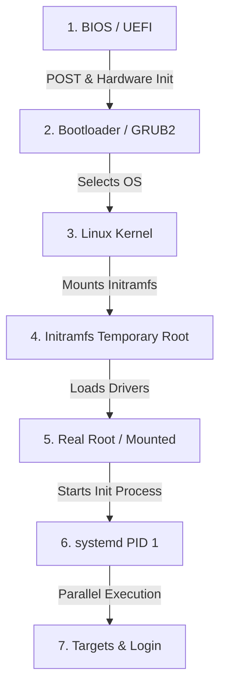

import { Aside, Tabs, TabItem, FileTree, LinkCard } from "@astrojs/starlight/components";
import PreCheck from "@/components/tutorial/PreCheck.astro";
import MultipleChoice from "@/components/tutorial/MultipleChoice.astro";
import Option from "@/components/tutorial/Option.astro";

<PreCheck>
  - Aprenderás la nomenclatura que usa Linux para interactuar con discos (ej.
  `/dev/sda`, `/dev/nvme0n1`). - Entenderás las limitaciones del antiguo MBR
  frente al moderno GPT. - Memorizarás la etapa crítica de arranque desde la
  BIOS hasta que `systemd` toma el control con PID 1.
</PreCheck>

Para un administrador de sistemas operando servidores, un fallo en el disco duro o un sistema que se queda "congelado" durante el arranque (kernel panic) son el pan de cada día. Entender con exactitud cómo detecta Linux los discos y qué archivos intervienen para llegar a la pantalla de inicio de sesión es vital.

---

## 1. Tratamiento de Discos en Linux

En Linux, los discos duros y otros medios de almacenamiento de bloques se representan como archivos en el directorio `/dev`.

La nomenclatura depende del tipo de conexión física o bus:

- **Discos SATA/SAS (Tradicionales y SSDs):** `/dev/sda` (primer disco), `/dev/sdb` (segundo disco), etc.
- **Discos NVMe (Alto rendimiento PCIe):** `/dev/nvme0n1` (primer disco), `/dev/nvme1n1` (segundo disco).
- **Lectores SD / eMMC:** `/dev/mmcblk0`.

Cuando particionamos un disco, a cada partición se le asigna un número:

- Las particiones de `/dev/sda` se llaman `/dev/sda1`, `/dev/sda2`, etc.
- Las particiones de `/dev/nvme0n1` se llaman `/dev/nvme0n1p1`, `/dev/nvme0n1p2`, etc.

### MBR vs GPT

- **MBR (Master Boot Record):** Es el estándar antiguo. Limitado a un máximo de 4 particiones primarias y no soporta discos mayores de 2 Terabytes. Se almacena en el primer sector absoluto del disco.
- **GPT (GUID Partition Table):** Es el estándar moderno atado a motherboards UEFI. Permite hasta 128 particiones por defecto en Linux y soporta discos de tamaños masivos de Zettabytes. Contiene copias de seguridad de sí misma al final del disco para evitar corrupción.

---

## 2. Sistemas de Archivos (Filesystems)

Pintar las "rayas de la pista" en un disco para que Linux sepa organizar carpetas requiere formatearlas con un _sistema de archivos_.

- **ext4 (Fourth Extended Filesystem):** Es el estándar tradicional de facto en la familia Debian y la mayoría de Linux. Es rápido, tiene excelente compatibilidad y es _journaling_ (mantiene un registro (journal) de lo que va a escribir antes de hacerlo, para evitar corrupciones si hay un apagón).
- **xfs:** El estándar por defecto en la familia RHEL. Está ultra-optimizado para manejar archivos paralelamente y de tamaños gigantescos.
- **btrfs y ZFS:** Sistemas de próxima generación (Copy-on-Write) que gestionan el particionamiento y los archivos simultáneamente, permitiendo "snapshots" (fotografías del sistema en el tiempo) nativos sin herramientas extra.

---

## 3. Esquemas de Particionamiento Habituales

<LinkCard
  title="Árbol de directorios FHS"
  description="Repasa cómo se organiza el sistema de archivos de Linux antes de decidir cómo particionar."
  href="/es/modules/module-1/2-installation/#2-el-árbol-de-directorios-fhs"
/>

El instalador de distribuciones como Ubuntu o Debian suele preguntarte si quieres **todo junto** o separar `/home`. Aquí están los tres escenarios más comunes:

<Tabs>
  <TabItem label="🖥️ Mínimo (todo junto)">
    La opción más sencilla: todo en una sola partición raíz. Válida para VMs, entornos de prueba o equipos con poco espacio.

    | Partición | Punto de montaje | Sistema de archivos | Tamaño orientativo |
    |-----------|-----------------|---------------------|--------------------|
    | `/dev/sda1` | `/boot/efi` | FAT32 | 512 MB |
    | `/dev/sda2` | `[SWAP]` | swap | RAM × 1-2 |
    | `/dev/sda3` | `/` | ext4 | Todo el resto |

    <FileTree>
    - / *Todo el sistema en una sola partición*
      - boot/
        - efi/ `sda1` — FAT32, 512 MB
      - home/ `sda3` — mismo disco que el sistema
        - usuario/
      - var/
        - log/
      - etc/
      - tmp/
    </FileTree>

    <Aside type="caution">
      Si un usuario llena `/home` con archivos grandes, el sistema operativo también se queda sin espacio y puede dejar de funcionar.
    </Aside>
  </TabItem>

  <TabItem label="🏠 Desktop (/home separado)">
    La opción que típicamente te ofrece el instalador gráfico de Ubuntu. Separar `/home` permite reinstalar el sistema sin perder los datos del usuario.

    | Partición | Punto de montaje | Sistema de archivos | Tamaño orientativo |
    |-----------|-----------------|---------------------|--------------------|
    | `/dev/sda1` | `/boot/efi` | FAT32 | 512 MB |
    | `/dev/sda2` | `[SWAP]` | swap | RAM × 1-2 |
    | `/dev/sda3` | `/` | ext4 | 30–50 GB |
    | `/dev/sda4` | `/home` | ext4 | Todo el resto |

    <FileTree>
    - / `sda3` — ext4, 30-50 GB
      - boot/
        - efi/ `sda1` — FAT32, 512 MB
      - etc/
      - var/
        - log/
      - tmp/
    - home/ `sda4` — ext4, partición independiente
      - usuario/
        - documentos/
        - proyectos/
    </FileTree>

    <Aside type="tip">
      Con `/home` en su propia partición puedes formatear `/` y reinstalar el sistema operativo manteniendo intactos todos tus documentos, configuraciones de usuario y proyectos.
    </Aside>
  </TabItem>

  <TabItem label="🖧 Servidor (producción)">
    En entornos de servidor se aíslan `/var` y opcionalmente `/tmp` para evitar que logs o bases de datos descontrolados colapsen el sistema. Es el esquema recomendado para el LFCS.

    | Partición | Punto de montaje | Sistema de archivos | Tamaño orientativo |
    |-----------|-----------------|---------------------|--------------------|
    | `/dev/sda1` | `/boot/efi` | FAT32 | 512 MB |
    | `/dev/sda2` | `[SWAP]` | swap | RAM × 1 |
    | `/dev/sda3` | `/` | ext4 / xfs | 20–30 GB |
    | `/dev/sda4` | `/var` | ext4 / xfs | 20–100 GB |
    | `/dev/sda5` | `/home` | ext4 | Lo que quede |

    <FileTree>
    - / `sda3` — ext4/xfs, 20-30 GB
      - boot/
        - efi/ `sda1` — FAT32, 512 MB
      - etc/
      - tmp/
    - var/ `sda4` — ext4/xfs, 20-100 GB
      - log/ *Logs del sistema — pueden crecer sin límite*
      - lib/
        - postgresql/
        - mysql/
      - www/
        - html/
    - home/ `sda5` — ext4, espacio restante
      - deploy/
      - admin/
    </FileTree>

    <Aside type="note">
      `/var` contiene `/var/log` (logs del sistema), `/var/lib` (bases de datos como PostgreSQL o MySQL) y `/var/www` (webs con Apache/Nginx). Aislarlo impide que un log desbocado llene el disco raíz y tumbe el servidor.
    </Aside>
  </TabItem>
</Tabs>

---

## 4. El Proceso de Arranque (Desde Botón de Encendido a Servidor Activo)

¿Qué pasa desde el segundo que enciendes la máquina de metal hasta que puedes escribir comandos?

1. **Firmware (BIOS/UEFI):** Inicializa el hardware rudimentario (CPU, memoria, teclado). Comprueba que nada está en cortocircuito (POST) y busca la partición `/boot/efi` para encontrar el gestor de arranque.
2. **Bootloader (GRUB2):** Lee su configuración (`/boot/grub/grub.cfg`) que dice dónde se encuentra físicamente el Kernel. Carga el Kernel y un archivo llamado `initramfs` en la memoria RAM, y le cede el control.
3. **El Kernel (`vmlinuz`):** Autodetecta el hardware a bajo nivel. Comienza a gestionar la memoria. Es el cerebro absoluto.
4. **Initramfs (Initial RAM Filesystem):** El Kernel inicialmente no sabe cómo leer el disco duro real (`ext4`, volúmenes LVM, o si está cifrado con contraseña). El `initramfs` es un "mini-Linux" que se carga en la RAM que contiene solo los _drivers_ (módulos) necesarios para saber leer el disco duro central de verdad.
5. **Montaje de Raíz:** Una vez superado el `initramfs`, el sistema monta el disco de verdad en la raíz (`/`).
6. **Init (`systemd`):** El Kernel ejecuta el primer programa real: `/sbin/init` (que en sistemas modernos es siempre `systemd`). Se le asigna el ID de Proceso 1 (`PID 1`).
7. **Systemd Targets:** `systemd` lee su configuración e inicia servicios en paralelo para llegar a un "Target" objetivo. Por ejemplo, el `multi-user.target` para servidores. Inicializa la red, SSH, monta bases de datos, y finalmente, muestra el **Prompt de Login**.

<Aside type="caution" title="¿Qué es una pantalla de Kernel Panic?">
  Si el Kernel no puede encontrar o montar la partición raíz (Paso 5) debido a
  que `/etc/fstab` está mal configurado, el proceso se detiene con un fatal
  *Kernel Panic*. No puede continuar porque no encuentra archivos del disco duro
  que ejecutar. ¡Aprenderemos a diagnosticar esto en módulos futuros!
</Aside>

---

## Comprueba tus conocimientos

1. Estás instalando Linux en un servidor con un disco NVMe ultra-rápido. ¿Bajo qué ruta y nombre de archivo lo buscarías típicamente en la terminal para particionarlo?

   <MultipleChoice>
     <Option>`/mnt/nvme-drive1`</Option>
     <Option>`/dev/sda`</Option>
     <Option isCorrect>`/dev/nvme0n1`</Option>
   </MultipleChoice>

2. ¿Cuál de las siguientes es una limitación histórica crítica del esquema de particiones MBR (Master Boot Record) que fue superada por GPT?

   <MultipleChoice>
     <Option>
       MBR limitaba la velocidad máxima de transferencia a 300 MB/s.
     </Option>
     <Option isCorrect>
       MBR solo soportaba un máximo de 4 particiones primarias y no reconocía
       discos mayores de ~2 Terabytes.
     </Option>
     <Option>
       MBR solo funcionaba con distribuciones derivadas de Red Hat.
     </Option>
   </MultipleChoice>

3. Durante el proceso de arranque de Linux, ¿qué pieza de software se encarga de cargar en RAM un "mini-Linux" temporal con los controladores justos para poder montar el disco duro real?
   <MultipleChoice>
     <Option>El Firmware UEFI</Option>
     <Option>Systemd (PID 1)</Option>
     <Option isCorrect>
       El Bootloader (GRUB2) cargando el Kernel y el `initramfs`
     </Option>
   </MultipleChoice>
