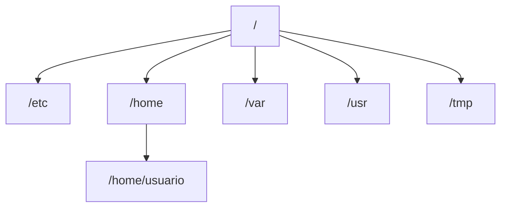
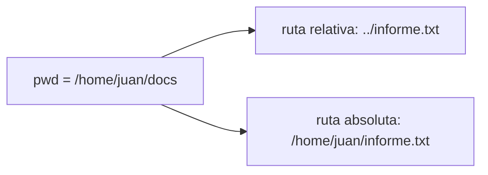
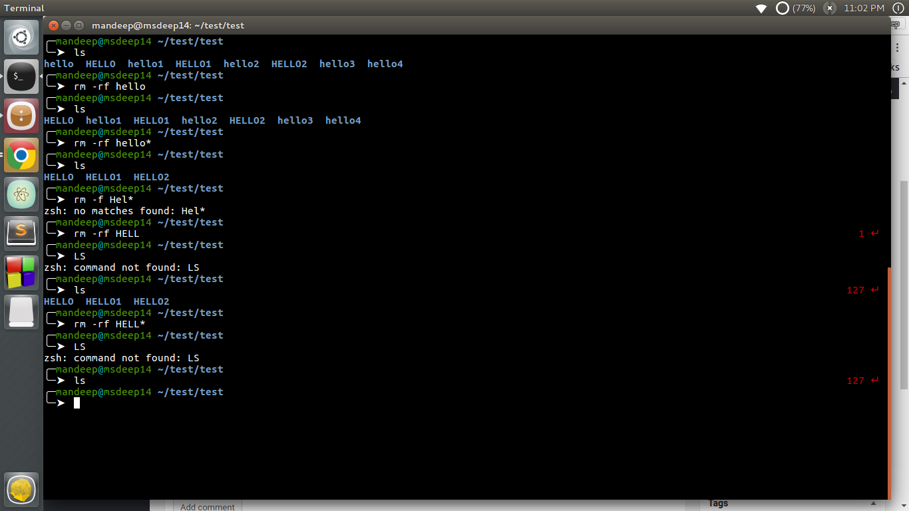

import { Aside, Card, CardGrid } from "@astrojs/starlight/components";
import PreCheck from "@/components/tutorial/PreCheck.astro";
import MultipleChoice from "@/components/tutorial/MultipleChoice.astro";
import Option from "@/components/tutorial/Option.astro";

<PreCheck>
  - Entenderás la diferencia crítica entre rutas absolutas y relativas. -
  Dominarás el listado de archivos avanzados y comodines (`ls`, `*`). -
  Aprenderás el kit de supervivencia para manipular archivos (`cp`, `mv`, `rm`).
  - Conocerás cómo encontrar cualquier archivo perdido con `find`.
</PreCheck>

## Jerarquía

Recuerda que todo comienza en `/`.

### Conceptos de rutas (path)

- **Ruta absoluta**: Comienza con `/`. Siempre funciona, sin importar dónde estés. (ej.: `/home/user/docs/file.txt`).
- **Ruta relativa**: _No_ comienza con `/`. Depende de tu ubicación actual. (ej.: `docs/file.txt` o `../file.txt`).

<Aside type="note">
  No confundas las **rutas de archivos** con la variable de entorno **`$PATH`**.
  Las rutas describen dónde están los archivos en el sistema; `$PATH` es la
  lista de directorios donde el shell busca ejecutables cuando escribes una
  orden. Puedes verlo con `echo $PATH`.
</Aside>

## Comandos de navegación

<table>
  <thead>
    <tr>
      <th>Comando</th>
      <th>Nombre</th>
      <th>Función</th>
    </tr>
  </thead>
  <tbody>
    <tr>
      <td>pwd</td>
      <td>Print Working Directory</td>
      <td>Te dice dónde estás ahora mismo.</td>
    </tr>
    <tr>
      <td>cd</td>
      <td>Change Directory</td>
      <td>Te mueve a una nueva carpeta.</td>
    </tr>
    <tr>
      <td>cd ..</td>
      <td></td>
      <td>Sube un nivel.</td>
     </tr>
    <tr>
      <td>cd ~</td>
      <td></td>
      <td>Va a tu directorio personal (home).</td>
     </tr>
    <tr>
      <td>cd -</td>
      <td></td>
      <td>Vuelve al directorio anterior.</td>
     </tr>
    <tr>
      <td>ls</td>
      <td>List</td>
      <td>Muestra los archivos en el directorio actual.</td>
     </tr>
  </tbody>
</table>

### Opciones de `ls`

Rara vez ejecutas solo `ls`. Opciones habituales:

- `ls -l`: Listado **largo** (permisos, propietario, tamaño, fecha).
- `ls -a`: **Todos** los archivos (muestra archivos ocultos que empiezan por `.`).
- `ls -lh`: Listado largo con tamaños **legibles para humanos** (MB, GB).
- `ls -la`: Listado largo de **todos** los archivos (incluyendo ocultos).
- `ls -ltr`: Ordena por fecha (los más recientes al final).

### Patrones glob (comodines)

Los comodines ayudan a seleccionar múltiples archivos:

- `*.txt`: Todos los `.txt`.
- `file?.txt`: Coincide `file1.txt`, `fileA.txt`, etc.
- `docs/*/index.md`: Cualquier `index.md` dentro de un subdirectorio de `docs/`.

## Gestión de archivos

  <table>
    <thead>
      <tr>
        <th>Comando</th>
        <th>Función</th>
        <th>Ejemplo</th>
      </tr>
    </thead>
    <tbody>
      <tr>
        <td>mkdir</td>
        <td>Crear directorio</td>
        <td>mkdir projects</td>
      </tr>
      <tr>
        <td>touch</td>
        <td>Crear archivo vacío</td>
        <td>touch notes.txt</td>
      </tr>
      <tr>
        <td>cp</td>
        <td>Copiar</td>
        <td>cp notes.txt backup.txt</td>
      </tr>
      <tr>
        <td>cp -r</td>
        <td>Copiar de forma recursiva (carpeta)</td>
        <td>cp -r projects/ projects-backup/</td>
      </tr>
      <tr>
        <td>mv</td>
        <td>Mover (o renombrar)</td>
        <td>mv notes.txt doc.txt</td>
      </tr>
      <tr>
        <td>rm</td>
        <td>Eliminar (borrar)</td>
        <td>rm file.txt</td>
      </tr>
      <tr>
        <td>rmdir</td>
        <td>Eliminar directorio <strong>vacío</strong></td>
        <td>rmdir old-empty-dir</td>
      </tr>
      <tr>
        <td>rm -i</td>
        <td>Confirmación interactiva</td>
        <td>rm -i file.txt</td>
      </tr>
    </tbody>
  </table>

<Aside type="tip">
  Si una ruta contiene espacios, **envuélvela con comillas**: `mv "Informe
  Final.txt" informes/`.
</Aside>

<Aside type="caution">
  **`rm -rf /`**: El `rm -r` (recursivo) combinado con `-f` (forzar) es
  peligroso. Borra carpetas y su contenido sin preguntar. Revisa siempre la ruta
  antes de pulsar Enter.
</Aside>

## Búsqueda de archivos

Herramientas habituales para localizar archivos en el sistema:

### `find`

Busca archivos en una jerarquía de directorios.

#### Find Cheatsheet (referencia rápida)

  
  

    <h3 >🔍 Búsqueda, tipo, tamaño y tiempo</h3>
    

      <table >
        <thead>
          <tr >
            <th >Patrón</th>
            <th >Qué hace</th>
          </tr>
        </thead>
        <tbody>
          <tr><td ><code>find . -name "file.txt"</code></td><td >Buscar un nombre exacto</td></tr>
          <tr><td ><code>find . -iname "readme.md"</code></td><td >Buscar sin distinguir mayúsculas/minúsculas</td></tr>
          <tr><td ><code>find /etc -name "&#42;.conf"</code></td><td >Buscar por extensión/patrón</td></tr>
          <tr><td ><code>find . -type f</code></td><td >Solo archivos regulares</td></tr>
          <tr><td ><code>find . -type d</code></td><td >Solo directorios</td></tr>
          <tr><td ><code>find . -type l</code></td><td >Solo enlaces simbólicos</td></tr>
          <tr><td ><code>find . -maxdepth 1 -type f</code></td><td >Solo el directorio actual (sin recursión)</td></tr>
          <tr><td ><code>find . -type f -empty</code></td><td >Archivos vacíos</td></tr>
          <tr><td ><code>find . -type d -empty</code></td><td >Directorios vacíos</td></tr>
          <tr><td ><code>find . -type f -size +100M</code></td><td >Archivos mayores de 100 MB</td></tr>
          <tr><td ><code>find . -type f -size -10M</code></td><td >Archivos menores de 10 MB</td></tr>
          <tr><td ><code>find . -type f -mtime -7</code></td><td >Modificados en los últimos 7 días</td></tr>
          <tr><td ><code>find . -type f -mtime +30</code></td><td >Modificados hace más de 30 días</td></tr>
          <tr><td ><code>find . -type f -mmin -60</code></td><td >Modificados en los últimos 60 minutos</td></tr>
          <tr><td ><code>find . -type f -atime -1</code></td><td >Accedidos en las últimas 24 horas</td></tr>
          <tr><td ><code>find . -type f -ctime -3</code></td><td >Metadatos cambiados en los últimos 3 días</td></tr>
        </tbody>
      </table>
    

  

  

    <h3 >🔧 Permisos, exclusiones y acciones</h3>
    

      <table >
        <thead>
          <tr >
            <th >Patrón</th>
            <th >Qué hace</th>
          </tr>
        </thead>
        <tbody>
          <tr><td ><code>find . -type f -perm 644</code></td><td >Permiso exacto (modo octal)</td></tr>
          <tr><td ><code>find . -type f -perm -u+w</code></td><td >Archivos escribibles por el usuario</td></tr>
          <tr><td ><code>find / -type f -user root</code></td><td >Archivos cuyo dueño es root</td></tr>
          <tr><td ><code>find /srv -type f -group www-data</code></td><td >Archivos cuyo grupo es www-data</td></tr>
          <tr><td ><code>find . -path ./node_modules -prune -o -type f -print</code></td><td >Excluir un directorio</td></tr>
          <tr><td ><code>find . ( -path ./node_modules -o -path ./.git ) -prune -o -type f -print</code></td><td >Excluir varios directorios</td></tr>
          <tr><td ><code>find . -type f ! -name "&#42;.log"</code></td><td >Excluir por patrón de nombre</td></tr>
          <tr><td ><code>find . -type f ! -path "&#42;/cache/&#42;"</code></td><td >Excluir por patrón de ruta</td></tr>
          <tr><td ><code>find . -type f -name "&#42;.tmp" -delete</code></td><td >Borrar coincidencias</td></tr>
          <tr><td ><code>find . -type f -name "&#42;.log" -exec gzip {} \;</code></td><td >Ejecutar un comando por archivo</td></tr>
          <tr><td ><code>find . -type f -name "&#42;.jpg" -exec mv {} /tmp/images/ \;</code></td><td >Mover coincidencias</td></tr>
          <tr><td ><code>find . -type f -name "&#42;.conf" -exec grep -H "listen" {} \;</code></td><td >Buscar texto dentro de coincidencias</td></tr>
          <tr><td ><code>find . -type f -name "&#42;.log" -exec rm {} +</code></td><td >Borrado en lote (más rápido que ;)</td></tr>
          <tr><td ><code>find . -type f -name "&#42;.txt" -print0 | xargs -0 rm -f</code></td><td >Operaciones seguras con espacios (NUL)</td></tr>
        </tbody>
      </table>
    

  

  <h3 >📖 Sintaxis y ejemplos</h3>
  
<strong>Sintaxis</strong>: <code>find [ruta] [expresión]</code>

  
<strong>Ejemplos</strong>:

  <ul >
    <li><code>find /etc -name "&#42;.conf"</code>: Busca todos los archivos en /etc que terminen en .conf.</li>
    <li><code>find . -type f</code>: Busca solo archivos en el directorio actual.</li>
    <li><code>find . -type d</code>: Busca solo directorios.</li>
    <li><code>find /var/log -size +10M</code>: Busca archivos mayores de 10 MB.</li>
    <li><code>find . -perm 777</code>: Busca archivos con permisos 777.</li>
    <li><code>find . -mtime -1</code>: Busca archivos modificados en las últimas 24 horas.</li>
    <li><code>find . -user alice</code>: Busca archivos cuyo propietario sea el usuario alice.</li>
    <li><code>find . -iname "&#42;.jpg"</code>: Búsqueda sin distinguir mayúsculas/minúsculas.</li>
    <li><code>find . -maxdepth 2 -name "&#42;.md"</code>: Limita la profundidad de búsqueda.</li>
    <li><code>find . -not -path "&#42;/node_modules/&#42;"</code>: Excluye directorios no deseados.</li>
    <li><code>find . -type f -name "&#42;.log" -exec ls -l {} \;</code>: Ejecuta una acción por cada resultado.</li>
  </ul>

### `locate`

Encuentra archivos por nombre usando una base de datos preconstruida (más rápido que `find`, pero puede estar desactualizada).

- **Sintaxis**: `locate [patrón]`
- **Actualizar la BD**: `sudo updatedb` (actualiza la base de datos que utiliza `locate`).

### `which`

Localiza un comando.

- **Ejemplo**: `which python` (muestra la ruta del ejecutable de Python).

### `whereis`

Localiza el binario, el código fuente y las páginas de manual de un comando.

- **Ejemplo**: `whereis ls`

## `$PATH` y resolución de comandos

Cuando escribes una orden, el shell busca el ejecutable en cada directorio de `$PATH` (separados por `:`).

- **Ver tu PATH**: `echo $PATH`
- **Añadir temporalmente un directorio**: `export PATH="$HOME/bin:$PATH"`
- **Hacerlo persistente**:
  - En `bash`: añade el export a `~/.bashrc` o `~/.profile`
  - En `zsh`: añádelo a `~/.zshrc`

<Aside type="tip">
  Si `which` no encuentra una orden pero el ejecutable existe, verifica que su
  directorio esté en `$PATH` o invócalo con la **ruta absoluta**
  (`/usr/local/bin/foo`) o una **ruta relativa** (`./foo`).
</Aside>

---

## Comprueba tus conocimientos

1. Estás en `/home/juan/docs` y quieres copiar el archivo `informe.txt` directamente a la carpeta padre `/home/juan`. ¿Cuál es el comando con ruta relativa correcto?

<MultipleChoice>
     <Option>`cp informe.txt /home/juan`</Option>
     <Option isCorrect>`cp informe.txt ..`</Option>
     <Option>`cp informe.txt ~/`</Option>
</MultipleChoice>

2. Has descargado un script de internet y necesitas encontrar un archivo de log viejo que sea mayor a 100MB alojado en algún lugar de `/var/log`. ¿Cuál es el comando más idóneo?

<MultipleChoice>
  <Option>
    `ls -la /var/log | grep "100MB"`
  </Option>
  <Option>
    `whereis log > 100M`
  </Option>
  <Option isCorrect>
    `find /var/log -size +100M`
  </Option>
</MultipleChoice>

3. Quieres listar todos los archivos, incluyendo los ocultos (que empiezan por punto), ordenados por fecha para ver los más recientes al fondo de la pantalla. ¿Qué combinación de banderas de `ls` usarías?

<MultipleChoice>
     <Option isCorrect>`ls -latr`</Option>
     <Option>`ls -lh`</Option>
     <Option>`ls -a -hidden`</Option>
</MultipleChoice>
