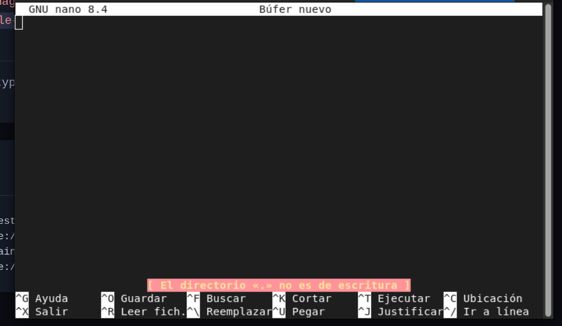
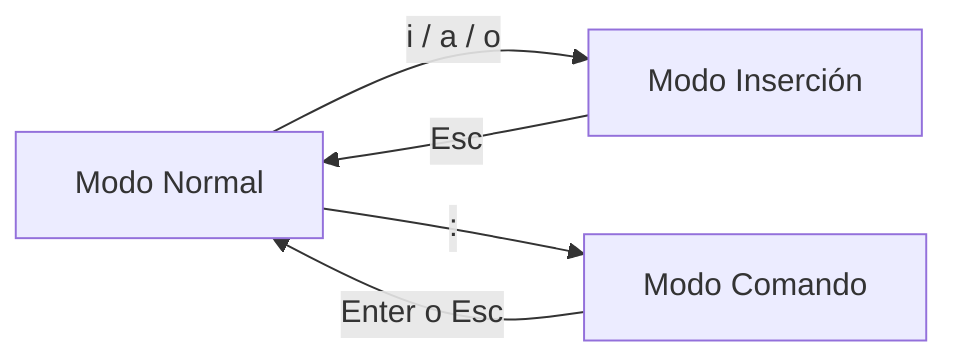

import { Aside, Card, CardGrid } from "@astrojs/starlight/components";
import PreCheck from "@/components/tutorial/PreCheck.astro";
import MultipleChoice from "@/components/tutorial/MultipleChoice.astro";
import Option from "@/components/tutorial/Option.astro";

<PreCheck>
  - Aprenderás a editar, guardar e inspeccionar archivos usando el amigable
  editor `nano`. - Descubrirás el origen de `vim` y su filosofía de "modos"
  (Comando e Inserción). - Memorizarás la maniobra de supervivencia máxima: cómo
  salir de `vim` sano y salvo.
</PreCheck>

En la vida real de un Sysadmin administrador de Debian, el 80% de tu tiempo lo pasarás leyendo, filtrando (como veremos en la próxima lección) o modificando archivos de texto ubicados en `/etc`. Para esto, necesitas dominar los editores de texto de la terminal.

---

## 1. Empezando por lo Fácil: GNU Nano

Para la inmensa mayoría de las tareas diarias, como cambiar una línea en la configuración de Nginx o SSH, el editor más rápido y con la curva de aprendizaje más amable es **`nano`**.

Nano fue creado específicamente para ser fácil de usar y mostrar todos sus atajos de teclado visualmente en la parte inferior de la pantalla, sin requerir memorización.



### Edición Básica

Para crear un archivo nuevo o editar uno existente, simplemente ejecuta su nombre seguido de la ruta:

```bash
nano /etc/ssh/sshd_config
```

Una vez dentro, puedes usar las flechas del teclado libremente para moverte y empezar a escribir de inmediato.

### Los Atajos de Teclado (La interfaz inferior)

En la parte inferior de la pantalla de `nano` verás cosas como `^O Guardar` o `^X Salir`. El símbolo `^` significa la tecla **Control (Ctrl)** de tu teclado.

- **`Ctrl + O` (Write Out/Guardar):** Guarda los cambios del archivo. Te pedirá presionar Enter para confirmar el nombre del archivo.
- **`Ctrl + W` (Where Is/Buscar):** Te permite buscar una palabra o patrón específico dentro del documento.
- **`Ctrl + K` (Cut Text/Cortar):** Borra (y guarda en el portapapeles de nano) toda la línea en la que se encuentre el cursor.
- **`Ctrl + U` (Uncut Text/Pegar):** Pega la línea que acabas de cortar con `Ctrl + K`.
- **`Ctrl + X` (Exit/Salir):** Sale de Nano. Si tienes cambios sin guardar, te preguntará educadamente `Save modified buffer? (Y/N/C)`. Pulsa `Y` (Yes) y luego Enter.

<Aside type="tip" title="¿Por qué preferimos Nano?">
  Es el estándar por defecto en distribuciones modernas como Ubuntu y Debian
  actual. No requiere cambiar de "modos" para escribir, por lo que es la
  recomendación principal para principiantes antes de adentrarse en la locura
  modal que es Vim.
</Aside>

---

## 2. El Omnipresente: vi y Vim

Si `nano` es tan fácil, **¿por qué se sigue hablando tanto de Vim?**

`vi` (Visual Editor) nació en los años 70. `vim` (_Vi IMproved_) es su sucesor directo. Como Sysadmin LFCS, **debes conocer lo básico de Vim**. La razón es la supervivencia: si alguna vez entras por SSH a una máquina Unix embebida, un servidor muy antiguo, o un contenedor Docker pelado de Alpine Linux, puede que `nano` no esté instalado, pero te garantizamos que `vi` siempre estará ahí esperando.

### La Filosofía Modal

A diferencia de nano o el Bloc de Notas, si abres Vim y empiezas a teclear letras aleatorias, es probable que borres la mitad del documento y salte un pitido de error. **Vim tiene modos:**




1. **Modo Normal**: Es el modo en el que Vim se abre por defecto. En este modo, el teclado es un panel de mandos. La tecla `x` borra caracteres, `dd` corta líneas enteras, y las flechas `h j k l` mueven el cursor sin desplazar tus manos de la fila base del teclado.
2. **Modo Inserción**: Es el modo para escribir texto normal. Para entrar en este modo desde el Modo Normal, presionas la letra **`i`** (Insert). Verás que abajo a la izquierda aparece `-- INSERT --`.
3. **Modo Comando (Ex)**: Usado para dar la orden final de guardar o salir. Se entra pulsando `:` desde el Modo Normal.

### Supervivencia en Vim: Entrar, Escribir, y Escapar

El meme más famoso de la informática es "no sé cómo salir de Vim". Aquí tienes el flujo de trabajo sagrado de supervivencia:

1. **Abrir el archivo**: `vim /tmp/secreto.txt`.
2. **Empezar a escribir**: Pulsa `i`. Abajo dirá `-- INSERT --`. Ahora escribe lo que necesites.
3. **Dejar de escribir**: Pulsas la tecla **`Escape (Esc)`** varias veces hasta que `-- INSERT --` desaparezca para volver al Modo Normal.
4. **Guardar y Salir**: Pulsa dos puntos `:` (verás que tu cursor salta a la barra inferior), seguido de la letra `w` (Write) y `q` (Quit). Presiona Enter. (Comando final: `:wq`).

### Hoja de Trucos de Emergencia de Vim

Estando en Modo Normal (Pulsa `Esc` varias veces por seguridad):

<CardGrid>
  <Card title="Movimiento y edición rápida (Modo Normal)">

| Tecla | Acción |
| --- | --- |
| `h` `j` `k` `l` | Mover cursor (izq/abajo/arriba/der) |
| `w` / `b` | Siguiente / anterior palabra |
| `0` / `$` | Inicio / fin de línea |
| `gg` / `G` | Inicio / final del archivo |
| `i` / `a` | Insertar (antes del cursor) / Añadir (después) |
| `o` | Nueva línea debajo y entrar a insertar |
| `x` | Borrar carácter bajo el cursor |
| `dd` | Borrar (cortar) línea |
| `yy` | Copiar (yank) línea |
| `p` | Pegar después del cursor |
| `u` | Deshacer |
| `Ctrl + r` | Rehacer |

  </Card>
  <Card title="Guardar, salir, buscar (Modo Comando)">

| Comando | Acción |
| --- | --- |
| `:w` | Guardar |
| `:q` | Salir (si no hay cambios) |
| `:wq` | Guardar y salir |
| `:q!` | **Salir sin guardar** (emergencia) |
| `/texto` | Buscar “texto” hacia delante |
| `n` / `N` | Siguiente / anterior coincidencia |
| `:%s/viejo/nuevo/g` | Reemplazar en todo el archivo |
| `:set nu` / `:set nonu` | Mostrar / ocultar números de línea |

  </Card>
</CardGrid>

---

## Comprueba tus conocimientos

Para cimentar qué editor usar y, más críticamente, cómo salir vivo del otro:

1. Estás editando el archivo `/etc/fstab` en `nano`. Quieres guardar tu progreso y cerrar el editor. ¿Qué combinación de teclas de atajo te muestra la interfaz, asumiendo que el símbolo principal es `^`?

<MultipleChoice>
     <Option>Presionar `:wq` y luego Enter.</Option>
     <Option isCorrect>
       Presionar `Ctrl + O` para confirmar el archivo y guardar, seguido de
       `Ctrl + X` para salir de Nano.
     </Option>
     <Option>
       Tipear `Save modified buffer? Y` en cualquier parte del texto.
     </Option>
</MultipleChoice>

2. Acabas de abrir un archivo de sistema con `vim`. Necesitas agregar la palabra "ServerIP". ¿Qué debes hacer primero?

<MultipleChoice>
     <Option isCorrect>
       Pulsar la tecla `i` para entrar al **Modo Inserción**, lo que me
       permitirá tipear caracteres en la pantalla.
     </Option>
     <Option>
       Presionar `Ctrl + W` para abrir el buscador y luego pegar el texto.
     </Option>
     <Option>
       Escribir "ServerIP" directamente, ya que Vim se abre en modo inserción
       por defecto.
     </Option>
</MultipleChoice>

3. ¡Desastre! Entraste a `vim`, tocaste varias teclas sin querer en el Modo Normal y de repente la configuración está estropeada. ¿Cuál es el comando sagrado para forzar el cierre destruyendo (descartando) los cambios sin guardar?

<MultipleChoice>
     <Option>`:error`</Option>
     <Option>`Ctrl + C`</Option>
     <Option isCorrect>
       Pulsar `Esc` para asegurar que estoy en Modo Normal, teclear `:q!` y
       darle a Enter.
     </Option>
</MultipleChoice>

<Aside type="tip" title="Para saber más sobre VIM">
  <a href="https://www.vim-hero.com/">Tutorial interactivo de Vim</a>
</Aside>
