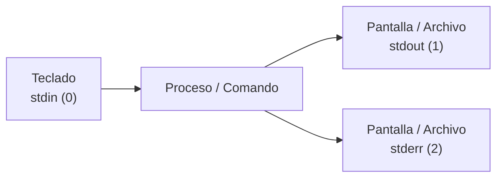
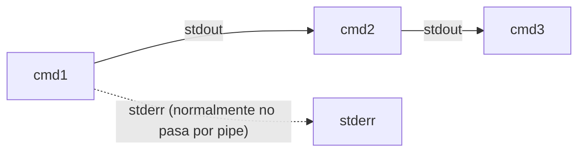

import { Aside } from "@astrojs/starlight/components";
import PreCheck from "@/components/tutorial/PreCheck.astro";
import MultipleChoice from "@/components/tutorial/MultipleChoice.astro";
import Option from "@/components/tutorial/Option.astro";

<PreCheck>
  - Entenderás el concepto de `stdin`, `stdout` y `stderr` (entradas y salidas estándar).
  - Sabrás cómo registrar la salida de los comandos en archivos usando `>` y `>>`.
  - Aprenderás la esencia de Linux uniendo comandos complejos con Tuberías (`|`).
  - Filtrarás datos masivos en segundos usando `grep`, `tail` y `wc`.
</PreCheck>

La Filosofía fundamental de Unix dictamina: **"Escribe programas que hagan solo una cosa, pero que la hagan perfecta. Luego, escribe programas para trabajar juntos."**

Ninguna herramienta en Linux hace todo. En su lugar, el poder de un Sysadmin reside en usar legos (pequeños comandos aislados) y conectarlos entre sí.

---

## 1. Redirecciones: Controlando el flujo

Normalmente, cuando ejecutas un comando, su resultado se imprime en tu pantalla. Podemos redirigir esta salida directamente a un archivo para guardar este resultado permanentemente.

### Los Tres Flujos (Streams) Estándar

Cada proceso en Linux nace siempre con tres "tuberías invisibles" conectadas a él:

1. **`stdin` (0)**: Entrada estándar. Por defecto es tu teclado.
2. **`stdout` (1)**: Salida estándar. El resultado exitoso de un comando. Por defecto es tu pantalla.
3. **`stderr` (2)**: Error estándar. Los mensajes de fallo. También salen por tu pantalla.




<Aside type="tip" title="Dato curioso: el nacimiento del pipe">
  La idea de “enchufar” la salida de un programa a la entrada de otro se
  popularizó en Unix en los años 70. Es una de las razones por las que la
  filosofía Unix escala tan bien: programas pequeños + composición.
</Aside>

### Operadores de Redirección

- **`>` (Redirigir Salida Estándar / Sobrescribir):** Redirige el `stdout` reemplazando todo el contenido previo del archivo si este ya existe. Si no existe, lo crea automáticamente.

  ```bash
  # Guarda el mensaje anulando el contenido anterior de registro.txt
  echo "Sistema iniciado" > registro.txt
  
  # Guarda la lista de archivos de tu directorio actual
  ls -la > mis_archivos.txt
  ```

- **`>>` (Añadir / Append):** Redirige el `stdout` agregando la salida al final del archivo sin tocar ni borrar el texto existente. Vital para sistemas de Logs o historiales.

  ```bash
  # Añade una nueva línea al final del archivo
  echo "Nueva alerta de seguridad: Intento de inicio de sesión fallido" >> registro.txt
  ```

- **`<` (Redirigir Entrada Estándar):** En lugar de usar el teclado para el `stdin`, toma el contenido de un archivo y se lo pasa a un comando.

  ```bash
  # El comando 'wc -l' (contar líneas) lee el contenido de registro.txt directamente
  wc -l < registro.txt
  ```

- **`2>` (Redirigir solo Errores):** Supongamos que escaneas un disco entero. La pantalla se llenará de aburridos errores "Permiso Denegado". Puedes limpiar la vista enviando los errores a `/dev/null` (el agujero negro de Linux donde todo lo que entra desaparece).

  ```bash
  # Muestra los archivos encontrados (stdout por pantalla), pero oculta e ignora los errores (stderr a /dev/null)
  find / -name "*.conf" 2> /dev/null
  ```

- **`&>` (Redirigir Salida y Errores Juntos):** Si no te importa si el comando fue exitoso o falló, y quieres que absolutamente todo el resultado se guarde en un mismo archivo (o se silencie en `/dev/null`).

  ```bash
  # Guarda tanto los resultados de la búsqueda como los posibles errores
  find / -name "*.conf" &> resultado_completo.txt
  ```

---

## 2. Tuberías (`|` PIPES)

Aquí es donde Linux brilla. El operador de Tubería `|` toma la Salida Estándar (`stdout`) del comando a su izquierda, y la introduce como si la hubieras tecleado (Entrada Estándar / `stdin`) en el comando de la derecha.

```bash
comando1 | comando2 | comando3
```




### Filtros Esenciales (Coreutils)

Los siguientes comandos están diseñados específicamente para brillar cuando se conectan detrás de un Pipe. Actúan como pequeños "filtros" que moldean los datos que reciben:

1. **`grep`**: El buscador universal. Filtra e imprime solo las líneas que contienen una palabra o patrón específico.
   ```bash
   # Lee un archivo inmenso, y solo imprime las líneas con la palabra "Error" o "Failed"
   cat /var/log/syslog | grep "Error"
   ```
2. **`less`**: Paginador. Si la salida de un comando es de miles de líneas y abarrota tu pantalla destruyendo tu historial, ponle `| less` y podrás navegarla cómodamente con flechas (presiona `q` para salir).
   ```bash
   # Mira la lista de todos los procesos corriendo de forma paginada y controlada
   ps aux | less
   ```
3. **`wc` (Word Count)**: Cuenta bytes, palabras o, lo más útil y frecuente, líneas con la bandera `-l` (lines).
   ```bash
   # ¿Cuántos archivos y carpetas hay en el directorio de configuraciones?
   ls /etc | wc -l
   ```
4. **`head` y `tail`**: Muestran sólo las 10 primeras (`head`) o las últimas (`tail`) líneas de texto de un flujo masivo. La bandera `-n` permite elegir la cantidad exacta.
   ```bash
   # Observa solo los últimos 20 logueos del sistema
   last | tail -n 20
   ```
5. **`sort`**: Ordena el texto resultante alfabéticamente o numéricamente. Agrega `-r` para orden inverso y `-n` para números.
6. **`uniq`**: Filtra y elimina las líneas duplicadas de un listado. **Ojo:** Requiere que los datos estén ordenados previamente (`sort | uniq`).
7. **`awk` y `sed`**: Herramientas súper potentes. `awk` extrae columnas de texto (ej: `awk '{print $1}'`) y `sed` busca y reemplaza patrones "al vuelo" a lo largo de flujos de texto inmensos.

---

## 3. Herramientas LFCS que multiplican los pipes

En examen, muchas tareas se vuelven triviales si dominas estos “conectores”.

### `tee` (ver en pantalla y guardar a la vez)

Si necesitas **ver** el resultado pero también **guardarlo** sin repetir el comando:

```bash
# Guarda y además muestra en pantalla
ps aux | grep nginx | tee /tmp/nginx_procesos.txt
```

<Aside type="tip" title="Dato curioso: por qué se llama tee">
  `tee` se llama así por la pieza de fontanería en forma de “T”: duplica el
  flujo, enviándolo a la pantalla y a un fichero al mismo tiempo.
</Aside>

### `xargs` (convertir líneas en argumentos)

Muchos comandos imprimen una lista (una ruta por línea). `xargs` toma ese flujo y lo convierte en argumentos para otro comando.

```bash
# Buscar .log y calcular tamaño total en bytes
find /var/log -type f -name "*.log" 2>/dev/null | xargs -r du -b | awk '{s+=$1} END{print s}'
```

`-r` evita ejecutar el comando si no hay entradas (muy útil en scripts).

### `cut` y `tr` (cortar columnas y transformar texto)

Cuando trabajas con ficheros delimitados (por `:` en `/etc/passwd`, por espacios, etc.):

```bash
# Extraer el usuario (campo 1) y la shell (campo 7) de /etc/passwd
cut -d: -f1,7 /etc/passwd | head

# Pasar a mayúsculas (útil para normalizar)
echo "error" | tr '[:lower:]' '[:upper:]'
```

### Ejemplos Prácticos de Sysadmin

La verdadera magia de la consola de Linux ocurre cuando encadenas tres, cuatro o cinco comandos combinados como piezas de lego.

- **Quiero ver solo las interfaces de red que están conectadas ("UP"):**
  ```bash
  # ip a muestra todas. grep filtra las conectadas.
  ip a | grep "state UP"
  ```
- **Quiero saber un recuento de cuántos puertos y servicios están escuchando en mi servidor:**
  ```bash
  # ss muestra la red, grep filtra lo que dice 'LISTEN', wc cuenta las líneas finales
  ss -tuln | grep "LISTEN" | wc -l
  ```
- **Top 5 de las direcciones IP que más intentan hackear el servidor SSH y fallan:**
  ```bash
  # cat lee toda la bitácora de auth.log, grep pilla los accesos fallidos,
  # awk extrae exactamente la columna de texto con la IP (suele ser la #11),
  # sort ordena las IPs para juntar las que son iguales,
  # uniq -c las recuenta agrupándolas,
  # sort -nr las re-ordena de mayor a menor con base en el nuevo recuento,
  # y head finaliza quedándose solo con las primeras 5.
  cat /var/log/auth.log | grep "Failed password" | awk '{print $11}' | sort | uniq -c | sort -nr | head -n 5
  ```
- **Buscar archivos modificados recientemente y registrar el nombre en un archivo sin llenarse de errores en pantalla:**
  ```bash
  # Buscamos archivos en la raíz (/) modificados los últimos 7 días (-mtime -7).
  # Los errores de permiso (2>) se vuelcan a /dev/null y se ignoran.
  # La salida estándar buena fluye por la tubería (|) y es ordenada por 'sort',
  # y su resultado final se guarda temporalmente (>)
  find / -mtime -7 2> /dev/null | sort > /tmp/archivos_recientes.txt
  ```

---

## Comprueba tus conocimientos

1. Si quieres guardar un listado detallado de los archivos de un directorio `/var/log` en un archivo llamado `inventario.log` sin borrar de casualidad otra información importante que pudiera ya contener ese archivo, ¿qué operador usas?

<MultipleChoice>
  <Option>
    `ls -la /var/log | inventario.log`
  </Option>
  <Option>
    `ls -la /var/log > inventario.log`
  </Option>
  <Option isCorrect>
    `ls -la /var/log >> inventario.log`
  </Option>
</MultipleChoice>

2. Ejecutas un comando engorroso que llena tu pantalla con cientos de líneas rojas de advertencia que no te importan, impidiendo que leas los resultados positivos porque se desplazan muy rápido. ¿Cómo ocultas los errores?

<MultipleChoice>
  <Option>
    Poniendo `| grep "errores"` al final del comando.
  </Option>
  <Option isCorrect>
    Añadiendo `2> /dev/null` al final del comando para enviar el Flujo Estándar de Errores al basurero.
  </Option>
  <Option>
    Redirigiendo el comando usando `>> /dev/null`.
  </Option>
</MultipleChoice>

3. Quieres listar tu directorio actual, pero dicho directorio contiene 15.000 fotos antiguas. Sólo quieres saber rápidamente y con exactitud cuántas imágenes hay en total. ¿Cómo combinas comandos para esto?

<MultipleChoice>
  <Option>
    `find . -type f > wc -l`
  </Option>
  <Option isCorrect>
    Listar los archivos (`ls`) y pasar ese resultado por una tubería al contador de líneas (`| wc -l`). Comando final: `ls | wc -l`
  </Option>
  <Option>
    Ejecutar `tail -15000`
  </Option>
</MultipleChoice>
