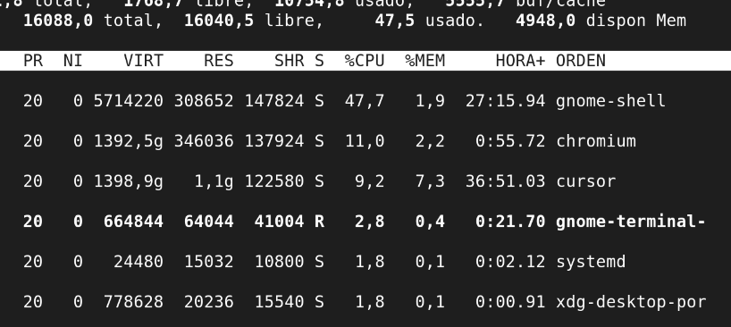
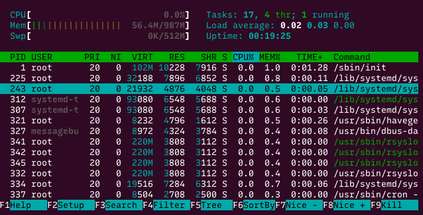

import { Aside } from "@astrojs/starlight/components";
import PreCheck from "@/components/tutorial/PreCheck.astro";
import MultipleChoice from "@/components/tutorial/MultipleChoice.astro";
import Option from "@/components/tutorial/Option.astro";

<PreCheck>
  - Aprenderás a identificar cualquier programa en ejecución mediante su comando
  `ps` y su PID. - Sabrás cómo cazar y destruir procesos bloqueados enviando
  señales con `kill`. - Dominarás el envío de tareas largas al segundo plano
  (`&`, `bg`) para liberar tu terminal.
</PreCheck>

En Linux, cada programa, comando o servicio en ejecución se denomina **Proceso**. Cada proceso vivo en el sistema tiene asignado un número de identificación único y temporal llamado **PID** (Process ID). Como administrador, gran parte de tu día consistirá en monitorear estos procesos y asesinar educadamente (o a la fuerza) aquellos que estén consumiendo demasiada RAM o CPU.

---

## 1. Viendo los Procesos Actuales

Hay dos enfoques para mirar qué está ocurriendo en tu Debian: las "fotos estáticas" y el "vídeo en tiempo real".




### `ps` (Process Status) - La Foto Estática

Muestra una captura en ese instante exacto de los procesos. Por sí solo `ps` solo muestra los de tu terminal actual, lo cual rara vez es útil. Para ver **todos los procesos del sistema** en estilo Sysadmin, usa las banderas `aux` (estilo BSD) o `-ef` (estilo estándar UNIX).

```bash
# Imprime todos los procesos con usuario, porcentaje de CPU/RAM, PID y Comando.
ps aux
```

_Como esto imprimirá miles de líneas, lo ideal es siempre combinarlo con el Pipe y Grep que aprendimos en lecciones anteriores:_

```bash
ps aux | grep "nginx"
```

### `top` y `htop` - El Vídeo en Vivo

Muestran una tabla en vivo que se actualiza cada pocos segundos. Son ideales para ver qué programa está colapsando el servidor ahora mismo.

- **`top`**: Viene instalado en absolutamente todos los sistemas Linux. Presiona `q` para salir.
- **`htop`**: Una versión mucho más bonita, a color y con barras visuales para las CPUs. Puede que necesites instalarlo primero (`sudo apt install htop`).

---

## 2. Matar Procesos (Señales)

Cuando un programa se cuelga o un usuario ejecuta un script infinito, tienes que detenerlo mandándole Señales (_Signals_). En Linux, no apagas programas, los _matas_.

### `kill` clásico (por PID)

Usa el comando `kill` seguido del número de PID del proceso rebelde.

- **`kill 1234` (Señal SIGTERM - 15)**: Le pide amablemente al programa con PID 1234 que termine. Le da tiempo a guardar datos, cerrar archivos y morir dignamente. Es el comportamiento por defecto.
- **`kill -9 1234` (Señal SIGKILL - 9)**: La ejecución máxima. El kernel de Linux destruye el proceso instantáneamente. El programa no tiene oportunidad de guardar nada. Úsalo solo si la opción anterior no funcionó tras esperar unos segundos.

{/*  */}

```mermaid
flowchart TD
  A[Proceso problemático] --> B["Intento 1: SIGTERM (15)<br/>kill PID"]
  B -->|termina| OK[Fin limpio]
  B -->|no termina| C["Intento 2: SIGKILL (9)<br/>kill -9 PID"]
  C --> HARD[Fin forzado (sin cleanup)]
```

<Aside type="tip" title="Dato curioso: kill casi nunca “mata” primero">
  Por defecto, `kill PID` envía **SIGTERM (15)**: una petición educada. Es el
  propio programa quien decide cómo cerrar. **SIGKILL (9)** es diferente: el
  proceso no puede capturarlo ni ignorarlo.
</Aside>

### `killall` (por Nombre)

A veces tienes 50 procesos del mismo programa (ej: `apache2`) y no quieres buscar 50 PIDs distintos.

```bash
# Envía la señal SIGTERM a todos los procesos que se llamen "apache2"
sudo killall apache2
```

---

## 3. Atajos LFCS: pgrep/pkill y prioridad (nice/renice)

En administración real, “grep al ps” funciona, pero hay herramientas hechas para esto.

### `pgrep` (buscar PID por patrón)

```bash
# Devuelve PIDs cuyo comando coincide con el patrón
pgrep nginx

# Ver PID y comando (útil para no matar lo incorrecto)
pgrep -a nginx
```

### `pkill` (matar por patrón, con cuidado)

```bash
# Envía SIGTERM a procesos que coincidan
pkill nginx

# Enviar SIGKILL (solo si es imprescindible)
pkill -9 nginx
```

<Aside type="caution">
  `pkill` es potente: revisa primero con `pgrep -a` qué va a coincidir.
</Aside>

### `nice` / `renice` (prioridad CPU)

Si un proceso está “comiéndose” la máquina, a veces no quieres matarlo: quieres bajarle prioridad.

```bash
# Lanzar un comando con menor prioridad (más "amable")
nice -n 10 tar -czf backup.tar.gz /var/log/

# Cambiar prioridad de un PID existente
sudo renice 10 -p 1234
```

{/*  */}

<Aside type="note" title="Dato curioso: el PID 1 es especial">
  PID 1 es el primer proceso de espacio de usuario (en muchos Linux modernos es
  `systemd`). Si PID 1 cae, el sistema normalmente entra en un estado crítico o
  reinicia porque se rompe la “cadena de adopción” y supervisión de procesos.
</Aside>

---

## 3. Trabajos en Segundo Plano (Jobs)

Ejecutas un script de backup masivo. La terminal se bloquea y no puedes escribir más comandos hasta que el backup termine (¡lo que podría tomar horas!). ¿Cómo seguimos trabajando?

### Background (`&`)

Añade un símbolo de _ampersand_ `&` al final del comando y el sistema te devolverá el control de la terminal inmediatamente, mientras el comando corre silenciosamente al fondo.

```bash
tar -czf backup.tar.gz /var/www/ &
```

### Suspender y Reanudar

¿Olvidaste poner el `&` y el comando ya empezó y bloqueó tu pantalla?

1. Estando en la terminal bloqueada, pulsa la combinación mágica **`Ctrl + Z`**. Esto "congelará" (suspenderá) el proceso y te devolverá tu terminal.
2. Escribe **`bg`** (Background) y dale a Enter. El proceso congelado se reanudará alegremente en segundo plano y tú conservarás la terminal libre.
3. Si en algún momento quieres traerlo de vuelta a tu pantalla, escribe **`fg`** (Foreground).

<Aside type="note" title="¿Cómo veo mis tareas de fondo?">
  Puedes escribir el comando `jobs`. Te listará las tareas suspendidas y de
  fondo que tienes corriendo en *esa* terminal específica.
</Aside>

---

## Comprueba tus conocimientos

1. Tu servidor web está muy lento. Sabes que hay un script de Python mal programado consumiendo muchísima RAM. ¿Cuál es la forma más profesional de descubrir su número de PID sabiendo que la pantalla te expulsaría demasiadas líneas de texto si usaras `ps aux` sin filtros?

   <MultipleChoice>
     <Option>
       Ejecutar `top python` y dejar que la pantalla me lo marque en rojo.
     </Option>
     <Option isCorrect>
       Ejecutar `ps aux | grep "python"`. Así filtro la foto estática de todos
       los procesos para mostrar solo las líneas del culpable y miro la columna
       PID.
     </Option>
     <Option>Ejecutar `killall python` para obtener su PID.</Option>
   </MultipleChoice>

2. Localizaste que el script rebelde tiene el PID `8842` e intentaste cerrarlo ejecutando `kill 8842`. Pasaron dos minutos e ignoró tu petición por completo porque estaba atascado en un bucle infinito. ¿Qué comando ejecuta tu orden como administrador de red incontestable?

   <MultipleChoice>
     <Option>`kill -15 8842`</Option>
     <Option>`killall -f 8842`</Option>
     <Option isCorrect>
       `kill -9 8842` (Envía la brutal señal SIGKILL y destruye el proceso
       inmediatamente).
     </Option>
   </MultipleChoice>

3. Empezaste a descargar un archivo de varios GB usando `wget`. Te das cuenta de que tardará media hora y la terminal está bloqueada mostrando la barra de progreso, pero querías seguir escribiendo otros comandos en esa misma ventana. ¿Cómo liberas tu teclado sin cancelar la descarga?
   <MultipleChoice>
     <Option>Escribo la palabra `background` y aprieto Enter.</Option>
     <Option>Apreto `Ctrl + C` para poner la descarga en fondo.</Option>
     <Option isCorrect>
       Pulso `Ctrl + Z` para congelar el proceso y recuperar el cursor, seguido
       del comando `bg` para que la descarga continúe en el segundo plano.
     </Option>
   </MultipleChoice>
