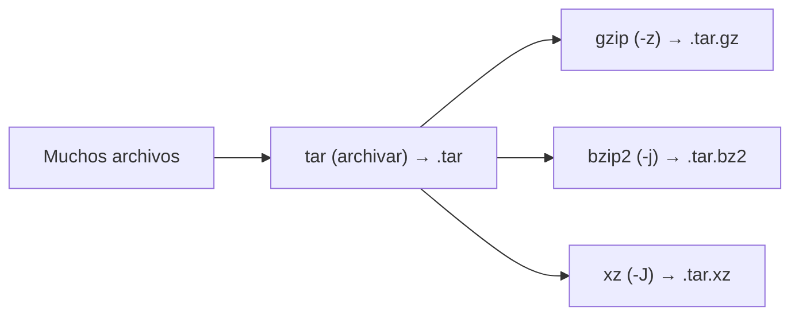

import { Aside } from "@astrojs/starlight/components";
import PreCheck from "@/components/tutorial/PreCheck.astro";
import MultipleChoice from "@/components/tutorial/MultipleChoice.astro";
import Option from "@/components/tutorial/Option.astro";

<PreCheck>
  - Entenderás la diferencia crítica entre *archivar* (empaquetar) y
  *comprimir*. - Aprenderás la sintaxis histórica (y moderna) del sagrado
  comando `tar`. - Conocerás los diferentes algoritmos de compresión (`gzip`,
  `bzip2`, `xz`). - Explorarás el rey de las copias de seguridad de red
  incrementales: `rsync`.
</PreCheck>

En Linux, a diferencia de Windows o Mac donde un archivo "zip" hace ambas cosas a la vez de forma invisible, el empaquetado y la compresión son dos operaciones mental y técnicamente distintas que se pueden apilar.

- **Archivar (Empaquetar):** Tomar 50 archivos distintos y juntarlos en un solo bloque sólido (como meterlos en una caja de cartón). El tamaño resultante es la suma exacta de los 50 archivos.
- **Comprimir:** Tomar ese bloque sólido y aplicarle un algoritmo matemático para que ocupe menos megabytes en el disco duro.

{/*  */}



---

## 1. El estándar absoluto: `tar`

`tar` proviene del inglés _Tape ARchive_ porque se inventó para respaldar datos en cintas magnéticas físicas. Es el responsable de "empaquetar". La extensión estándar que genera es un `.tar` (conocido coloquialmente como un _tarball_ de datos).

Para dominar `tar`, debes recordar sus banderas principales:

- `c` (Create): Para crear un archivo nuevo.
- `x` (eXtract): Para extraer un archivo existente.
- `t` (Table of contents): Para ver qué hay dentro de un archivo sin extraerlo.
- `f` (File): Le indica a tar que el siguiente texto que escribas es el nombre del archivo. **Debe ser siempre la última bandera.**
- `v` (Verbose): Mueve rápido por la pantalla los archivos que está procesando.

**Ejemplos:**

```bash
# Empaquetar dos carpetas enteras en un solo archivo "backup.tar"
tar -cvf backup.tar /var/log/ /etc/ssh/

# Extraer el contenido de ese "backup.tar" en mi carpeta actual
tar -xvf backup.tar
```

## 2. Compresión Integrada en `tar`

Ya sabemos empaquetar. Ahora queremos que ese paquete ocupe el mínimo espacio posible en disco. `tar` modernos permiten inyectar algoritmos de compresión directamente sobre la marcha. Las extensiones de los archivos cambiarán para reflejar esta doble naturaleza.

- **`gzip` (`-z`)**: La compresión estándar. Rápida y eficiente. Crea archivos `.tar.gz` o la abreviación `.tgz`.

  ```bash
  # El comando más famoso de Linux: "tar equis zeta ube efe"
  # (Extraer tar.gz)
  tar -xzvf archivo.tar.gz

  # Comprimir una carpeta usando gzip
  tar -czvf archivo.tar.gz /mi_carpeta_pesada/
  ```

- **`bzip2` (`-j`)**: Mucho más lento que gzip, pero comprime algo más de tamaño. Crea `.tar.bz2`.

  ```bash
  tar -cjvf archivo.tar.bz2 /carpeta/
  ```

- **`xz` (`-J`)**: Extremadamente lento al comprimir, extremadamente rápido al descomprimir. Es el algoritmo moderno que más tamaño salva a costa de exprimir tu CPU. Crea `.tar.xz`. (El Kernel de Linux se distribuye oficialmente en este formato).

---

## 3. El Rey de las Copias de Seguridad: `rsync`

Mientras que `tar` es ideal para preparar un archivo y enviarlo por correo o guardarlo en frío, al hacer copias de seguridad de terabytes de servidores en producción de disco a disco, `tar` repetiría todo desde cero cada día.

`rsync` (Remote Sync) resuelve esto. Analiza matemáticamente el origen y el destino, confirmando qué ha cambiado a nivel de byte. **Si de un archivo de 10GB solo cambió una línea de texto de 1KB, rsync transmite solo ese kilobyte de diferencia a través de la red.**

```bash
# Sincroniza la carpeta local hacia una carpeta de backup
# -a (Archive): Copia recursivamente, preservando dueños, permisos y fechas (Vital)
# -v (Verbose): Muestra progreso
rsync -av /mis_datos/ /media/disco_backup/mis_datos_respaldo/

# Enviar una copia de seguridad directa a un servidor remoto a través del puerto seguro SSH
# -z (Zip): Comprime los datos temporalmente durante la transferencia de red
rsync -avz /mis_datos/ usuario@192.168.1.50:/home/usuario/backup/
```

<Aside type="caution" title="La magia de la barra final (/) en rsync">
  En `rsync`, `/mis_datos/` (con barra) copia *el contenido* de la carpeta. Pero
  `/mis_datos` (sin barra) copia *la carpeta misma*. ¡Un error en la barra puede
  arruinar una jerarquía de copias de seguridad planificada!
</Aside>

---

## Comprueba tus conocimientos

1. Trabajas en el servidor de base de datos. Quieres descargar el repositorio principal del proyecto, el cual se llama `ventas01.tar.gz`. ¿Cuál es el comando y los modificadores (banderas) correctas para desencriptar (revertir la compresión Gzip) y desempaquetar el Tape Archive simultáneamente en tu directorio actual?

   <MultipleChoice>
     <Option>`tar -czvf ventas01.tar.gz`</Option>
     <Option isCorrect>
       `tar -xzvf ventas01.tar.gz` (eXtract, GZip, Verbose, File)
     </Option>
     <Option>`unzip ventas01.tar.gz`</Option>
   </MultipleChoice>

2. Analizando las extensiones de distintos instaladores en Linux, te encuentras con `kernel.tar.xz`, `kernel.tar.bz2` y `kernel.tar.gz`. Te han pedido que descargues para el servidor IoT la versión que ocupará absolutamente el MENOR espacio en megabytes de tráfico al descargarse, sin importar si demora más en procesarse en tu terminal. ¿Cuál técnica de compresión cumple esto?

   <MultipleChoice>
     <Option>Tar pelado (`.tar`).</Option>
     <Option>La compresión estándar Gzip (`.tar.gz`).</Option>
     <Option isCorrect>
       El formato XZ (`.tar.xz`). Usa muchísima más CPU, pero arroja los ratios
       de tamaño más pequeños.
     </Option>
   </MultipleChoice>

3. Quieres hacer una copia de seguridad de la carpeta `/etc` hacia un disco externo en `/mnt/respaldo`. Sin embargo, es vital que los archivos que copies no pierdan accidentalmente la propiedad estricta del usuario `root` y sigan conservando sus fechas de modificación reales. ¿Qué comando te asegura eso de serie?
   <MultipleChoice>
     <Option>`cp -r /etc /mnt/respaldo`</Option>
     <Option isCorrect>
       `rsync -a /etc/ /mnt/respaldo` (La 'a' de Archive Mode empaqueta
       preservando permisos, dueños y timestamps, copiando solo las
       diferencias).
     </Option>
     <Option>`mv /etc /mnt/respaldo`</Option>
   </MultipleChoice>
