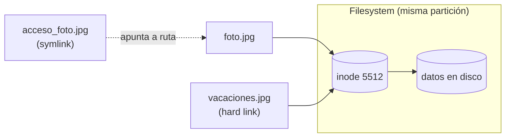

import { Aside } from "@astrojs/starlight/components";
import PreCheck from "@/components/tutorial/PreCheck.astro";
import MultipleChoice from "@/components/tutorial/MultipleChoice.astro";
import Option from "@/components/tutorial/Option.astro";

<PreCheck>
  - Entenderás el concepto invisible de Linux: el **Inodo**. - Crearás Enlaces
  Duros (`Hard Links`) para proteger archivos de borrados accidentales. -
  Crearás Enlaces Simbólicos (`Soft Links`) para hacer accesos directos a
  carpetas. - Aprenderás por qué un enlace se "rompe".
</PreCheck>

En Windows usamos "Accesos Directos". En Linux usamos **Enlaces** (_Links_), pero la arquitectura debajo de ellos es infinitamente más potente y peligrosa si no se entiende.

---

## 1. El Secreto de Linux: Los Inodos

Para Linux, el nombre de un archivo no importa. Cuando guardas `foto.jpg`, el disco duro almacena los datos reales en un bloque llamado **Inodo** (nódulo índice), el cual tiene un número único (Ej: Inodo 5512).

El nombre `foto.jpg` es simplemente una "etiqueta visual" para los humanos que apunta al Inodo 5512.

Sabiendo esto, imagina que creamos una segunda etiqueta llamada `vacaciones.jpg` que apunte al **mismo** Inodo 5512. Tendrías un solo archivo físico en el disco duro, pero podrías abrirlo desde dos nombres diferentes. Eso es un enlace.

{/*  */}



---

## 2. Enlaces Duros (Hard Links)

Un Enlace Duro es literalmente **un segundo nombre real para el mismo archivo físico**.

- **Ventaja de Supervivencia:** Si tienes 3 enlaces duros apuntando al mismo archivo y borras 2 de ellos, **los datos no se pierden**. Los datos físicos del disco duro se destruyen _únicamente_ cuando borras el último enlace duro existente.
- **Limitaciones vitales:**
  1. No pueden enlazar a directorios (carpetas).
  2. No pueden cruzar de un disco duro o partición a otra. Todo debe estar en la misma partición física.

**Comando (Link):**

```bash
# Crear un enlace duro.
# Sintaxis: ln [origen_existente] [nombre_del_nuevo_enlace]
ln proyecto_final.docx copia_seguridad.docx
```

---

## 3. Enlaces Simbólicos (Soft/Symbolic Links)

Son el equivalente exacto a los accesos directos de Windows. Un enlace simbólico **no apunta a los datos, apunta a la ruta de otro nombre**.

- **Ventajas:**
  1. ¡Pueden enlazar a directorios enteros!
  2. Pueden cruzar a diferentes discos duros, pendrives, o redes.
- **Debilidad mortal:**
  - Si borras o mueves el archivo o carpeta original al que apuntan, el enlace simbólico se queda "huérfano" apuntando a la nada y se rompe (_Broken Link_, aparecerá en rojo parpadeante en muchas terminales).

**Comando (Link Simbólico):**
Para crearlo, añadimos la bandera `-s` (Simbólico).

<Aside type="caution" title="Regla de oro de los Soft Links">
  Usa SIEMPRE rutas absolutas al crear Enlaces Simbólicos. Si usas rutas
  relativas y luego mueves el enlace a otra carpeta, se romperá porque intentará
  buscar el archivo relativo a su nueva ubicación.
</Aside>

```bash
# Crear un acceso directo de la carpeta web hacia la carpeta de mi usuario
ln -s /var/www/html/ /home/juan/acceso_web
```

---

## Comprueba tus conocimientos

1. Ejecutas `ls -l` y observas en la primera columna que el archivo empieza con una letra `l`, así: `lrwxrwxrwx 1 root root 15 Jan 10 14:00 www -> /var/www/html`. ¿Ante qué tipo de objeto estamos?

<MultipleChoice>
  <Option>
    Es un Enlace Duro (Hard Link), todos tienen absolutamente todos los permisos abiertos a '777'.
  </Option>
  <Option isCorrect>
    Es un Enlace Simbólico (Soft Link), la letra 'l' inicial y la flecha '->' nos indican a qué ruta apunta realmente este acceso directo.
  </Option>
  <Option>
    Es un Directorio normal.
  </Option>
</MultipleChoice>

2. Tienes un archivo gigante de base de datos de 50GB en el Disco Duro A. Quieres que una aplicación que está instalada de forma aislada en el Disco Duro B pueda acceder a este archivo. ¿Cómo le creas el puente?

<MultipleChoice>
     <Option isCorrect>
       Usando un Enlace Simbólico (`ln -s`), ya que son los únicos que pueden
       cruzar entre diferentes particiones y discos físicos.
     </Option>
     <Option>
       Usando un Enlace Duro (`ln`), porque protegen la base de datos contra
       borrados accidentales del Disco A.
     </Option>
     <Option>
       Copiando el archivo con `cp` para generar el enlace entre ambos discos.
     </Option>
</MultipleChoice>

3. Tienes un archivo muy importante llamado `servidor.conf`. Usas el comando `ln servidor.conf respaldo.conf`. Si tu compañero de equipo ejecuta por error `rm servidor.conf`, ¿Qué sucede con la configuración que había dentro?

<MultipleChoice>
     <Option>
       Se pierde totalmente y el enlace `respaldo.conf` se pinta de rojo y deja
       de funcionar (*Broken Link*).
     </Option>
     <Option>Ambos archivos se borran mágicamente en cadena.</Option>
     <Option isCorrect>
       La información sigue 100% intacta en disco. `respaldo.conf` es un enlace
       duro, por lo que actúa como un escudo; para que Linux borre la
       información, tendría que haber borrado todos sus enlaces.
     </Option>
</MultipleChoice>
