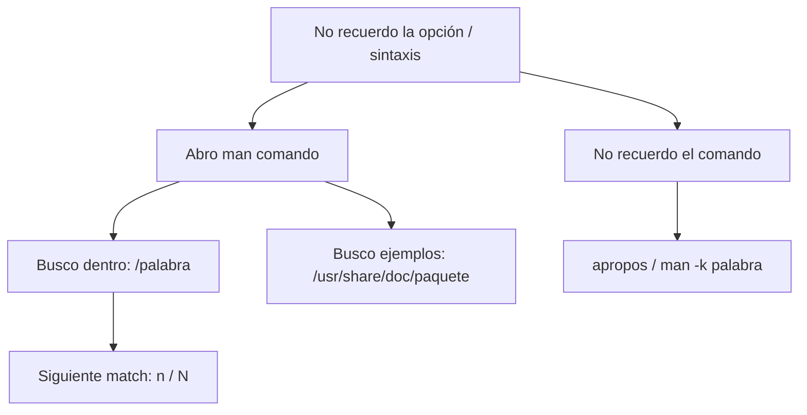

import { Aside } from "@astrojs/starlight/components";
import PreCheck from "@/components/tutorial/PreCheck.astro";
import MultipleChoice from "@/components/tutorial/MultipleChoice.astro";
import Option from "@/components/tutorial/Option.astro";

<PreCheck>
  - Encontrarás la respuesta a cualquier bandera de comando en segundos usando
  `man`. - Sabrás cómo buscar herramientas cuando no sabes el nombre del comando
  usando `apropos` / `man -k`. - Descubrirás dónde se esconden los ejemplos de
  configuración y tutoriales del sistema en Debian `/usr/share/doc`.
</PreCheck>

Cuando rindas un examen de certificación como el LFCS (Linux Foundation Certified Sysadmin), no tendrás acceso a Google. Estarás tú solo frente a una terminal negra. **Tu vida dependerá de saber cómo leer y buscar en el manual interno del sistema operativo.**

{/*  */}



---

## 1. El Manual de Comandos (`man`)

Casi todos los comandos y programas en Linux vienen con un gigantesco manual hiperdetallado incorporado en el sistema.

- **Sintaxis**: `man [comando]`
- **Ejemplo**:
  ```bash
  man rsync
  ```
  _(Al ejecutar esto, la pantalla se limpiará y entrarás al visor interactivo de manuales, que es literalmente el programa `less` que vimos en la lección de Tuberías)._

### Navegando por el Manual

Como `man` usa `less` por deajo, te mueves exactamente igual:

- **Espacio**: Bajar una página entera.
- **Letra `b`**: Volver a la página anterior (Back).
- **Flechas arriba/abajo**: Moverse línea a línea.
- **Letra `q`**: Salir del manual (Quit) para volver a tu terminal.

### El Súper-Poder: Buscar dentro del Manual

Imagina que abres `man rsync`, el cual tiene mil líneas de texto, e intentas buscar cómo excluir carpetas. Bajar leyendo línea por línea es una pérdida de tiempo.

1. Una vez dentro de `man`, presiona la tecla de la barra inclinada **`/`**.
2. Escribe una palabra, por ejemplo: `/exclude` y presiona Enter.
3. El manual saltará inmediatamente a la primera aparición de la palabra y la resaltará.
4. Presiona la tecla **`n`** (Next) para saltar a la siguiente aparición en el documento, o **`N`** (Shift+N) para volver a la aparición anterior.

---

## 2. Buscar Comandos Desconocidos (Apropos)

¿Qué pasa si necesitas particionar un disco, pero no recuerdas cuál era el comando para hacerlo? Afortunadamente, el sistema manual tiene un motor de búsqueda inversa de palabras clave en todas las descripciones de los miles de comandos de Linux.

Para buscar programas relacionados con una palabra clave, usa `man -k` (Keyword) o su alias `apropos` (A Propósito de).

```bash
# "A propósito de particiones..."
apropos partition

# Equivalente:
man -k partition
```

Esto te devolverá una lista con comandos como `fdisk`, `parted` o `mkfs` seguidos de una breve línea descriptiva para refrescarte la memoria.

---

## 3. Guías Extendidas y Ejemplos de Configuración (`/usr/share/doc`)

`man` es grandioso para ver qué botones apretar en un comando, pero es terrible enseñándote **cómo configurar el software en la vida real**.
Cuando instalas un servicio grande como un servidor de correos (Postfix) o un servidor Web (Nginx), si quieres ver ejemplos reales de configuración, plantillas o tutoriales oficiales, los encontrarás en:
`/usr/share/doc/[nombre_del_paquete]`

```bash
ls /usr/share/doc/nginx
```

Aquí a menudo encontrarás archivos README.gz que te explicarán las idiosincrasias de ese paquete específico en la arquitectura Debian.

---

## Comprueba tus conocimientos

1. Estás en pleno examen LFCS buscando cómo cambiar una contraseña temporal. Entraste a `man passwd`. ¿Cuál de las siguientes acciones es la más eficiente para encontrar información sobre cómo "expirar" la contraseña lo antes posible?

   <MultipleChoice>
     <Option>
       Mantener la flecha abajo apretada hasta encontrar la sección que hable de
       fechas (se estima 5 minutos de lectura rápida).
     </Option>
     <Option>
       Presionar la Letra `b` y luego `q` para buscar ayuda en otro comando.
     </Option>
     <Option isCorrect>
       Escribir `/expire` para abrir la búsqueda interna, presionar Enter, y
       luego usar `n` para ubicar el parámetro (bandera) asociado.
     </Option>
   </MultipleChoice>

2. Necesitas ver cuánto espacio queda libre en el disco duro, pero has sufrido un apagón mental y no recuerdas si el comando era `du`, `df`, `free` o ninguno de ellos. ¿Cuál es la forma correcta de "preguntarle a Linux" usando como palabra clave el almacenamiento en disco en inglés (_disk_)?

   <MultipleChoice>
     <Option>`man disk`</Option>
     <Option isCorrect>
       `apropos disk` (Buscará "disk" en las descripciones de todos los comandos
       y listará herramientas como 'df - report file system disk space').
     </Option>
     <Option>`ls /usr/share/doc/disk`</Option>
   </MultipleChoice>

3. Instalaste un paquete misterioso de VPN pero su página de `man` da poca información teórica y dice "Consulte la documentación en el directorio de share". ¿A dónde debes dirigirte para encontrar los PDFs, README o archivos de configuración de ejemplo que trajo el paquete?
   <MultipleChoice>
     <Option>A `$PATH`</Option>
     <Option>A `/etc/manuales/`</Option>
     <Option isCorrect>A la ruta `/usr/share/doc/nombre_del_paquete`</Option>
   </MultipleChoice>
