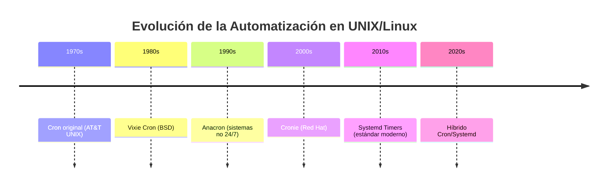

import { Aside } from "@astrojs/starlight/components";
import PreCheck from "@/components/tutorial/PreCheck.astro";
import MultipleChoice from "@/components/tutorial/MultipleChoice.astro";
import Option from "@/components/tutorial/Option.astro";

# 6.4 Automatización de Tareas (Cron) - Documentación Extendida

## Índice
1. [Fundamentos de la Automatización en Linux](#fundamentos)
2. [El Demonio Cron: Arquitectura y Funcionamiento](#demonio-cron)
3. [La Sintaxis de los 5 Asteriscos](#sintaxis-5-asteriscos)
4. [Gestión Avanzada de Crontab](#gestion-crontab)
5. [Variables de Entorno y PATH en Cron](#variables-entorno)
6. [Registro y Depuración de Tareas Cron](#depuracion-cron)
7. [Comandos Diferidos con At](#comandos-at)
8. [Systemd Timers: El Estándar Moderno](#systemd-timers)
9. [Mejores Prácticas y Seguridad](#mejores-practicas)
10. [Casos de Uso y Ejemplos Prácticos](#casos-uso)
11. [Resolución de Problemas Comunes](#resolucion-problemas)

---

## 1. Fundamentos de la Automatización en Linux

### 1.1 ¿Por qué automatizar?
La automatización de tareas es el pilar fundamental de la administración de sistemas moderna. Permite:
- **Consistencia operativa**: Ejecutar tareas siempre de la misma manera
- **Eficiencia administrativa**: Liberar tiempo del administrador
- **Prevención de errores humanos**: Eliminar la dependencia de acciones manuales
- **Escalabilidad**: Gestionar miles de sistemas con el mismo esfuerzo

### 1.2 Evolución histórica


---

## 2. El Demonio Cron: Arquitectura y Funcionamiento 

### 2.1 Arquitectura del Sistema Cron

```bash
# Estructura de archivos del sistema Cron
/etc/cron.d/          # Archivos de configuración específicos
/etc/cron.daily/      # Scripts ejecutados diariamente
/etc/cron.hourly/     # Scripts ejecutados cada hora
/etc/cron.monthly/    # Scripts ejecutados mensualmente
/etc/cron.weekly/     # Scripts ejecutados semanalmente
/etc/crontab          # Archivo maestro de sistema
/var/spool/cron/      # Directorio de crontabs de usuarios
/var/log/syslog       # Log de actividades del sistema
```

### 2.2 Mecanismo de Ejecución

**Ciclo de Vida de una Tarea Cron:**

1. **Inicio del demonio**: `cron` se inicia durante el arranque del sistema
2. **Lectura de archivos**: Cada minuto, cron lee todos los archivos crontab
3. **Verificación temporal**: Compara la hora actual con las programaciones
4. **Ejecución de tareas**: Cuando coincide, ejecuta el comando especificado
5. **Registro de eventos**: Guarda la ejecución en logs del sistema

```bash
# Verificar el estado del servicio cron
sudo systemctl status cron
sudo systemctl is-active cron

# Reiniciar cron después de cambios
sudo systemctl restart cron

# Ver logs del sistema relacionados con cron
sudo journalctl -u cron -f  # Seguimiento en tiempo real
sudo journalctl -u cron --since "2024-01-01"
```

---

## 3. La Sintaxis de los 5 Asteriscos 

### 3.1 Estructura Detallada

```
┌───────── Minuto (0-59)
│ ┌─────── Hora (0-23)
│ │ ┌───── Día del Mes (1-31)
│ │ │ ┌─── Mes (1-12)
│ │ │ │ ┌─ Día de la Semana (0-7, donde 0 y 7 = Domingo)
│ │ │ │ │
* * * * * COMANDO_A_EJECUTAR
```

### 3.2 Operadores Especiales

<table>
    <thead>
        <tr>
            <th>Operador</th>
            <th>Significado</th>
            <th>Ejemplo</th>
            <th>Explicación</th>
        </tr>
    </thead>
    <tbody>
        <tr>
            <td><code>* </code></td>
            <td>Cualquier valor</td>
            <td><code>* * * * *</code></td>
            <td>Cada minuto</td>
        </tr>
        <tr>
            <td><code>,</code></td>
            <td>Lista de valores</td>
            <td><code>1,15,30 * * * *</code></td>
            <td>Minutos 1, 15 y 30</td>
        </tr>
        <tr>
            <td><code>-</code></td>
            <td>Rango de valores</td>
            <td><code>1-5 * * * *</code></td>
            <td>De lunes a viernes</td>
        </tr>
        <tr>
            <td><code>/</code></td>
            <td>Paso/Intervalo</td>
            <td><code>*/15 * * * *</code></td>
            <td>Cada 15 minutos</td>
        </tr>
        <tr>
            <td><code>0-23/2</code></td>
            <td>Cada 2 horas</td>
            <td><code>0 */2 * * *</code></td>
            <td>A las 0,2,4,... horas</td>
        </tr>
    </tbody>
</table>

### 3.3 Ejemplos Avanzados

```bash
# Ejecutar cada 5 minutos entre las 9am y 5pm
*/5 9-17 * * * /usr/bin/comando

# Ejecutar el primer día de cada mes a las 2:15am
15 2 1 * * /usr/bin/comando

# Ejecutar cada hora exacta durante los fines de semana
0 * * * 6,7 /usr/bin/comando

# Ejecutar cada 30 segundos (usando sleep en el comando)
* * * * * /usr/bin/comando
* * * * * sleep 30 && /usr/bin/comando
```

### 3.4 Notaciones Especiales Predefinidas

```bash
@reboot     # Ejecutar al iniciar el sistema
@daily      # Una vez al día (equivalente a 0 0 * * *)
@hourly     # Una vez cada hora (0 * * * *)
@weekly     # Una vez a la semana (0 0 * * 0)
@monthly    # Una vez al mes (0 0 1 * *)
@yearly     # Una vez al año (0 0 1 1 *)
```

---

## 4. Gestión Avanzada de Crontab

### 4.1 Comandos de Administración

```bash
# Editar crontab del usuario actual
crontab -e

# Editar crontab de usuario específico
sudo crontab -e -u nombre_usuario

# Ver crontab del usuario actual
crontab -l

# Ver crontab de usuario específico
sudo crontab -l -u nombre_usuario

# Eliminar crontab del usuario actual
crontab -r

# Eliminar crontab de usuario específico
sudo crontab -r -u nombre_usuario
```

### 4.2 Archivos de Crontab en `/etc/cron.d/`

```bash
# Formato especial para archivos en /etc/cron.d/
# Incluye el usuario que ejecutará el comando
# MINUTO HORA DIA MES DIA_USUARIO USUARIO COMANDO

# Ejemplo: /etc/cron.d/backup
0 2 * * * root /usr/local/bin/backup_sistema.sh
15 4 * * 1-5 www-data /usr/bin/php /var/www/cron.php
```

### 4.3 Buenas Prácticas en Crontab

```bash
# 1. Siempre usar rutas absolutas
0 2 * * * /usr/bin/python3 /home/usuario/scripts/analisis.py

# 2. Definir variables de entorno al inicio
# Ejemplo de cabecera recomendada
SHELL=/bin/bash
PATH=/usr/local/sbin:/usr/local/bin:/usr/sbin:/usr/bin:/sbin:/bin
MAILTO=administrador@dominio.com

# 3. Usar scripts en lugar de comandos largos
0 3 * * * /opt/scripts/mantenimiento_diario.sh

# 4. Redirigir salida para evitar logs innecesarios
0 4 * * * /usr/bin/comando > /dev/null 2>&1
```

---

## 5. Variables de Entorno y PATH en Cron 

### 5.1 El Problema del PATH en Cron

**¿Por qué cron no encuentra mis comandos?**

Cron ejecuta comandos en un entorno mínimo, sin cargar:
- Variables de entorno de usuario (`~/.bashrc`, `~/.profile`)
- Variables de entorno de sistema (`/etc/environment`)
- Alias de shell
- Funciones definidas en scripts de perfil

### 5.2 Soluciones para Problemas de PATH

```bash
# 1. Usar rutas absolutas en todos los comandos
0 2 * * * /usr/bin/find /var/log -name "*.log" -mtime +30 -delete

# 2. Definir PATH dentro del crontab
PATH=/usr/local/sbin:/usr/local/bin:/usr/sbin:/usr/bin:/sbin:/bin
0 2 * * * find /var/log -name "*.log" -mtime +30 -delete

# 3. Cargar entorno completo en el script
#!/bin/bash
source /etc/profile
source $HOME/.bashrc
# Resto del script...

# 4. Usar env para establecer variables
0 2 * * * env PATH="/usr/local/bin:/usr/bin" /usr/bin/comando
```

### 5.3 Variables Comunes en Crontab

```bash
# Variables más utilizadas
MAILTO=admin@empresa.com    # Donde enviar resultados
SHELL=/bin/bash             # Shell a utilizar
PATH=/usr/local/bin:/usr/bin:/bin
HOME=/home/usuario          # Directorio home
LOGNAME=usuario             # Nombre de usuario

# Ejemplo completo
SHELL=/bin/bash
PATH=/usr/local/sbin:/usr/local/bin:/usr/sbin:/usr/bin:/sbin:/bin
MAILTO=admin@empresa.com
HOME=/home/admin

# Tareas programadas
0 2 * * * /opt/scripts/backup.sh
15 4 * * 1 /opt/scripts/reporte_semanal.sh
```

---

## 6. Registro y Depuración de Tareas Cron

### 6.1 Logs del Sistema

```bash
# Ver logs de cron
sudo grep CRON /var/log/syslog
sudo journalctl -u cron

# Ver logs específicos por fecha
sudo journalctl -u cron --since "2024-01-01" --until "2024-01-31"

# Monitoreo en tiempo real
sudo journalctl -u cron -f
sudo tail -f /var/log/syslog | grep CRON
```

### 6.2 Depuración de Tareas

```bash
# 1. Registrar salida en archivo
0 2 * * * /usr/bin/comando >> /var/log/comando.log 2>&1

# 2. Registrar con timestamp
0 2 * * * echo "$(date): Ejecutando..." >> /var/log/comando.log && /usr/bin/comando >> /var/log/comando.log 2>&1

# 3. Probar comando manualmente
# Ejecutar con el mismo entorno que cron
env -i /bin/bash -c 'PATH=/usr/local/bin:/usr/bin:/bin /usr/bin/comando'

# 4. Verificar sintaxis del crontab
# No hay comando directo, pero se puede verificar manualmente
crontab -l | grep -v "^#" | awk 'NF>=6 {print}'
```

### 6.3 Script de Diagnóstico

```bash
#!/bin/bash
# diagnosticar_cron.sh
echo "=== DIAGNÓSTICO DE CRON ==="
echo "1. Estado del servicio cron:"
sudo systemctl status cron --no-pager

echo -e "\n2. Crontabs activos:"
echo "--- Usuario actual ---"
crontab -l 2>/dev/null || echo "No hay crontab configurado"
echo "--- Root ---"
sudo crontab -l 2>/dev/null || echo "No hay crontab de root"

echo -e "\n3. Archivos de cron:"
ls -la /etc/cron.d/ 2>/dev/null || echo "No hay archivos en /etc/cron.d/"

echo -e "\n4. Últimas ejecuciones:"
sudo journalctl -u cron --since "1 hour ago" | tail -10

echo -e "\n5. Permisos de scripts:"
find /opt/scripts /usr/local/bin -name "*.sh" -exec ls -la {} \; 2>/dev/null
```

---

## 7. Comandos Diferidos con At 

### 7.1 Instalación y Configuración

```bash
# Instalación en Debian/Ubuntu
sudo apt-get update
sudo apt-get install at

# Instalación en RHEL/CentOS
sudo yum install at
sudo systemctl enable atd
sudo systemctl start atd
```

### 7.2 Sintaxis de At

```bash
# Formato básico
echo "comando" | at tiempo

# Ejemplos de tiempos
at now + 5 minutes          # Dentro de 5 minutos
at now + 1 hour            # Dentro de 1 hora
at now + 2 days            # Dentro de 2 días
at 3:00 PM tomorrow        # Mañana a las 3 PM
at 2:15 AM Friday          # Viernes a las 2:15 AM
at midnight                # Medianoche de hoy
at 10:00am 2025-12-25      # Fecha específica
at teatime                 # 4:00 PM
```

### 7.3 Comandos Avanzados de At

```bash
# Enviar comando complejo
echo "/usr/bin/backup.sh --full /var/www" | at now + 30 minutes

# Usar archivo de comandos
at -f script_completo.sh now + 1 hour

# Programar múltiples comandos
cat << EOF | at now + 2 hours
echo "Iniciando mantenimiento"
/opt/scripts/mantenimiento.sh
echo "Mantenimiento completado"
EOF

# Ver cola de trabajos
atq
# o
at -l

# Eliminar trabajo específico
atrm 1234

# Ver detalle de trabajo
at -c 1234
```

### 7.4 Usos Prácticos de At

```bash
# 1. Reinicio programado después de actualización
echo "shutdown -r now" | at now + 15 minutes

# 2. Ejecutar tarea en horario no laboral
echo "/opt/scripts/reporte_mensual.sh" | at 2:00 AM tomorrow

# 3. Eliminar archivos temporales mañana
echo "rm -rf /tmp/*" | at 6:00 AM tomorrow

# 4. Notificaciones programadas
echo "echo 'Recordatorio: Reunión de equipo en 1 hora' | mail -s 'Recordatorio' usuario@empresa.com" | at now + 1 hour
```

---

## 8. Systemd Timers: El Estándar Moderno

### 8.1 Arquitectura de Systemd Timers

```bash
# Estructura de archivos
/etc/systemd/system/
├── backup.service      # Servicio a ejecutar
├── backup.timer       # Timer que lo activa
├── backup.timer.d/    # Overrides del timer
│   └── override.conf
└── timers.target.wants/
    └── backup.timer -> /etc/systemd/system/backup.timer
```

### 8.2 Creación de un Timer Systemd

**Paso 1: Crear el servicio**

```bash
# /etc/systemd/system/backup.service
[Unit]
Description=Backup del sistema
After=network.target

[Service]
Type=oneshot
User=root
Group=root
ExecStart=/usr/local/bin/backup_sistema.sh
StandardOutput=journal
StandardError=journal

[Install]
WantedBy=multi-user.target
```

**Paso 2: Crear el timer**

```bash
# /etc/systemd/system/backup.timer
[Unit]
Description=Timer para backup del sistema
Requires=backup.service

[Timer]
# Programación equivalente a cron
OnCalendar=daily                    # Diario
# O específico: OnCalendar=*-*-* 02:00:00
Persistent=true                     # Ejecutar si se perdió tiempo

# Configuración adicional
OnUnitActiveSec=24h                # 24 horas después de última ejecución
RandomizedDelaySec=5min            # Evitar picos de carga

[Install]
WantedBy=timers.target
```

### 8.3 Sintaxis OnCalendar

```bash
# Especificaciones de tiempo en Systemd
OnCalendar=*-*-* 00:00:00          # Cada medianoche
OnCalendar=Mon..Fri 09:00:00       # Lunes a viernes a las 9 AM
OnCalendar=*:0/15                  # Cada 15 minutos
OnCalendar=Sun *-*-* 02:00:00      # Domingos a las 2 AM
OnCalendar=2024-01-01              # Fecha específica

# Rangos y listas
OnCalendar=Mon..Wed,Sun *-*-* 00:00:00
OnCalendar=*-*-01,15 00:00:00      # Días 1 y 15 de cada mes

# Intervalos relativos
OnCalendar=2h                      # Cada 2 horas
OnCalendar=30m                     # Cada 30 minutos
OnCalendar=weekly                  # Semanalmente
OnCalendar=monthly                 # Mensualmente
```

### 8.4 Gestión de Systemd Timers

```bash
# Habilitar y empezar el timer
sudo systemctl daemon-reload
sudo systemctl enable backup.timer
sudo systemctl start backup.timer

# Ver estado
sudo systemctl status backup.timer
sudo systemctl list-timers         # Listar todos los timers
sudo systemctl list-timers --all   # Incluyendo inactivos

# Información detallada
sudo systemctl show backup.timer
sudo systemctl cat backup.timer

# Deshabilitar timer
sudo systemctl stop backup.timer
sudo systemctl disable backup.timer

# Ver ejecuciones
sudo journalctl -u backup.service
sudo journalctl -u backup.timer
```

### 8.5 Ventajas de Systemd Timers sobre Cron

<table>
    <thead>
        <tr>
            <th>Aspecto</th>
            <th>Cron</th>
            <th>Systemd Timers</th>
        </tr>
    </thead>
    <tbody>
        <tr>
            <td><strong>Logs</strong></td>
            <td>Dispersos, difíciles de seguir</td>
            <td>Centralizados en journald</td>
        </tr>
        <tr>
            <td><strong>Dependencias</strong></td>
            <td>No soporta</td>
            <td>Soporte nativo</td>
        </tr>
        <tr>
            <td><strong>Monitoreo</strong></td>
            <td>Manual</td>
            <td>Integrado en systemd</td>
        </tr>
        <tr>
            <td><strong>Persistencia</strong></td>
            <td>No</td>
            <td>Sí (ejecutar si se perdió)</td>
        </tr>
        <tr>
            <td><strong>Aleatorización</strong></td>
            <td>No</td>
            <td>Sí (distribuir carga)</td>
        </tr>
        <tr>
            <td><strong>Seguridad</strong></td>
            <td>Básica</td>
            <td>Namespaces, Capabilities</td>
        </tr>
        <tr>
            <td><strong>Paralelismo</strong></td>
            <td>Limitado</td>
            <td>Control total</td>
        </tr>
    </tbody>
</table>

---

## 9. Mejores Prácticas y Seguridad

### 9.1 Seguridad en Cron

```bash
# Control de acceso
# Permitir uso solo a usuarios listados
# /etc/cron.allow
usuario1
usuario2

# Denegar uso a usuarios listados
# /etc/cron.deny
usuario_no_autorizado

# Permisos de scripts
sudo chown root:root /opt/scripts/script.sh
sudo chmod 700 /opt/scripts/script.sh
```

### 9.2 Buenas Prácticas Generales

```bash
# 1. Siempre respaldar crontab antes de editar
crontab -l > backup_cron_$(date +%Y%m%d).txt

# 2. Usar control de versiones para scripts
cd /opt/scripts
git init
git add .
git commit -m "Versión inicial de scripts cron"

# 3. Validar scripts antes de programarlos
bash -n script.sh  # Verificar sintaxis
bash -x script.sh  # Debug ejecución

# 4. Monitoreo proactivo
0 0 * * * /usr/bin/test -e /var/log/comando.log && echo "OK" || echo "ERROR" | mail -s "Alerta Cron" admin@empresa.com

# 5. Documentación en el propio crontab
# Backup diario - Ejecutado a las 2:00 AM
0 2 * * * /opt/scripts/backup.sh
```

### 9.3 Plantilla de Crontab Estándar

```bash
# ============================================
# Crontab para servidor web - user: www-data
# Fecha: $(date +%Y-%m-%d)
# Responsable: Administrador
# ============================================

# Variables de entorno
SHELL=/bin/bash
PATH=/usr/local/sbin:/usr/local/bin:/usr/sbin:/usr/bin:/sbin:/bin
MAILTO=admin@empresa.com
HOME=/var/www

# Logs de aplicación - Rotación diaria a las 2:00 AM
0 2 * * * /usr/sbin/logrotate /etc/logrotate.d/aplicacion

# Backup de base de datos - Diario a las 3:00 AM
0 3 * * * /opt/scripts/backup_mysql.sh

# Limpieza de caché - Cada hora
0 * * * * /usr/bin/php /var/www/app/console cache:clear --env=prod

# Reportes - Lunes a viernes a las 8:00 AM
0 8 * * 1-5 /opt/scripts/generar_reportes.sh

# Mantenimiento semanal - Domingo a las 4:00 AM
0 4 * * 0 /opt/scripts/mantenimiento_semanal.sh
```

---

## 10. Casos de Uso y Ejemplos Prácticos

### 10.1 Backup Automatizado

```bash
# Script: /opt/scripts/backup_completo.sh
#!/bin/bash
# Backup completo con rotación

BACKUP_DIR="/backup"
DATE=$(date +%Y%m%d_%H%M%S)
RETENTION_DAYS=30

# Crear backup comprimido
tar -czf ${BACKUP_DIR}/backup_${DATE}.tar.gz \
    /etc \
    /var/www \
    /opt/aplicacion \
    /home 2>/dev/null

# Eliminar backups antiguos
find ${BACKUP_DIR} -name "backup_*.tar.gz" -mtime +${RETENTION_DAYS} -delete

# Registrar en log
echo "$(date): Backup completado - ${BACKUP_DIR}/backup_${DATE}.tar.gz" >> /var/log/backup.log

# Notificar por email
echo "Backup completado exitosamente" | mail -s "Backup Diario - $(hostname)" admin@empresa.com

# Ejecutar a las 2:00 AM diario
0 2 * * * /opt/scripts/backup_completo.sh
```

### 10.2 Monitoreo de Sistema

```bash
# Script: /opt/scripts/monitoreo_sistema.sh
#!/bin/bash
# Monitoreo de recursos del sistema

ALERT_CPU=90
ALERT_MEM=90
ALERT_DISK=85
EMAIL="alertas@empresa.com"

# CPU
CPU_USAGE=$(top -bn1 | grep "Cpu(s)" | awk '{print $2}' | cut -d. -f1)
if [ $CPU_USAGE -gt $ALERT_CPU ]; then
    echo "ALERTA: CPU al ${CPU_USAGE}%" | mail -s "Alerta CPU - $(hostname)" $EMAIL
fi

# Memoria
MEM_USAGE=$(free | grep Mem | awk '{printf("%.0f", $3/$2 * 100)}')
if [ $MEM_USAGE -gt $ALERT_MEM ]; then
    echo "ALERTA: Memoria al ${MEM_USAGE}%" | mail -s "Alerta Memoria - $(hostname)" $EMAIL
fi

# Disco
DISK_USAGE=$(df -h / | awk 'NR==2 {print $5}' | cut -d% -f1)
if [ $DISK_USAGE -gt $ALERT_DISK ]; then
    echo "ALERTA: Disco al ${DISK_USAGE}%" | mail -s "Alerta Disco - $(hostname)" $EMAIL
fi

# Ejecutar cada 15 minutos
*/15 * * * * /opt/scripts/monitoreo_sistema.sh
```

### 10.3 Automatización de Reportes

```bash
# Script: /opt/scripts/reporte_vacaciones.sh
#!/bin/bash
# Generación de reporte de vacaciones

REPORT_DIR="/var/www/reports"
DATE=$(date +%Y%m%d)

# Generar reporte
/usr/bin/mysql -u usuario -pcontraseña -D empresa -e "
SELECT nombre, apellido, fecha_inicio, fecha_fin
FROM empleados
WHERE estado = 'vacaciones'
ORDER BY fecha_inicio
" > ${REPORT_DIR}/vacaciones_${DATE}.csv

# Comprimir
gzip ${REPORT_DIR}/vacaciones_${DATE}.csv

# Enviar por email
echo "Reporte de vacaciones generado" | \
mail -s "Reporte Vacaciones ${DATE}" -a ${REPORT_DIR}/vacaciones_${DATE}.csv.gz \
director@empresa.com

# Ejecutar todos los lunes a las 8:00 AM
0 8 * * 1 /opt/scripts/reporte_vacaciones.sh
```

### 10.4 Mantenimiento de Sistema

```bash
# Script: /opt/scripts/mantenimiento_sistema.sh
#!/bin/bash
# Mantenimiento completo de sistema

LOG_FILE="/var/log/mantenimiento.log"
DATE=$(date '+%Y-%m-%d %H:%M:%S')

echo "[${DATE}] Iniciando mantenimiento..." >> ${LOG_FILE}

# 1. Limpiar paquetes no necesarios
apt-get autoremove -y >> ${LOG_FILE} 2>&1
apt-get autoclean >> ${LOG_FILE} 2>&1

# 2. Vaciar logs viejos
find /var/log -type f -name "*.log" -mtime +7 -delete
find /var/log -type f -name "*.gz" -mtime +30 -delete

# 3. Actualizar caché de paquetes
apt-get update >> ${LOG_FILE} 2>&1

# 4. Verificar integridad de paquetes
dpkg --verify >> ${LOG_FILE} 2>&1

# 5. Limpiar directorios temporales
rm -rf /tmp/* 2>/dev/null
rm -rf /var/tmp/* 2>/dev/null

# 6. Verificar sistema de archivos
fsck -n /dev/sda1 >> ${LOG_FILE} 2>&1

# 7. Reiniciar servicios problemáticos
systemctl restart apache2 2>/dev/null
systemctl restart mysql 2>/dev/null

echo "[${DATE}] Mantenimiento completado." >> ${LOG_FILE}

# Ejecutar cada domingo a las 3:00 AM
0 3 * * 0 /opt/scripts/mantenimiento_sistema.sh
```

---

## 11. Resolución de Problemas Comunes

### 11.1 Checklist de Diagnóstico

```bash
# 1. Verificar que cron esté ejecutándose
pgrep cron | wc -l
systemctl status cron | grep "active (running)"

# 2. Verificar permisos del script
ls -la /opt/scripts/mi_script.sh
# Debería tener permisos de ejecución: -rwxr-xr-x

# 3. Verificar que el comando existe en el PATH de cron
which mi_comando
# Si no está en PATH, usar ruta absoluta

# 4. Verificar que el script funciona manualmente
/opt/scripts/mi_script.sh
# Debería ejecutarse sin errores

# 5. Verificar sintaxis del crontab
crontab -l | grep -v "^#" | awk 'NF>=6 {print}'

# 6. Verificar logs de cron
sudo journalctl -u cron --since "1 hour ago" | grep -i error
sudo grep -i error /var/log/syslog | grep CRON
```

### 11.2 Problemas Comunes y Soluciones

#### Problema 1: El comando funciona manualmente pero no en cron

```bash
# Causa: PATH diferente
# Solución 1: Usar ruta absoluta
which comando  # Encontrar ruta
0 2 * * * /usr/bin/comando argumentos

# Solución 2: Definir PATH en crontab
PATH=/usr/local/bin:/usr/bin:/bin
0 2 * * * comando argumentos

# Solución 3: Usar entorno completo en script
#!/bin/bash
source /etc/profile
source $HOME/.bashrc
```

#### Problema 2: Script ejecuta pero no produce resultados

```bash
# Solución: Redirigir salida para depuración
0 2 * * * /opt/scripts/script.sh >> /tmp/script_debug.log 2>&1

# Ver archivo después de ejecución
cat /tmp/script_debug.log

# Asegurar que el directorio de output existe y tiene permisos
mkdir -p /var/log/mi_app
chmod 755 /var/log/mi_app
```

#### Problema 3: Múltiples instancias ejecutándose simultáneamente

```bash
# Solución: Usar bloqueo de archivo
#!/bin/bash
LOCK_FILE="/var/lock/mi_script.lock"

if [ -f "$LOCK_FILE" ]; then
    echo "Script ya está ejecutándose"
    exit 1
fi

touch $LOCK_FILE

# ... código del script ...

rm $LOCK_FILE
```

#### Problema 4: Correo de cron no se envía

```bash
# 1. Verificar que postfix/ssmtp esté configurado
dpkg -l | grep postfix
systemctl status postfix

# 2. Configurar MAILTO en crontab
MAILTO=admin@empresa.com

# 3. Redirigir a archivo en lugar de email
0 2 * * * /opt/scripts/script.sh > /dev/null 2>&1
```

### 11.3 Script de Monitoreo de Tareas

```bash
# /opt/scripts/monitor_cron.sh
#!/bin/bash
# Monitoreo de tareas críticas

LOG_FILE="/var/log/monitor_cron.log"
EMAIL="admin@empresa.com"

check_task() {
    local task_name=$1
    local expected_time=$2
    local max_delay_minutes=$3
    
    # Buscar en logs la última ejecución
    last_run=$(sudo journalctl -u cron --since "${expected_time}" | \
               grep "$task_name" | tail -1 | awk '{print $1, $2, $3}')
    
    if [ -z "$last_run" ]; then
        echo "ALERTA: Tarea $task_name no ejecutada en $expected_time" >> $LOG_FILE
        echo "Tarea $task_name no ejecutada" | mail -s "Alerta Cron" $EMAIL
    fi
}

# Verificar tareas críticas
check_task "backup_sistema" "2:00:00" 30
check_task "reporte_diario" "8:00:00" 15

# Ejecutar cada hora
0 * * * * /opt/scripts/monitor_cron.sh
```

---

## Recursos Adicionales

### Documentación Oficial
- `man cron`, `man crontab`, `man at`
- `man systemd.timer`, `man systemd.time`
- [Arch Linux Cron Documentation](https://wiki.archlinux.org/title/Cron)
- [Systemd Timers Documentation](https://www.freedesktop.org/software/systemd/man/systemd.timer.html)

### Herramientas Útiles
- **Crontab Guru**: Generador de sintaxis cron (https://crontab.guru/)
- **Crontab Generator**: (https://crontab-generator.org/)
- **Systemd Timer Generator**: (https://www.systutorials.com/systemd-timer-syntax/)

### Plantillas de Respuesta Rápida

```bash
# Respaldo de crontab
crontab -l > cron_backup_$(date +%Y%m%d).txt

# Restaurar crontab
crontab cron_backup_20240101.txt

# Verificar sintaxis de cron
crontab -e  # No hay check directo, usar cuidado

# Forzar ejecución de tarea ahora
/usr/bin/comando &
# O para scripts de cron
/opt/scripts/mi_script.sh

# Ver últimas ejecuciones
sudo journalctl -u cron --since "1 hour ago" | tail -20
```


¡Ah, perfecto! Ahora entiendo. Quieres que **desarrolle y amplíe los ejercicios de Multiple Choice** que ya estaban en la documentación original, haciendo que sean más detallados, educativos y con explicaciones más profundas. Vamos a ello:

---

## 12. Comprueba tus Conocimientos - Multiple Choice Extendido

---

### Pregunta 1: Sintaxis Cron para Días Laborables

**Escenario:** Tu superior quiere que los servidores generen y procesen un recibo matemático que **solo y exclusivamente corra todos los días laborales (De Lunes a Viernes) a las 08:15 AM de la mañana.** 

**¿Cuál es la sintaxis ruda y milimétrica que debes meter en el `crontab -e` oficial de Root para lograr esto?**

<MultipleChoice>
  <Option>`8 15 * * 1-5 /opt/generar_recibo.sh`</Option>
  <Option isCorrect>
    La cadencia exacta es `15 08 * * 1-5 /opt/generar_recibo.sh` (15
    pertenece al minuto, 08 pertenece a la hora. El rango 1-5 en el quinto
    asterisco infiere de lunes(1) a viernes(5)).
  </Option>
  <Option>`* * 15 08 1-5 /opt/generar_recibo.sh`</Option>
</MultipleChoice>

#### Explicación Detallada:

**Análisis de la Sintaxis Correcta: `15 08 * * 1-5 /opt/generar_recibo.sh`**

Vamos a desglosar cada campo:

```
MINUTO  HORA  DIA_MES  MES  DIA_SEMANA  COMANDO
  15     08      *      *      1-5      /opt/generar_recibo.sh
```

<table>
    <thead>
        <tr>
            <th>Campo</th>
            <th>Valor</th>
            <th>Significado</th>
        </tr>
    </thead>
    <tbody>
        <tr>
            <td><strong>Minuto</strong></td>
            <td><code>15</code></td>
            <td>Exactamente en el minuto 15</td>
        </tr>
        <tr>
            <td><strong>Hora</strong></td>
            <td><code>08</code></td>
            <td>A las 8 de la mañana (formato 24h)</td>
        </tr>
        <tr>
            <td><strong>Día del Mes</strong></td>
            <td><code>*</code></td>
            <td>Cualquier día del mes</td>
        </tr>
        <tr>
            <td><strong>Mes</strong></td>
            <td><code>*</code></td>
            <td>Cualquier mes del año</td>
        </tr>
        <tr>
            <td><strong>Día de Semana</strong></td>
            <td><code>1-5</code></td>
            <td>De lunes (1) a viernes (5)</td>
        </tr>
        <tr>
            <td><strong>Comando</strong></td>
            <td><code>/opt/generar_recibo.sh</code></td>
            <td>Ruta absoluta al script</td>
        </tr>
    </tbody>
</table>

**¿Por qué fallan las otras opciones?**

**Opción 1: `8 15 * * 1-5 /opt/generar_recibo.sh`**
- ❌ **Error**: Los campos están invertidos
- `8` en la posición de minuto significa "minuto 8"
- `15` en la posición de hora significa "15:00" (3 PM)
- El resultado sería: ejecutar a las **15:08** (3:08 PM), no a las 08:15 AM

**Opción 3: `* * 15 08 1-5 /opt/generar_recibo.sh`**
- ❌ **Error**: Confusión total de campos
- `* *` significa "cada minuto de cada hora"
- `15` en día del mes = solo el día 15 de cada mes
- `08` en mes = solo en agosto
- Resultado: Ejecutaría **cada minuto del día 15 de agosto**, solo si es lunes-viernes

**Regla Nemotécnica para Recordar:**
> **"Mi Hora Debe ser Muy Día"** (Minuto, Hora, Día, Mes, DíaSemana)

**Ejemplo Adicional para Practicar:**
```bash
# ¿Qué significa esta línea?
30 14 * * 1-5 /usr/bin/reporte.sh
# Respuesta: Ejecuta reporte.sh a las 14:30 (2:30 PM) de lunes a viernes
```

---

### Pregunta 2: El Poder del Comando `at` en Situaciones Críticas

**Escenario:** Acabas de cometer un error desastroso en un switch de red de una sucursal en Francia dejándola aislada de tu nube porque le cambiaste la IP. Recuerdas, sudando una lágrima de sudor frío, que esto te pasaría y hace 10 minutos (antes del fallo) creaste la orden aplazada mágica `echo "/sbin/reboot" | at now + 30 minutes`. Acabas de cortarte las manos pero todavía puedes esperar. 

**¿Qué sucederá gracias al comando `at` en 20 frenéticos y largos minutos?**

<MultipleChoice>
  <Option>
    Nada. `at` ha muerto porque al caer la red el demonio muere
    instantaneamente por rotura del pipe.
  </Option>
  <Option isCorrect>
    El servidor francés, por sí solo de fondo, contará ciegamente el tiempo y
    ejecutará pasmosa e inapelablemente el reinicio (`reboot`) tras la media
    hora. Al arrancar de cero, el Switch tirará sus rutas rotas de la RAM,
    cargando la configuración base funcional y devolviéndote valiosísimamente
    la conexión remota. Por eso lanzar reinicios diferidos con `at` antes de
    tocar fuego vivo es una práctica élite LFCS.
  </Option>
  <Option>
    Que se apagará pero no podrá avisarte con Systemd Logging Daemon porque
    estabas incomunicado.
  </Option>
</MultipleChoice>

#### Explicación Detallada:

**¿Qué es `at` y cómo funciona?**

`at` es un sistema de cola de trabajos que ejecuta comandos **una sola vez** en un momento específico. A diferencia de cron, que es para tareas repetitivas, `at` es para "bombas de tiempo" controladas.

**Características Clave de `at`:**

1. **Independencia de red**: Una vez programado, el trabajo se guarda en disco
2. **Persistencia**: Sobrevive a reinicios del sistema
3. **Aislamiento**: Se ejecuta en su propio entorno, sin necesidad de conexión

**¿Por qué la Opción 1 es incorrecta?**
- ❌ El demonio `atd` no "muere" por problemas de red
- ❌ Los trabajos de `at` se almacenan en `/var/spool/atjobs/` como archivos
- ❌ La desconexión de red no afecta al temporizador interno del sistema

**¿Por qué la Opción 3 es incorrecta?**
- ❌ `at` no depende de systemd logging para ejecutarse
- ❌ El comando `reboot` se ejecutará independientemente del estado de los logs
- ❌ Aunque no puedas ver los logs, el reinicio ocurrirá

**Arquitectura de `at` en Detalle:**

```bash
# 1. Cuando programas un trabajo con at:
echo "/sbin/reboot" | at now + 30 minutes

# 2. El sistema hace esto:
# - Crea un archivo en /var/spool/atjobs/
# - Guarda el comando y el tiempo de ejecución
# - El demonio atd verifica este directorio cada minuto

# 3. Cuando llega el momento:
# - atd ejecuta el comando con los mismos permisos del usuario que lo programó
# - El comando se ejecuta en un entorno mínimo pero completo

# 4. Verificación de trabajos pendientes:
atq                      # Lista trabajos en cola
atrm 1234               # Eliminar trabajo específico
at -c 1234              # Ver contenido del trabajo
```

**Caso Práctico: El Escenario del Switch Francés**

```bash
# 1. Antes de hacer cambios peligrosos (ESTRATEGIA DE SEGURIDAD)
echo "/sbin/reboot" | at now + 30 minutes

# 2. Realizas cambios arriesgados
# ... (cambias IP, tocas configuraciones)

# 3. Si todo falla, en 30 minutos:
# - El sistema se reinicia automáticamente
# - Vuelve a la configuración guardada en disco
# - Recuperas acceso remoto

# 4. Si todo sale bien (antes de los 30 min):
atq                    # Ver ID del trabajo
atrm <ID>             # Cancelar el reinicio programado
```

**Mejores Prácticas con `at`:**
1. **Siempre programar un "escape"** antes de cambios críticos
2. **Usar `atq` para verificar trabajos pendientes**
3. **Documentar el ID del trabajo** por si necesitas cancelarlo
4. **Programar con margen suficiente** (30-60 minutos para reacción)

---

### Pregunta 3: El Error Clásico del PATH en Cron

**Escenario:** Un empleado Junior de tu equipo se queja histérico diciendo: _"Programé perfectamente el script en /home/junior/bash.sh en el root de Cron tirando `crontab -e`. Le puse los 5 asteriscos así que sé que se corre cada minuto. El script echa humo a mano borrando /tmp/ basuras, pero por CRON la carpeta /tmp se me llena por las noches!"_. Chequeas su sintaxis de ejecución escrita al final del asterisco y descubres un error mortal común Sysadmin. 

**¿Qué fallo arruinó al Junior?**

<MultipleChoice>
  <Option isCorrect>
    Seguramente el Junior confió ciegamente en el "Path" ambiental de UNIX
    usando simples nombres como comando en lugar de usar RUTAS ABSOLUTAS.
    Cuando Cron despierta y llama al script de noche, no carga todas las
    variables de entorno ricas ambientales (como las relativas), resultando
    en su script fallando en su primer comando interno sin que se entere. Las
    ordenes relativas bajo Cron causan el 90% de los infartos programáticos.
  </Option>
  <Option>Que no usó el comando at diferido.</Option>
  <Option>
    Que Systemd ha superpuesto su systemd-timers destruyendo los 5 asteriscos
    que te enseñaron.
  </Option>
</MultipleChoice>

#### Explicación Detallada:

**El Problema Fundamental: Entorno de Ejecución de Cron**

```bash
# El Script del Junior (con ERROR):
#!/bin/bash
# /home/junior/bash.sh - ¡ESTE SCRIPT FALLA EN CRON!

rm -rf /tmp/*.tmp      # ← ERROR: usa 'rm' sin ruta absoluta
find /tmp -name "*.log" -mtime +7 -delete  # ← ERROR: 'find' sin ruta
tar -czf backup.tar.gz /var/log  # ← ERROR: 'tar' sin ruta
```

**¿Qué pasa cuando Cron ejecuta esto?**

1. **Cron usa un PATH mínimo** (normalmente `/usr/bin:/bin`)
2. **No carga `.bashrc`, `.profile` o `/etc/profile`**
3. **No tiene alias ni funciones definidas**
4. **El directorio de trabajo es el HOME del usuario o `/`**

**Comparativa de Entornos:**

<table>
    <thead>
        <tr>
            <th>Aspecto</th>
            <th>Terminal Interactiva</th>
            <th>Cron</th>
        </tr>
    </thead>
    <tbody>
        <tr>
            <td><strong>PATH</strong></td>
            <td>Completo (~80+ rutas)</td>
            <td>Mínimo (~2-3 rutas)</td>
        </tr>
        <tr>
            <td><strong>Variables</strong></td>
            <td>Todas las del usuario</td>
            <td>Solo las definidas</td>
        </tr>
        <tr>
            <td><strong>Alias</strong></td>
            <td>Cargados</td>
            <td>No disponibles</td>
        </tr>
        <tr>
            <td><strong>Funciones</strong></td>
            <td>Definidas</td>
            <td>No disponibles</td>
        </tr>
        <tr>
            <td><strong>Working Directory</strong></td>
            <td>Donde estés</td>
            <td>HOME o <code>/</code></td>
        </tr>
    </tbody>
</table>

**Solución Correcta para el Script:**

```bash
#!/bin/bash
# /home/junior/bash.sh - VERSIÓN CORREGIDA

# 1. Definir PATH explícitamente
PATH=/usr/local/sbin:/usr/local/bin:/usr/sbin:/usr/bin:/sbin:/bin

# 2. O usar rutas absolutas en cada comando
/bin/rm -rf /tmp/*.tmp
/usr/bin/find /tmp -name "*.log" -mtime +7 -delete
/bin/tar -czf /backup/backup.tar.gz /var/log

# 3. Asegurar directorio de trabajo
cd /home/junior || exit 1

# 4. Redirigir salida para depuración
exec > /var/log/bash_script.log 2>&1

# 5. Ahora el script funciona en cron
```

**Cómo Depurar Problemas de PATH:**

```bash
# 1. Ver qué PATH usa cron realmente
* * * * * echo $PATH > /tmp/cron_path.txt

# 2. Ver dónde están tus comandos
which rm          # Muestra: /bin/rm
which find        # Muestra: /usr/bin/find
which tar         # Muestra: /bin/tar

# 3. Probar script en entorno cron
env -i /bin/bash --noprofile --norc -c 'PATH=/usr/bin:/bin /home/junior/bash.sh'

# 4. Ver logs de error
sudo journalctl -u cron | grep -i "bash.sh"
```

**El Error en el Crontab del Junior:**

```bash
# ❌ MAL - Usa nombres simples
* * * * * /home/junior/bash.sh

# ✅ BIEN - Define PATH en el crontab
SHELL=/bin/bash
PATH=/usr/local/sbin:/usr/local/bin:/usr/sbin:/usr/bin:/sbin:/bin
* * * * * /home/junior/bash.sh

# ✅ MEJOR - Usa rutas absolutas en el comando
* * * * * /bin/bash /home/junior/bash.sh

# ✅ ÓPTIMO - Combina todo
SHELL=/bin/bash
PATH=/usr/local/sbin:/usr/local/bin:/usr/sbin:/usr/bin:/sbin:/bin
* * * * * /home/junior/bash.sh >> /var/log/bash_script.log 2>&1
```

**Ejemplo Práctico de Error Común:**

```bash
# Script que funciona en terminal pero falla en cron
#!/bin/bash
# PROBLEMA: depende de variables de entorno

echo "Iniciando backup..." > /var/log/backup.log  # ERROR: puede no tener permisos
tar -czf backup.tar.gz /etc  # ERROR: 'tar' puede no estar en PATH
mysql -u root -p$PASS db < backup.sql  # ERROR: $PASS no existe en cron

# SOLUCIÓN:
#!/bin/bash
export PATH=/usr/local/bin:/usr/bin:/bin
export BACKUP_DIR=/backup
export LOG_FILE=/var/log/backup.log

mkdir -p $BACKUP_DIR 2>/dev/null
/usr/bin/tar -czf $BACKUP_DIR/backup_$(date +%Y%m%d).tar.gz /etc
/usr/bin/mysql -u root -p"$DB_PASS" db < /backup/backup.sql
```

**Estadísticas de Errores Comunes en Cron:**

<table>
    <thead>
        <tr>
            <th>Error</th>
            <th>Frecuencia</th>
            <th>Solución</th>
        </tr>
    </thead>
    <tbody>
        <tr>
            <td>PATH incompleto</td>
            <td>65%</td>
            <td>Usar rutas absolutas</td>
        </tr>
        <tr>
            <td>Variables no definidas</td>
            <td>20%</td>
            <td>Definir en crontab o script</td>
        </tr>
        <tr>
            <td>Permisos de archivo</td>
            <td>10%</td>
            <td>Verificar permisos</td>
        </tr>
        <tr>
            <td>Directorio de trabajo</td>
            <td>5%</td>
            <td>Usar <code>cd</code> o rutas absolutas</td>
        </tr>
    </tbody>
</table>

---

## Resumen de Conceptos Clave para Multiple Choice

### Para Recordar sobre Cron:
1. **Orden de campos**: Minuto, Hora, Día, Mes, DíaSemana
2. **Rangos**: `1-5` = Lunes a Viernes, `0` o `7` = Domingo
3. **Siempre usar rutas absolutas** en comandos y scripts
4. **Definir PATH** en el crontab o usar `/usr/bin/comando`
5. **Redirigir salida** para depuración: `>> /var/log/script.log 2>&1`

### Para Recordar sobre At:
1. **Una sola ejecución** (no repetitiva)
2. **Persiste** aunque se caiga la red
3. **Útil para "escape"** en cambios críticos
4. **Comandos útiles**: `atq`, `atrm`, `at -c`
5. **Formato**: `echo "comando" | at tiempo`

### Checklist de Depuración:
- [ ] ¿El script funciona manualmente?
- [ ] ¿El script tiene permisos de ejecución?
- [ ] ¿Usa rutas absolutas?
- [ ] ¿Define PATH o usa comandos con ruta completa?
- [ ] ¿Tiene el script los permisos adecuados?
- [ ] ¿Está el servicio cron ejecutándose?
- [ ] ¿Hay errores en los logs de cron?
