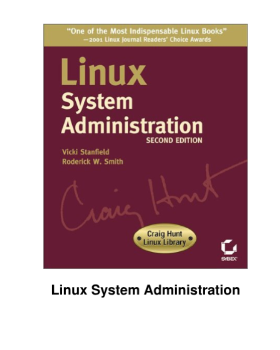

Para el desarrollo de los materiales didácticos y la preparación de las clases, se recomiendan las siguientes fuentes oficiales y recursos de referencia:

## Documentación Oficial de Certificación

- **Linux Foundation Training**: [training.linuxfoundation.org](https://training.linuxfoundation.org/certification/linux-foundation-certified-sysadmin-lfcs/) – Objetivos oficiales de LFCS.
- **LPI (Linux Professional Institute)**: [lpi.org](https://www.lpi.org/our-certifications/lpic-1-overview/) – Objetivos detallados para los exámenes 101-500 y 102-500.
- **Red Hat**: [redhat.com](https://www.redhat.com/en/services/training/ex200-red-hat-certified-system-administrator-rhcsa-exam) – Objetivos del examen EX200 (RHCSA).

## Manuales y Libros Recomendados

- _The Linux Command Line_ de William Shotts (excelente para el Módulo 2).
- _UNIX and Linux System Administration Handbook_ de Evi Nemeth et al. (referencia clásica para administradores). [leer](https://books.google.es/books/about/UNIX_and_Linux_System_Administration_Han.html?id=f7M1DwAAQBAJ&redir_esc=y)
- _Linux System Administration Second Edition_ de Vicki Stanfield, Roderick W. Smith.
  

- Documentación oficial para las distribuciones utilizadas:
  - [Guía del Servidor Ubuntu](https://ubuntu.com/server/docs)
  - [Documentación de Debian](https://www.debian.org/)

## Recursos de Laboratorio en Línea

- **Instruqt** o **Katacoda** (entornos interactivos).
- **DistroWatch** (comparación de distribuciones).
